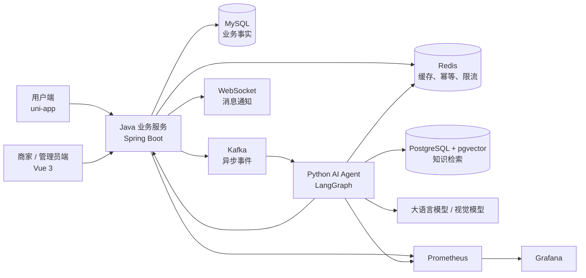

# Ecommerce After-Sales System

一个面向电商售后场景的智能客服与工单协同系统。系统覆盖用户咨询、售后申请、凭证审核、知识检索、AI 辅助决策、人工接管和商家运营监控，并通过清晰的服务边界保证业务状态可控、AI 结果可追踪、异常流程可恢复。

## 系统架构



### 职责边界

| 模块 | 主要职责 |
| --- | --- |
| Java 业务服务 | 用户与商家鉴权、订单和售后工单、聊天消息、权限校验、事务、状态机及最终结果持久化 |
| Python AI Agent | LangGraph 流程编排、意图理解、RAG、工具规划、图片审核、回复生成和人工转接建议 |
| 用户端 | 商品、订单、售后申请、凭证补充、咨询会话与状态查看 |
| 商家 / 管理员端 | 会话处理、工单审核、订单与商品管理、知识管理、风险队列和运行监控 |
| MySQL | 订单、工单、消息、审核结果等业务事实的唯一持久化来源 |
| PostgreSQL + pgvector | 知识文档、向量及检索元数据，不保存售后业务状态 |
| Redis | 短期缓存、消费幂等、限流和处理中状态，不承担长期业务存储 |
| Kafka | 售后审核事件的异步解耦、重试和故障隔离 |

## 核心功能

### 用户侧

- 用户注册、登录、商品浏览、下单与订单查询
- 退款、退货等售后申请及处理进度跟踪
- 图片或文件形式的售后凭证上传与补充
- 与 AI、商家客服共享同一会话历史
- 后端新增状态消息、人工接入通知后自动同步最新记录

### 商家与管理员侧

- 按商家隔离订单、商品、售后工单和会话数据
- 根据未回复状态、情绪风险和等待时间生成客服优先级
- 统一展示文本、图片和文件消息
- 查看 AI 建议、置信度、风险原因及审核轨迹
- 管理售后知识内容与发布生命周期
- 观察 Agent 请求、延迟、失败、降级和人工转接指标

### AI Agent

- 识别咨询意图、问题类型、情绪和风险
- 基于会话、订单、工单与商家策略补全上下文
- 通过向量、关键词和过滤条件进行混合知识检索，并使用 reranker 精排
- 调用 Java 内部工具查询事实或提交审核结果，不直接修改业务数据库
- 使用视觉模型审核商品问题图片和相关凭证
- 通过受控工作流完成规划、工具调用、结果观察、决策和回复
- 在证据不足、策略不确定或依赖持续失败时转人工处理

## 关键业务链路

### 智能咨询

```text
用户发送消息
  -> Java 校验身份并持久化消息
  -> Python Agent 读取会话与业务上下文
  -> RAG 检索相关售后知识
  -> Agent 按需调用 Java 内部工具
  -> Java 持久化 AI 回复
  -> 用户端和商家端按 sessionId 重新加载同一份会话历史
```

### 异步售后审核

```text
用户提交售后申请
  -> Java 在事务中创建工单并记录 Outbox 事件
  -> Kafka 投递 AI 审核请求
  -> Python Agent 幂等消费并执行规则、RAG 与视觉审核
  -> Agent 通过内部 API 提交审核建议
  -> Java 校验状态流转并保存最终结果
  -> WebSocket / 会话消息通知用户与商家
  -> 失败超过边界后进入 DLQ 或人工处理
```

## 设计思想

1. **AI 辅助业务，不拥有业务**
   AI 负责理解、检索、分析和建议；订单、工单、权限、事务与最终状态始终由 Java 控制。

2. **确定性规则约束概率模型**
   身份校验、状态流转、金额和时效等关键规则写在业务代码中，模型输出不能绕过规则直接改变业务状态。

3. **事实来源唯一**
   MySQL 保存业务事实，pgvector 保存检索知识，Redis 保存短期控制状态，Kafka 负责事件传递，避免同一状态在多个组件中互相冲突。

4. **异步解耦与幂等恢复**
   耗时的 AI 审核不阻塞用户提交。系统通过 Outbox、事件幂等键、有限重试和 DLQ 处理重复投递与局部故障。

5. **失败时优先保证用户可继续**
   模型不确定、凭证不足或外部服务异常时，系统给出可解释提示并尽快转人工，不让用户停留在无限重试中。

6. **多端共享同一会话事实**
   用户端、商家端和 Agent 都以数据库会话历史为准；同一订单或工单复用同一会话，隐藏会话不等于删除历史。

7. **可观测、可评测、可演进**
   对请求链路、工具调用、检索模式、模型降级、消费状态和人工转接建立指标与离线评测，支持持续优化而不牺牲业务稳定性。

## 技术栈

| 层次 | 技术 |
| --- | --- |
| 业务后端 | Java 21、Spring Boot、MyBatis-Plus、Spring Security |
| AI Agent | Python、LangGraph、LLM Function Calling、视觉模型 |
| 知识检索 | PostgreSQL、pgvector、pg_trgm、混合检索、RRF、Reranker |
| 数据与消息 | MySQL、Redis、Kafka、Outbox |
| 用户端 | uni-app、Vue 3、微信小程序 |
| 商家端 | Vue 3、Vite |
| 可观测性 | Prometheus、Grafana、结构化日志与 Trace ID |
| 部署 | Docker Compose |

## 项目结构

```text
.
├─ src/                         # Java 业务服务
├─ python_agent/                # Python AI Agent
├─ frontend/
│  ├─ uniapp/                   # 用户端小程序
│  └─ staff-auth-test-ui/       # 商家客服端与管理员端
├─ sql/                         # MySQL、pgvector 脚本与迁移
├─ observability/               # Prometheus / Grafana 配置
├─ tools/                       # 评测、审计和压测工具
├─ compose.yml                  # 本地完整链路编排
└─ Dockerfile                   # Java 服务镜像
```

## 快速启动

准备本地配置后，在仓库根目录运行：

```powershell
docker compose up -d --build
docker compose ps
```

主要访问地址：

- Java API：`http://127.0.0.1:8080/api`
- Java 健康检查：`http://127.0.0.1:8080/api/actuator/health`
- Grafana：按 `compose.yml` 中的端口配置访问

用户端和商家端需要分别进入 `frontend/uniapp` 与 `frontend/staff-auth-test-ui` 安装依赖并启动。

## 配置安全

真实密钥、数据库密码和本机配置不应提交。项目通过环境变量或本地忽略文件提供以下配置：

- Java 数据源、JWT 和内部 Agent 鉴权配置
- Python LLM、视觉模型、Embedding、Reranker 和 pgvector 配置
- 前端不同环境的 API 地址
- Docker Compose 的本地变量

仓库只保留可公开的示例配置，运行日志和提交内容不得输出真实凭据。
