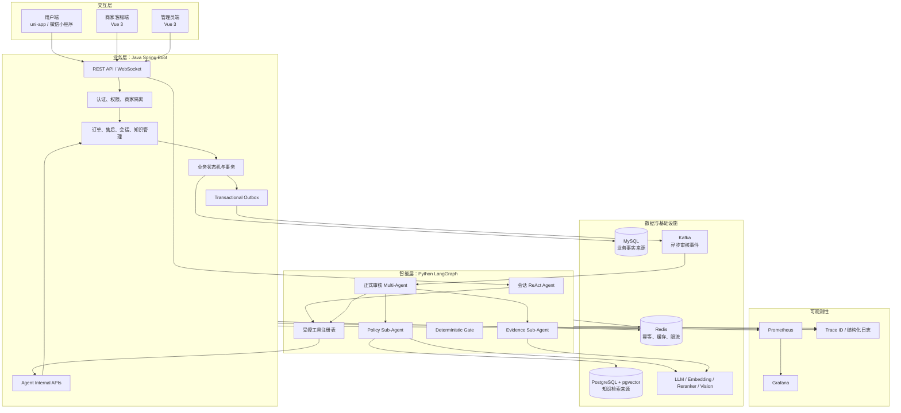
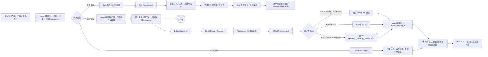
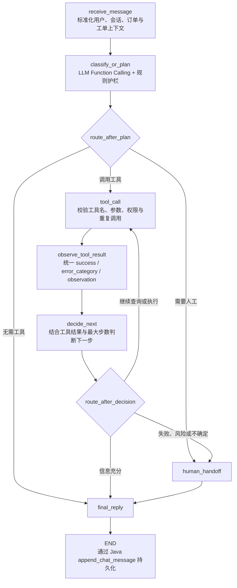
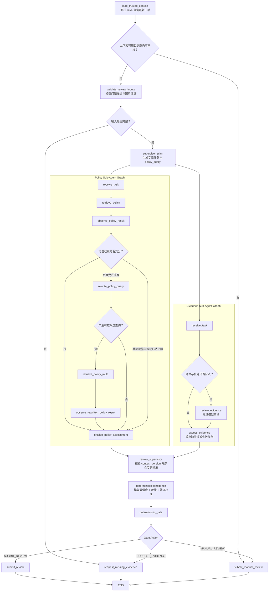
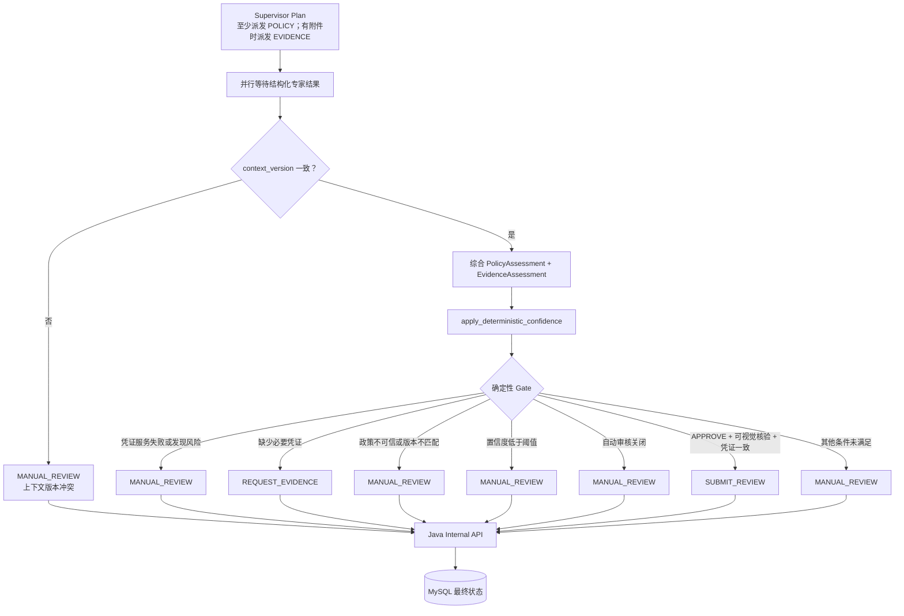
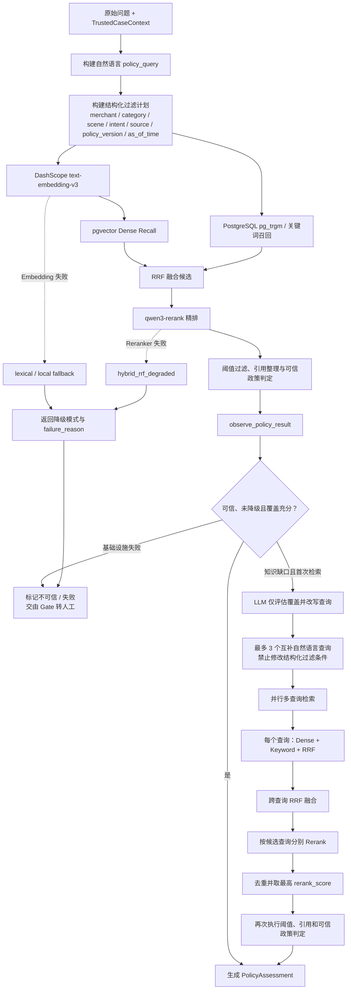
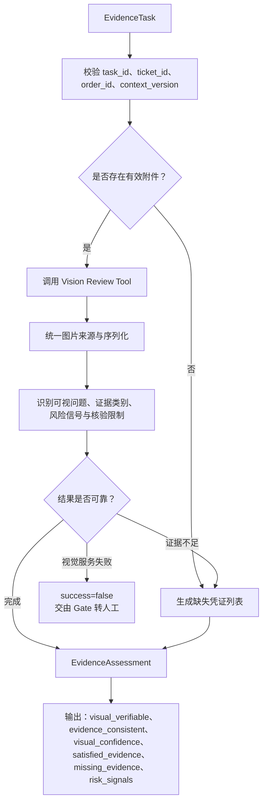
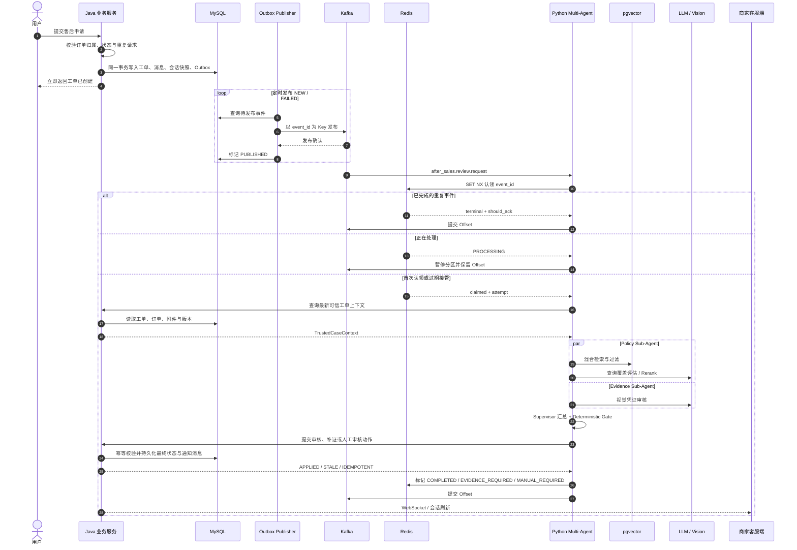
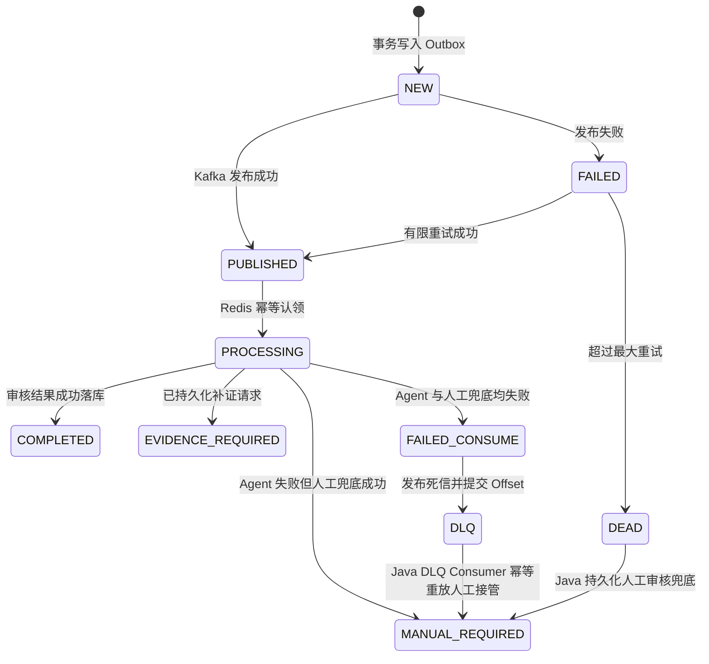

# Ecommerce After-Sales System

面向电商售后场景的智能客服与工单协同系统。项目覆盖用户咨询、售后申请、凭证审核、知识检索、AI 辅助决策、人工接管、商家运营和链路监控，并通过 Java 业务内核、Python LangGraph Agent、事件驱动架构与分层 RAG 保证业务状态可控、AI 结论可解释、分布式失败可恢复。

## 一、总体架构



### 核心职责边界

| 模块 | 拥有的职责 | 明确不做 |
| --- | --- | --- |
| Java 业务服务 | 鉴权、权限、订单、售后工单、会话消息、事务、状态机、最终审核结果 | 不把业务状态交给模型直接修改 |
| Python Agent | LangGraph 编排、意图理解、工具规划、RAG、视觉审核、风险分析、回复生成 | 不直写 MySQL，不拥有最终业务状态 |
| 前端 | 用户交互、消息渲染、状态展示和失败时的短期交互兜底 | 不把本地状态当作会话或工单事实 |
| MySQL | 业务事实与审计记录 | 不保存向量检索运行状态 |
| PostgreSQL + pgvector | 已发布知识、Chunk、Embedding 和检索元数据 | 不保存订单、工单或聊天业务状态 |
| Redis | 消费幂等、短期状态、缓存和限流 | 不承担长期业务持久化 |
| Kafka | 事件投递、异步解耦和故障隔离 | 不作为业务最终状态来源 |

## 二、完整业务链路



这条链路有两个关键约束：

1. 所有写操作最终回到 Java，由 Java 校验用户归属、商家权限、当前状态和幂等键。
2. 前端展示以 Java 持久化后的结果为准；发送消息后优先重新加载会话历史，而不是只在本地追加。

## 三、Agent 体系

系统包含两类相互隔离的运行时：

| Agent | 触发方式 | 目标 | 是否可直接形成业务结果 |
| --- | --- | --- | --- |
| 会话 ReAct Agent | 用户实时咨询 | 理解问题、选择工具、查询事实、生成回复或转人工 | 否，消息与接管结果必须经 Java 持久化 |
| 正式审核 Supervisor | Kafka 售后审核事件 | 编排政策与凭证专家，综合结构化结论 | 否，只生成提案 |
| Policy Sub-Agent | Supervisor 派发 | 检索可信售后政策，判断政策覆盖与适用性 | 否，输出 PolicyAssessment |
| Evidence Sub-Agent | Supervisor 派发 | 审核图片凭证，识别一致性、缺失项和风险 | 否，输出 EvidenceAssessment |
| Deterministic Gate | 专家结果汇合后执行 | 用确定性规则决定自动通过、补证或人工审核 | 只选择提交动作，最终仍由 Java 落库 |

### 3.1 会话 ReAct Agent 子图



会话 Agent 的工具边界包括：

- 查询用户订单、订单详情、物流和已有售后工单
- 查询会话历史和售后知识
- 获取工单可信上下文
- 提交受保护的 AI 审核结果
- 请求人工接管
- 通过 Java 追加聊天消息

工具执行被拆分为“调用—观察—决策”，便于统一处理超时、参数错误、权限拒绝、空结果和可恢复故障。循环受最大步数、重复工具调用检测和终态动作校验约束。

### 3.2 正式审核 Multi-Agent 总图



Supervisor 不把完整业务上下文随意交给子 Agent，而是构造最小化任务：

- Policy Agent 只接收政策检索需要的商品、类目、售后类型、商家、政策版本和业务时间。
- Evidence Agent 只接收图片审核需要的问题、商品、订单、工单与附件。
- 两个子 Agent 都携带相同的 `context_version`。汇合时版本不一致会直接转人工，防止使用不同时间点的事实合成结论。
- `task_id` 由 `review_request_id + specialist + context_version` 计算，便于追踪与幂等分析。

### 3.3 Supervisor 决策子图



这里的 LLM 只生成 `ReviewProposal`，真正的 Gate 是代码规则。即使模型提出自动通过，只要政策、凭证、版本、置信度或功能开关任一条件不满足，系统就不会自动通过。

### 3.4 Policy Sub-Agent 与 Agentic RAG



Agentic RAG 不是让模型自由搜索，而是“模型判断知识覆盖、代码控制检索边界”：

1. 首次检索使用结构化硬过滤，避免跨商家、跨政策版本或跨生效时间召回。
2. Dense 与 Keyword 召回通过 RRF 融合，再由 Reranker 精排。
3. 模型只能判断覆盖是否充分，并生成最多 3 个互补查询；不能更改商家、政策版本、时间等过滤条件。
4. 多查询结果再次融合和精排，并保留文档、Chunk 与来源引用。
5. `trusted_policy_eligible`、`filter_level`、`reranker_succeeded`、`no_answer` 和 `failure_reason` 会进入结构化评估。
6. 降级召回可以用于提示和诊断，但正式审核不会把降级结果当成可信政策自动通过。

### 3.5 Evidence Sub-Agent 子图



Evidence Agent 不针对单个商品或某张截图写死规则，而是输出通用的证据类别、可观察问题、缺失项、风险信号和视觉能力边界。功能异常无法仅凭静态图片验证时，会要求补充更合适的凭证或转人工。

## 四、异步审核、幂等与故障恢复



### 失败状态流



可靠性策略：

- `event_id` 同时作为 Kafka Key、Redis 消费幂等键和 Java `review_request_id`。
- Redis 使用带 TTL 的 `PROCESSING` 状态和心跳续期；崩溃后允许过期接管。
- 终态重复事件直接 ACK；仍在处理的重复事件不推进 Offset。
- Agent 异常先尝试通过 Java 持久化人工审核；只有人工兜底也失败才进入 DLQ。
- Outbox 发布耗尽重试时不能假装成功，必须把工单转入可见的人工处理状态。
- Trace ID 从 Java、Outbox、Kafka、Agent 工具调用一直贯穿到最终落库。

## 五、核心功能

### 用户侧

- 用户注册、登录、商品浏览、下单与订单查询
- 退款、退货等售后申请与处理进度跟踪
- 图片或文件形式的售后凭证上传与补充
- AI 与人工客服共享同一会话历史
- 售后状态、补证请求和人工接入通知同步展示

### 商家与管理员侧

- 按 `merchantCode` 隔离订单、商品、售后工单和会话
- 根据未回复状态、情绪风险、等待时间和最近活动生成队列优先级
- 统一渲染文本、图片和文件消息
- 展示 AI 建议、置信度、风险原因、证据缺口和审核轨迹
- 管理知识文档的草稿、发布、版本和检索元数据
- 查看 Agent 请求量、延迟、错误、降级、Outbox、DLQ 和人工转接指标

### AI 能力

- 意图识别、问题分类、情绪与风险分析
- 会话、订单、工单、商品与商家策略上下文组装
- 原生 Function Calling 与受控工具执行
- Agentic RAG 查询覆盖评估与多查询改写
- Dense、Keyword、RRF、Reranker 分层检索
- 图片凭证审核、风险识别与能力边界说明
- 多 Agent 正式审核、确定性 Gate 与人工兜底
- 离线安全评测、受控 Multi-Agent 评测和视觉基线评测

## 六、设计思想

1. **AI 辅助业务，不拥有业务**
   Agent 负责理解、检索、分析和建议；订单、工单、权限、事务和最终状态由 Java 控制。

2. **确定性规则约束概率模型**
   身份、金额、时效、状态机、可信政策资格、证据要求和自动审核条件写在代码中，模型输出不能绕过规则。

3. **最小上下文与最小工具权限**
   Supervisor 只向子 Agent 派发完成任务必需的数据；Agent 只能调用注册工具，不能直接访问业务数据库。

4. **事实来源唯一**
   MySQL 保存业务事实，pgvector 保存知识，Redis 保存短期控制状态，Kafka 传递事件，避免多份状态相互冲突。

5. **先持久化，再通知**
   工单、消息和审核结果先由 Java 事务落库，再通过 WebSocket 或历史重载同步给前端。

6. **异步解耦与幂等恢复**
   耗时 AI 审核不阻塞用户提交；Outbox、Kafka、Redis 和 Java 幂等共同处理重复投递与局部故障。

7. **失败时优先保证用户可继续**
   模型不确定、证据不足、政策不可信或外部服务异常时，系统明确补证或转人工，不进入无限推理和重试。

8. **检索质量优先于看似有答案**
   降级检索、Reranker 失败、政策版本不匹配或无可信引用时宁可拒绝自动审核，也不把低质量召回包装成确定结论。

9. **全链路可观测与可评测**
   节点耗时、工具结果、检索模式、置信度拆分、幂等状态、DLQ 和人工接管都有结构化记录和指标。

## 七、技术栈

| 层次 | 技术 |
| --- | --- |
| 业务后端 | Java 21、Spring Boot、MyBatis-Plus、Spring Security |
| AI 编排 | Python、LangGraph、LLM Function Calling |
| 模型能力 | DashScope LLM、text-embedding-v3、qwen3-rerank、视觉模型 |
| 知识检索 | PostgreSQL、pgvector、pg_trgm、RRF、Reranker |
| 数据与消息 | MySQL、Redis、Kafka、Transactional Outbox |
| 用户端 | uni-app、Vue 3、微信小程序 |
| 商家端 | Vue 3、Vite |
| 可观测性 | Prometheus、Grafana、Trace ID、结构化日志 |
| 部署 | Docker Compose |

## 八、项目结构

```text
.
├─ src/                         # Java 业务服务
├─ python_agent/                # Python LangGraph Agent
│  └─ after_sales_agent/
│     ├─ api/                   # HTTP 与 Kafka 入口
│     ├─ application/           # 会话、正式审核、RAG 与工具编排
│     ├─ providers/             # LLM、Embedding、Reranker、Vision
│     ├─ retrieval/             # pgvector、关键词、RRF 与过滤
│     └─ infra/                 # Redis 幂等、指标、Trace
├─ frontend/
│  ├─ uniapp/                   # 用户端小程序
│  └─ staff-auth-test-ui/       # 商家客服端与管理员端
├─ sql/                         # MySQL、pgvector 脚本与迁移
├─ observability/               # Prometheus / Grafana 配置
├─ tools/                       # 评测、审计和压测工具
├─ compose.yml                  # 本地完整链路编排
└─ Dockerfile                   # Java 服务镜像
```

## 九、快速启动

准备本地配置后，在仓库根目录运行：

```powershell
docker compose up -d --build
docker compose ps
```

主要地址：

- Java API：`http://127.0.0.1:8080/api`
- Java 健康检查：`http://127.0.0.1:8080/api/actuator/health`
- Python Agent：仅在 Compose 容器网络暴露 `8000`
- Grafana：按 `compose.yml` 的端口配置访问

用户端和商家端分别进入 `frontend/uniapp` 与 `frontend/staff-auth-test-ui` 安装依赖并启动。

## 十、配置安全

真实密钥、数据库密码和本机环境文件不应提交。项目通过环境变量或 Git 忽略的本地配置提供：

- Java 数据源、JWT、Kafka、Redis 和内部 Agent 鉴权配置
- Python LLM、视觉模型、Embedding、Reranker 与 pgvector 配置
- 前端不同环境的 API 地址
- Docker Compose 的本地变量

仓库只保留可公开的示例配置，运行日志、README 和提交记录不得输出真实凭据。
