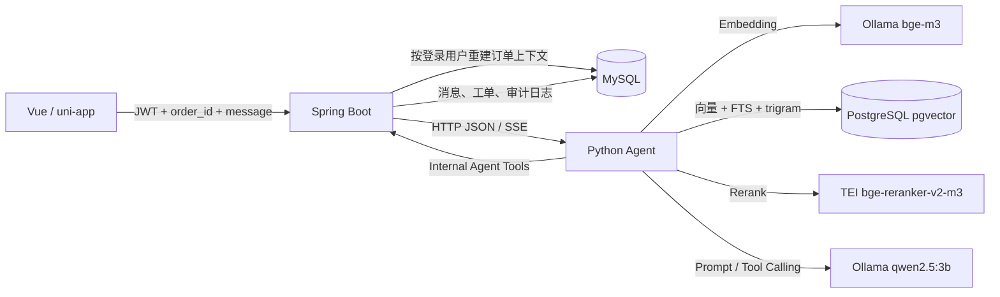

# AI / RAG 架构

> 验证日期：2026-09-22
> 证据范围：当前 Java/Python 源码、MySQL/PostgreSQL 数据、自动化测试、真实跨轮聊天与实时通道。

## 1. 系统边界

Java 是业务事实与最终写入的唯一入口；Python Agent 负责意图分析、工作流编排、RAG、模型调用和建议生成。Python 不直接修改 MySQL 工单或消息，而是调用受内部 Token 保护的 Java API。



## 2. 可信上下文

前端传入的 `selected_order` 只作为不可信输入。`AgentConversationContextService` 使用登录用户 ID 与 `order_id` 查询 MySQL，覆盖客户端字段并补齐：

- 商家编码；
- 商品名称与真实分类；
- 工单 ID、状态和政策版本；
- 带 `+08:00` 偏移的业务时间。

这样，商家、分类和政策版本不能由客户端伪造后用于缩小 RAG 过滤范围。

## 3. 完整处理链

```text
Document
→ Draft Chunk / Published Chunk
→ bge-m3 1024 维 Embedding
→ PostgreSQL vector(1024)
→ Dense + FTS + pg_trgm
→ RRF 融合
→ TEI Reranker
→ 可信过滤与阈值判断
→ Prompt
→ qwen2.5:3b
→ Java Internal Tool
→ MySQL 持久化
```

### 3.1 文档与向量

`knowledge_document` 保存来源、商家范围、政策版本和有效期；`knowledge_chunk_draft` 是解析与确认区；`knowledge_chunk` 只保存已发布版本。安全 reindex 会先生成全部 Embedding，再锁定并校验文档版本，最后替换发布 chunk，避免先清空后失败。

### 3.2 检索与过滤

严格检索同时约束商家、来源、政策版本、有效期、商品分类、场景和意图。空数组或 `NULL` 表示通用维度。严格召回为空时按计划逐步放宽分类、场景，但放宽结果必须：

- `relaxation_level != strict`；
- `trusted_policy_eligible=false`；
- 对外模式为 `hybrid_rrf_degraded`；
- 不能成为自动审核的可信政策依据。

Reranker 是否成功与过滤是否严格分别记录。即使 Reranker 成功，放宽过滤的政策仍不可信。

### 3.3 回答与工具

Agent 使用 LangGraph 组织咨询和正式审核。模型可调用订单、工单、政策、消息写入、补证和转人工工具。涉及最终业务状态的工具全部回到 Java，由 Java 再校验用户、商家、工单状态、审核实例和证据版本。

### 3.4 会话记忆与 checkpoint

聊天跨轮上下文由 Java 从 MySQL 最近消息和摘要重建，再随请求传给 Python。普通咨询工作流使用 `graph.compile()`，没有 PostgreSQL checkpointer。

正式审核工作流使用 `graph.compile(checkpointer=self.checkpointer)`。Review Consumer 注入 PostgreSQL `ReviewCheckpointRuntime`，用于审核暂停、补证和恢复。2026-09-22 实查 `agent_runtime` 有 1 个正式审核 thread、5 个 checkpoint，而聊天 session `2101952086903840769` 对应 checkpoint 为 0。

## 4. 本地模型配置

| 能力 | 服务 | 模型 | 地址 |
| --- | --- | --- | --- |
| 文本生成 / Tool Calling | Ollama | `qwen2.5:3b` | VM `11434` |
| Embedding | Ollama OpenAI compatible | `bge-m3` | VM `11434/v1` |
| Rerank | Hugging Face TEI | `BAAI/bge-reranker-v2-m3` | VM `8081/rerank` |
| Vision | 未配置 | 无 | NOT_DONE |

CPU 验收环境会把 Java Agent 超时设为 300 秒，前端 Agent 请求超时设为 330 秒，以便接收 Java 网关终态或错误事件。政策聊天可通过本机忽略配置关闭可选的前置情绪 LLM 调用，主链的 Embedding、pgvector、Reranker 和回答 LLM 仍真实执行。

## 5. 失败与安全边界

| 情况 | 行为 |
| --- | --- |
| Embedding、pgvector 或 Reranker 不可用 | 返回结构化失败或降级，不伪造可信引用 |
| 严格过滤无结果 | 分层放宽，但结果不具备可信政策资格 |
| 政策版本、商家或业务时间不匹配 | Java 自动审核守卫拒绝自动通过 |
| LLM 无可靠结论 | 请求补证或转人工 |
| 客户端伪造订单上下文 | Java 从 MySQL 重建并覆盖 |

## 6. 已验证结果与限制

- 43 条已发布文档生成 43 个真实 1024 维 chunk；
- “七天无理由退货”Top-1 为 `return_policy_001`，cosine 分数 `0.8064`；
- 真实聊天返回 `knowledge_mode=hybrid_reranked`、1 条可信政策引用，并由 Java 写入 MySQL；
- 同一 MySQL 会话的追问正确继承上一轮政策语境；
- SSE 返回 `start → token → finish → done`，当前 `token` 是工作流完成后的整段回答，不是模型逐 token 输出；
- 本地 CPU 链路观察到约 141–244 秒，仅证明功能闭环；
- Vision、生产并发和公网部署尚未完成验收。

## 7. 代码入口

| 职责 | 入口 |
| --- | --- |
| Java 聊天网关 | `AgentGatewayController` / `AgentGatewayServiceImpl` |
| 可信上下文 | `AgentConversationContextService` |
| Agent 入口 | `after_sales_agent.interface.http_server` |
| 咨询工作流 | `ConsultationWorkflow` / `LangGraphAfterSalesAgent` |
| 混合检索 | `PgVectorKnowledgeRetriever` |
| 过滤计划 | `retrieval/knowledge_filters.py` |
| Reranker | `providers/reranker_client.py` |
| 内部工具 | `InternalAgentToolsController` / `AgentToolRegistry` |
