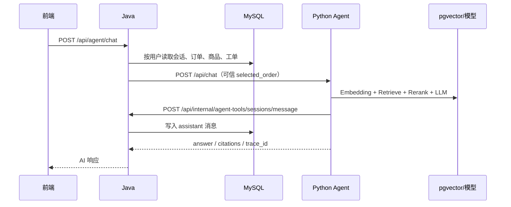

# API 与业务调用链

> 本文只记录当前源码中的主链。对外 Java 基地址为 `http://127.0.0.1:8080/api`，Python Agent 基地址为 `http://127.0.0.1:8000/api`。

## 1. 登录与鉴权

```text
Vue 登录页
→ POST /api/auth/login
→ Java 校验客服账号
→ 返回 JWT
→ 前端后续请求携带 Authorization: Bearer <token>
→ Java 拦截器写入当前用户上下文
```

演示客服账号为 `cs_demo / 123456`。内部 Agent API 不使用用户 JWT，而使用共享的 `X-Agent-Internal-Token`。

## 2. AI 客服聊天



流式入口为 `POST /api/agent/chat/stream`。历史回读使用 `GET /api/chat/history?sessionId=...`。64 位 ID 在跨 JavaScript/Python 边界时按字符串传输。

## 3. 售后工单与异步审核

```text
POST /api/aftersales
→ Redis 频率限制
→ MySQL 事务：ticket + attachment + log + outbox
→ Outbox 调度器发布 after_sales.review.request
→ Python Review Consumer
→ Java Internal Agent Tools 读取可信事实
→ LangGraph 正式审核
→ Java 条件回写结果 / 请求补证 / 转人工
→ 成功后提交 Kafka offset
```

补证通过 `POST /api/aftersales/{id}/supplements` 恢复同一 `review_request_id`，同时增加 `evidence_revision`。Java 拒绝旧 revision 的迟到结果。

## 4. 知识库

管理端经 Java 完成文档创建、草稿解析、发布和状态查询。Python 负责解析、分块、Embedding 与检索。重建入口：

```text
python_agent/setup_knowledge_base.ps1
→ GET /api/health
→ POST /api/knowledge/reindex
→ 生成全部 Embedding
→ 校验发布 revision
→ 原子替换对应 chunk
```

Java 管理接口负责文件类型、大小、状态与版本校验；Python 返回结构化解析或索引结果。

## 5. 内部 Agent Tools

主要内部接口位于 `/api/internal/agent-tools/**`：

| 接口方向 | 用途 |
| --- | --- |
| 订单搜索/详情 | 给 Agent 提供 Java 认可的订单事实 |
| 工单查询 | 读取现有工单和审核状态 |
| 商家政策 | 读取政策版本与适用范围 |
| 会话消息 | 持久化 Agent 回复并广播 |
| 补证/转人工 | 由 Java 执行状态迁移 |
| 正式审核回写 | 校验 request ID、revision、引用和置信度后更新 |

内部接口只能由配置一致的 Agent 调用，前端不应直接访问。

## 6. 实时通道

- WebSocket：`/api/ws/chat`，用于会话消息广播；握手需要 JWT。
- SSE：聊天流式输出；连接中断不代表 Java 已回滚之前完成的持久化。
- Kafka：正式审核异步事件；消费提交与业务落库结果绑定。

## 7. 错误处理

| 层 | 典型错误 | 对外行为 |
| --- | --- | --- |
| Java 参数/权限 | 400、401、403、404 | 统一 `ApiResponse` |
| Agent 超时/不可用 | 502/超时 | Java 返回可重试提示，不伪造 AI 结果 |
| RAG 基础设施 | `EMBEDDING_ERROR`、`PGVECTOR_ERROR`、degraded | 禁止可信政策自动决策 |
| Kafka 消费失败 | 重试后 DLQ | Java 转人工并留审计日志 |
| 文档解析失败 | 稳定错误码 | 保留失败状态供管理端查看 |

## 8. 调试顺序

1. 先看浏览器请求 URL、状态码和 `trace_id`。
2. 再查 Java Controller、Service 和 MySQL 数据。
3. 跨到 Python 时查 Agent trace 与 RAG mode。
4. 异步审核查 Outbox 状态、Kafka offset、Consumer 日志和工单日志。
5. 只在端口、日志和数据都一致时宣称链路通过。
