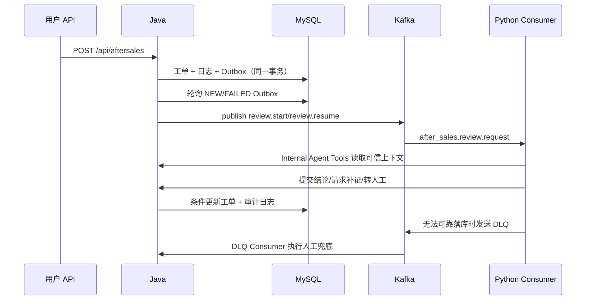

# Kafka 与售后审核事件设计

> 验证日期：2026-09-21
> 依据：Java Outbox、Python Consumer、Java DLQ Consumer、Compose 与一次真实业务链路。

## 1. Topic

| Topic | 生产者 | 消费者 | 用途 |
| --- | --- | --- | --- |
| `after_sales.review.request` | Java `AfterSalesReviewEventServiceImpl` | Python `AfterSalesReviewKafkaConsumer` | 启动或恢复售后正式审核 |
| `after_sales.review.dlq` | Python Consumer | Java `AfterSalesReviewDlqConsumer` | 消费失败后的人工审核兜底 |

本地开发为单 broker、单 partition、replication factor 1。它用于功能验证，不代表生产高可用设计。

## 2. 事件链路



## 3. 事件契约

Python 在消费前要求至少存在：

```text
event_id
review_request_id
ticket_id
user_id
order_id
```

Java 还会发送 `trace_id`、`event_type`、`evidence_revision`、`ticket_no`、`order_no`、商家和售后上下文。ID 通过字符串传输，避免 JavaScript/Python 边界丢失 64 位整数精度。

事件类型：

- `after_sales.review.start`：新工单启动审核；
- `after_sales.review.resume`：补充证据后恢复同一审核实例。

`review_request_id` 在补证前后保持不变，`evidence_revision` 递增。Java 回写时同时校验二者，拒绝过期结果。

## 4. 可靠性与幂等

### 4.1 Java Producer / Outbox

- 创建工单和插入 Outbox 在同一 MySQL 事务中完成。
- 调度器默认每 3 秒读取最多 20 条 `NEW` / `FAILED` 事件。
- Kafka 发送成功后标记 `PUBLISHED`。
- 默认最多重试 5 次，退避为 `5 * 次数` 秒，上限 300 秒。
- 重试耗尽后先持久化人工审核兜底；如果兜底也未落库，不把事件伪装成已处理。
- `event_id` 唯一，Kafka producer 启用幂等发送。

### 4.2 Python Consumer

- consumer group：`python-after-sales-agent-review`；
- 关闭自动提交，只在业务结果完成、补证请求已落库或人工兜底已落库后提交 offset；
- 幂等键为 `event_id`，Compose 使用 Redis；本机脚本未配置 Redis URL 时退化为项目 `.runtime` 文件存储；
- 正在处理的事件定期续租，避免长审核被另一个实例抢占；
- 无法验证的消息和业务处理失败消息写入 DLQ。

### 4.3 Java DLQ Consumer

Java group `java-after-sales-review-dlq` 消费 DLQ。有效事件会把工单转为 `MANUAL_REVIEW_REQUIRED`，并记录来源和失败原因。无 `ticket_id` 或 `review_request_id` 的坏消息只记录为不可恢复，不修改任意工单。

## 5. VMware 网络配置

Compose 内部客户端使用 `kafka:29092`。Windows 主机使用 VM NAT 地址和 `9092`：

```dotenv
KAFKA_BOOTSTRAP_SERVERS=192.168.100.130:9092
KAFKA_ADVERTISED_HOST=192.168.100.130
```

`KAFKA_ADVERTISED_HOST` 必须是 Windows 能访问的 VM 地址。若仍广播 `localhost`，初始 bootstrap 可能成功，但客户端获取元数据后会尝试连接自己的 `localhost:9092` 并失败。

## 6. 启动

```powershell
.\scripts\start-agent.ps1
.\scripts\start-backend.ps1
.\scripts\start-review-consumer.ps1
```

最后一个脚本加载项目根 `.env` 和 `python_agent/.env`，再使用项目 `.venv` 启动 Consumer。

## 7. 当前实机验收

VM Kafka 版本为 Confluent 7.5.0，Java 客户端为 3.7.1。两个 topic 都已创建，主 topic 为 1 partition / RF 1 / leader 1 / ISR 1。

2026-09-21 的真实业务验收：

1. 用户 API 创建订单 `ORD1789979354721`。
2. 创建工单 `AS37669ee6db2d43e388e0`。
3. MySQL Outbox 事件 `6bbee213-1441-49a3-8f8c-80f50e180ed3` 从 `NEW` 变为 `PUBLISHED`，重试次数为 0。
4. Python Consumer 读取同一事件和 Java 可信上下文。
5. 因缺少商品问题图片，正式审核选择 `REQUEST_EVIDENCE`。
6. Python 调用 Java 内部接口，Java 写入 `AI_REVIEW_WAITING_EVIDENCE` 日志。
7. Consumer 成功提交 Kafka offset。

该验收覆盖 Java → MySQL Outbox → Kafka → Python → Java → MySQL。它没有调用 LLM、Embedding 或 Vision，因此不能作为完整 AI/RAG 通过证据。
