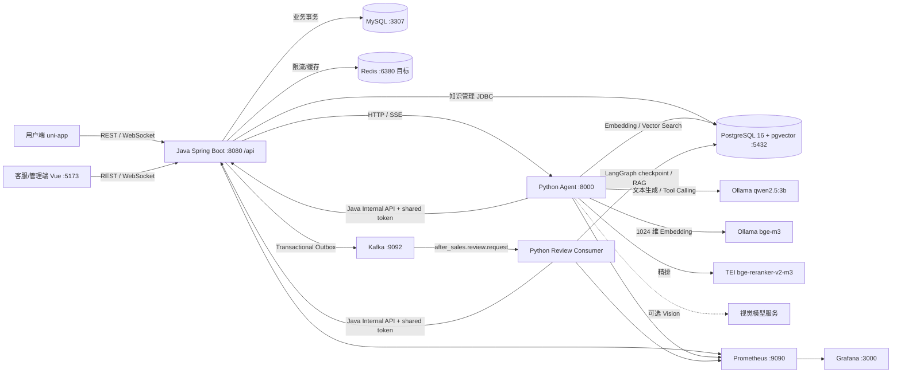

# 项目架构与第一阶段审计

> 审计日期：2026-09-21
>
> 审计基线：`main` / `eac3754`
>
> 证据范围：当前源码、配置、SQL、自动化测试与本机端口；历史 README 和旧设计文档只作线索。

> 运行状态更新（2026-09-22）：Windows 承载 MySQL、Redis、Java、Python Agent、Kafka Consumer 和 Vue；专用 Ubuntu VMware 承载 PostgreSQL/pgvector、Kafka、Ollama、TEI Reranker、Prometheus 与 Grafana。Java Outbox 审核、AI/RAG 聊天、SSE、WebSocket、跨轮对话、知识库生命周期和三个应用指标采集目标均已有实机证据。本地 `qwen2.5:3b`、`bge-m3` 和 `BAAI/bge-reranker-v2-m3` 覆盖 LLM、Tool Calling、1024 维 Embedding 与精排，无需远程模型 Key。

## 1. 审计结论

这是一个多进程的 Java 业务系统与 Python AI 应用，不是微服务集合。

- Java Spring Boot 保存业务事实、执行权限校验、事务写入和最终状态变更。
- Python Agent 负责 LLM、RAG、工具编排、图片审核建议和 Kafka 售后审核。
- MySQL 保存用户、商品、订单、工单、会话、消息和 Outbox。
- PostgreSQL + pgvector 保存知识文档、草稿、1024 维向量，以及正式审核使用的 LangGraph checkpoint。
- Redis 用于限流、缓存和 Kafka Consumer 幂等状态。
- Kafka 承载售后审核请求，Java 通过 Transactional Outbox 发布，Python 消费。
- 管理/客服端是 Vue 3 + Vite；用户端是 Vue 3 + uni-app。

当前采用混合本地运行：Windows 运行 Java、Python、Vue、MySQL 与 Redis，专用 VMware 运行需要 Linux 容器的 pgvector、Kafka 和本地模型。知识库已生成 43 个当前发布的真实向量 chunk；指定业务商户的 Top-K 检索已命中正确政策。Vision 仍需要单独的视觉模型或远程 Key，不影响文本 AI/RAG 链路。

## 2. 真实目录结构

| 路径 | 责任 | 现场事实 |
| --- | --- | --- |
| `src/main/java/com/ecommerce/aftersales` | Java 业务内核、REST、WebSocket、SSE、鉴权、MyBatis、Outbox | Java 21 / Spring Boot 3.3.6，16 个 Controller |
| `src/main/resources` | Spring 配置、Mapper XML、内置知识数据 | 主配置导入可选 `application-local.yml` 和项目根 `agent.local.properties` |
| `frontend/staff-auth-test-ui` | 管理员与客服工作台 | Vue 3 + Vite，真实 API adapter 与显式 mock 模式并存 |
| `frontend/uniapp` | 用户 H5 / 微信小程序 | 登录、订单、售后、会话、AI 客服、评价等 15 个页面 |
| `python_agent/after_sales_agent` | Agent、Workflow、RAG、LLM、工具、HTTP 与 Kafka 入口 | Python HTTP 入口是 `interface/http_server.py`；Kafka 入口是 `interface/kafka_adapter.py` |
| `sql/schema.sql` | MySQL 业务模型 | 用户、客服、订单、工单、附件、Outbox、会话、消息、评价、通知等 |
| `sql/pgvector_schema.sql` | PostgreSQL RAG 模型 | `vector`、`pg_trgm`、1024 维向量、GIN、FTS、IVFFlat cosine |
| `sql/migrations` | 增量 SQL | 18 个迁移脚本；仓库没有 Flyway/Liquibase 自动执行器 |
| `compose.yml` | 完整容器编排 | MySQL、PostgreSQL、Redis、Kafka、Agent、Consumer、Java、Prometheus、Grafana |
| `observability` | Prometheus 告警和 Grafana dashboard | 配置已存在，当前未运行 |
| `.github/workflows` | CI 与定时 smoke | Java、Python、前端流水线；真实 LLM/RAG 依赖受保护变量 |
| `tools` | 评测、压测、知识覆盖工具 | 包含 RAG、视觉、情绪、安全与 Agent 负载工具 |

代码知识图谱当前索引 466 个文件、8,506 个节点、32,299 条关系：199 个 Java 文件、138 个 Python 文件、49 个 Vue 文件、224 个路由节点。

## 3. 真实架构



### 边界原则

1. Python 不直接修改 MySQL 业务结果。
2. Python 通过 `/api/internal/agent-tools/**` 请求 Java 执行订单查询、工单审核、消息落库和转人工。
3. Java 内部工具接口使用共享 Token；用户与客服接口使用 JWT。
4. MySQL 是业务真相源，也保存聊天消息和摘要；PostgreSQL 保存知识数据与正式审核 checkpoint。

## 4. 核心调用链

### 4.1 登录与 RBAC

```text
Vue login
→ POST /api/merchant-cs/auth/login 或 /api/admin/auth/login
→ MerchantCsServiceImpl / AdminConsoleServiceImpl
→ PasswordEncoder 校验
→ JwtTokenUtil 签发 JWT
→ JwtAuthenticationFilter
→ SecurityConfig 的角色/路径规则
```

关键代码：

- `config/SecurityConfig.java:23`
- `config/JwtAuthenticationFilter.java:21`
- `service/impl/MerchantCsServiceImpl.java`
- `service/impl/AdminConsoleServiceImpl.java`

### 4.2 用户创建售后与异步审核

```text
POST /api/aftersales
→ AfterSalesController.create
→ Redis 提交限流
→ AfterSalesServiceImpl.create 的 MySQL 事务
→ 工单 + 日志 + 附件 + after_sales_event_outbox
→ AfterSalesReviewEventServiceImpl 定时 claim/publish
→ Kafka after_sales.review.request
→ AfterSalesReviewKafkaConsumer
→ FormalReviewWorkflow / RAG / Vision / LLM
→ Java InternalAgentToolsController
→ Java 再校验并写 MySQL
→ WebSocket 通知用户与客服
```

关键代码：

- `controller/AfterSalesController.java:66`
- `service/impl/AfterSalesServiceImpl.java`
- `service/impl/AfterSalesReviewEventServiceImpl.java:37`
- `python_agent/after_sales_agent/interface/kafka_adapter.py:419`
- `controller/InternalAgentToolsController.java:62`

### 4.3 AI 客服聊天

```text
用户问题
→ POST /api/agent/chat 或 /api/agent/chat/stream
→ AgentGatewayController（JWT + Redis 限流）
→ AgentGatewayServiceImpl（保存用户消息、补全可信业务上下文）
→ Python POST /api/chat 或 SSE
→ AfterSalesAgent
→ ConsultationWorkflow
→ Java 工具查询订单/工单/客户/商品
→ PgVectorKnowledgeRetriever
→ Embedding + vector/FTS/pg_trgm + RRF + 可选 reranker
→ LLM 生成回答或转人工
→ append_chat_message Java 工具落库
→ WebSocket / HTTP 响应回前端
```

关键代码：

- `controller/AgentGatewayController.java:25`
- `service/impl/AgentGatewayServiceImpl.java`
- `python_agent/after_sales_agent/interface/http_server.py:233`
- `python_agent/after_sales_agent/agent/agent.py:39`
- `python_agent/after_sales_agent/agent/workflows/consultation.py:31`
- `python_agent/after_sales_agent/retrieval/pgvector_retriever.py:146`

### 4.4 知识文档入库

```text
管理端文件/文本上传
→ /api/admin/knowledge/file-import 或 text-import
→ KnowledgeService 创建 knowledge_document 与草稿状态
→ KnowledgeIngestionAsyncService
→ Python /api/parse-document
→ 分块与元数据分类
→ knowledge_chunk_draft
→ 人工确认/发布
→ Python /api/embeddings
→ KnowledgePublishService 校验每条 1024 维
→ knowledge_chunk + published_revision
→ IVFFlat / FTS / pg_trgm 检索
```

关键代码：

- `controller/KnowledgeManagementController.java:36`
- `service/KnowledgeIngestionAsyncService.java:33`
- `service/KnowledgePublishService.java:26`
- `python_agent/after_sales_agent/infrastructure/embedding_service.py:12`
- `sql/pgvector_schema.sql:4`

## 5. 功能矩阵

状态含义：`IMPLEMENTED` 为源码与自动化契约存在；`PARTIAL` 为能力或入口不完整；`BROKEN` 为当前已知失败；`MOCK` 为仅模拟；`NOT_STARTED` 为无实现；`NOT_VERIFIED` 为尚无当前运行证据。

| 模块 | 前端 | Java | Python | DB/中间件 | 当前状态 | 是否真正可用 |
| --- | --- | --- | --- | --- | --- | --- |
| 用户登录 | uni-app 登录页 | 用户 JWT 登录/注册/重置 | 无 | MySQL | IMPLEMENTED | NOT_VERIFIED |
| 客服/管理员登录 | Vue 登录页 | JWT、角色与账号状态 | 无 | MySQL | IMPLEMENTED | NOT_VERIFIED |
| RBAC | 路由守卫 | Spring Security + JWT 角色规则 | 内部 Token | MySQL | IMPLEMENTED | NOT_VERIFIED |
| 客服工作台 | Dashboard | 概览、待办、绩效 | 无 | MySQL | IMPLEMENTED | NOT_VERIFIED |
| 客户 | 会话/订单内客户信息 | 无独立客户 CRUD | 工具上下文读取 | MySQL | PARTIAL | NOT_VERIFIED |
| 商品 | 列表、详情、编辑 | 商品查询与客服管理接口 | 商品查询工具 | MySQL | IMPLEMENTED | NOT_VERIFIED |
| 订单 | 用户与客服两套页面 | 查询、创建、发货、详情 | 订单查询工具 | MySQL | IMPLEMENTED | NOT_VERIFIED |
| 会话 | 列表、详情、用户咨询 | 会话生命周期 | 对话编排 | MySQL + WebSocket | IMPLEMENTED | Agent 回答关联真实 MySQL session 已验证 |
| 消息 | 历史与实时展示 | 落库、广播、顺序查询 | append message 工具 | MySQL + WebSocket | IMPLEMENTED | 助手消息 `2102063467434463234` 已通过历史 API 回读 |
| 工单/售后 | 用户申请、客服审核 | 事务、补证、状态机 | 正式审核 Workflow | MySQL + Kafka | IMPLEMENTED | NOT_VERIFIED |
| AI 客服 | 用户咨询页、客服建议 | HTTP/SSE 网关 | Agent + 本地 LLM + 工具 | MySQL/Redis/PostgreSQL | IMPLEMENTED | 141.35 秒返回 AI 模式、1 条可信引用并落库；Vision 另行配置 |
| RAG | 管理端测试检索 | 检索代理接口 | 混合召回/RRF/rerank | pgvector/FTS/pg_trgm | IMPLEMENTED | 43 个发布 chunk；新导入文档经管理 API 命中 |
| 知识库 | 管理端列表、草稿、发布 | 完整管理 API | 解析、Embedding、检索 | PostgreSQL | IMPLEMENTED | TXT 上传、草稿确认、发布、1024 维向量与页面展示已通过 |
| 文档上传 | 文件导入 UI | multipart 校验与异步任务 | PDF/文本解析 | PostgreSQL + 文件系统 | IMPLEMENTED | NOT_VERIFIED |
| 文档解析/Chunk | 状态展示 | 调用 Python 并保存草稿 | 解析、分块、分类 | PostgreSQL | IMPLEMENTED | NOT_VERIFIED |
| Embedding | 发布流程触发 | 维度与数量校验 | Ollama OpenAI compatible `bge-m3` | vector(1024) | IMPLEMENTED | 42/42 向量维度已实查 |
| Vector Search | 检索结果展示 | 网关 | cosine Top-K + 硬过滤 | IVFFlat | IMPLEMENTED | Top-1 `return_policy_001`，分数 0.8064 |
| Agent Tool Calling | 会话 UI | Internal Agent Tools | Native function calling | MySQL | IMPLEMENTED | Ollama 原生工具调用已验证 |
| Session/Memory | 会话 UI | 从消息/摘要重建上下文 | 普通聊天不使用 checkpoint | MySQL | IMPLEMENTED | 同一会话追问已正确继承上一轮政策语境 |
| Kafka | 无 | Outbox producer | Consumer、幂等、DLQ | Kafka + Redis | IMPLEMENTED | Broker 与完整审核消息链路已验证 |
| Redis | 无 | 限流与状态缓存 | Consumer 幂等 | Redis | IMPLEMENTED | 本机 6380 已验证 |
| MySQL | 无 | 主业务库 | 只经 Java 工具访问 | MySQL | IMPLEMENTED | 本机 3307 与 15 张业务表已验证 |
| PostgreSQL/pgvector | 管理 UI | 独立 JdbcTemplate | RAG/checkpoint | PostgreSQL | IMPLEMENTED | VM 5432、扩展、索引和查询已验证 |
| WebSocket | 用户端、客服端 | `/api/ws/chat` + JWT handshake | 无 | 内存订阅表 | IMPLEMENTED | JWT 订阅、广播、历史回读与匿名 401 已验证 |
| SSE | 用户端可调用流式聊天 | `/api/agent/chat/stream` | SSE 流输出 | HTTP | IMPLEMENTED | `start → token → finish → done` 已验证；当前为整段单 token 事件 |
| 监控 | 管理端 Agent 运行中心 | Actuator/Micrometer | Prometheus metrics | Prometheus/Grafana | IMPLEMENTED | 三个 target UP、4 条规则健康、Grafana dashboard 已加载 |
| 日志/Trace ID | 无 | MDC Trace Filter | TraceRecorder/请求日志 | 日志文件 | IMPLEMENTED | NOT_VERIFIED |
| 全局异常处理 | 错误展示 | GlobalExceptionHandler | 结构化错误 | 无 | IMPLEMENTED | 自动化已覆盖一部分 |
| 自动化测试 | 14 个契约通过 | 148 通过、0 跳过 | 非集成集 609 通过；真实 pgvector/Redis/LLM 8 项通过 | VM Docker + SSH 隧道 | IMPLEMENTED | Testcontainers 与真实模型门禁已执行 |
| CI/CD | 无 | GitHub Actions | GitHub Actions | 真实模型 smoke 可跳过 | PARTIAL | NOT_VERIFIED |

## 6. 当前运行状态

2026-09-21 本次检查：

| 服务 | 目标端口 | 现场状态 | 主要原因 |
| --- | ---: | --- | --- |
| MySQL | 3307 | RUNNING | Windows 项目专用数据目录 |
| Redis | 6380 | RUNNING | Windows 项目专用配置 |
| PostgreSQL/pgvector | 5432 | RUNNING | Ubuntu VMware Compose，health 为 healthy |
| Kafka | 9092 | RUNNING | Ubuntu VMware KRaft broker |
| Ollama | 11434 | RUNNING | `qwen2.5:3b` 与 `bge-m3` |
| TEI Reranker | 8081 | RUNNING | `BAAI/bge-reranker-v2-m3` |
| Java | 8080 | RUNNING | Actuator 200 / `UP` |
| Python Agent | 8000 | RUNNING | `/api/health` 返回 `ok=true` |
| Python Review Consumer | 8001 | RUNNING | Prometheus metrics 200 |
| Vue 客服端 | 5173 | RUNNING | Vite real mode 200 |
| Prometheus | 9090 | RUNNING | Ubuntu VMware 抓取 Windows 三个应用目标 |
| Grafana | 3000 | RUNNING | Ubuntu VMware，dashboard 自动加载 |

## 7. 自动化证据

| 检查 | 结果 | 解释 |
| --- | --- | --- |
| `mvn -DskipTests compile` | PASS | Java 21 编译通过 |
| `mvn test` | PASS | 148 总计，0 failures，0 errors，0 skipped；VM Docker 上的 Testcontainers 全部执行 |
| Python `pip check` | PASS | 当前虚拟环境依赖一致 |
| Python 非集成测试 | PASS | 609 passed，8 deselected；排除显式标记的 integration 与 real_llm |
| Python pgvector 集成测试 | PASS | 3 passed，真实连接 VM PostgreSQL |
| Python Redis Testcontainers | PASS | 1 passed，临时 Redis 容器由 VM Docker 提供 |
| Python 真实 LLM | PASS | 4 passed，覆盖对话、JSON、原生 Tool Calling 与流式响应 |
| 客服前端契约测试 | PASS | 15/15 |
| 客服前端生产构建 | PASS | 显式设置 `VITE_API_BASE_URL=http://127.0.0.1:8080/api` 后通过 |
| uni-app 微信小程序构建 | PASS | 构建完成 |

### 7.1 本地文本 AI/RAG 实机证据

2026-09-21 使用小程序演示用户、真实订单 `2101951877910061058` 和问题“七天无理由退货需要满足什么条件？”调用 `POST /api/agent/chat`：

- Java 从 MySQL 按登录用户和订单号重建商户、商品分类、政策版本与带时区业务时间，未信任客户端自报过滤条件；
- 首轮严格检索耗时约 25 秒，返回 `hybrid_reranked`、`trusted_hit_count=1`；
- 引用 `return_policy_001 / 7天无理由退货规则 / 2026-07-02-v3`；
- 总耗时 141.35 秒，响应为 `need_human=false`、`session_mode=AI`；
- `append_chat_message` 返回 `message_id=2102063467434463234`，随后由 `/api/chat/history` 回读到相同回答文本。

这是 4 vCPU CPU-only VM 的本地功能证据，不代表生产延迟或吞吐能力。聊天前置情绪 LLM 在这次政策 RAG 验收中通过本机配置关闭；情绪能力的独立验收应单列执行。

2026-09-22 又完成 SSE、WebSocket 与跨轮对话验收。SSE 用时 188.358 秒并按 `start → token → finish → done` 结束；当前 `token` 事件携带整段回答。追问用时 196.578 秒，并从 MySQL 历史继承上一轮政策语境。WebSocket 完成 JWT 订阅、客服发信、匹配广播和历史回读；匿名握手返回 401。

普通聊天使用不带 checkpointer 的 LangGraph；PostgreSQL checkpoint 只用于正式审核。实查已有 1 个审核 thread、5 个 checkpoint，聊天 session checkpoint 为 0。Prometheus 三个 target、告警规则和 Grafana dashboard 也已通过运行验收。Vision 仍待单独配置和验收，因此完整系统可用性尚未完成最终签收。

## 8. 已确认的配置问题

1. Windows Docker Desktop Engine 当前不可用，Linux 容器改由专用 Ubuntu VMware 承载；VM 地址是 NAT DHCP，变化后需要同步项目本地 `.env`。
2. Compose 的 MySQL/Redis 本机映射已参数化为 3307/6380；容器网络仍使用标准内部端口。
3. `application.yml` 保留容器默认端口，项目启动脚本从 `.env` 映射 Windows 本机端口并清理其他项目继承的 Spring 变量。
4. `python_agent/setup_knowledge_base.ps1` 已改为调用安全 reindex API，不再要求旧 `db.local.env` 或 DashScope Key，也不再先清空 chunk。
5. Agent 与 Kafka Consumer 的真实入口分别由 `scripts/start-agent.ps1`、`scripts/start-review-consumer.ps1` 调用。
6. 本地 `.env`、`python_agent/.env`、`application-local.yml` 已被 Git 忽略，共享内部 Token 一致；文本 LLM、Embedding 与 Reranker 使用本地模型，Vision 尚未配置。
7. 仓库有 SQL migration 文件，但没有 Flyway/Liquibase；已有数据库如何可靠升级尚无统一执行器。
8. Python 非集成、pgvector、Redis Testcontainers、真实 LLM 与 Java 全量 Testcontainers 当前全绿；CI Runner 仍需配置等价 Docker 与模型环境后才能复现这些门禁。
9. `merchantCs.mock.js` 仍保留显式开发模式；生产构建在缺少 `VITE_API_BASE_URL` 时会主动失败，不会静默回退 mock。

## 9. 下一阶段验收标准

1. 项目自身配置能在新 PowerShell 会话中稳定启动，不读取 `fctts-main5` 的全局数据库值。
2. `docker compose config` 可解析，Redis 明确映射到 6380。
3. PostgreSQL 实际执行 `CREATE EXTENSION vector`，并验证表、1024 维列、索引和一次 Top-K 查询。
4. Kafka 实际创建主题并完成一次 Java producer → Python consumer 事件。
5. Python Agent `/api/health` 可用，Java `/api/agent/health` 可透传。
6. `/api/actuator/health` 返回 200/UP。
