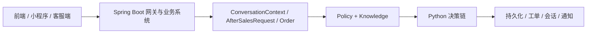

# 售后 Agent 架构说明

## 1. 系统目标

这个项目不是单一聊天机器人，而是一套“电商售后业务系统 + Agent 决策引擎”。
目标是让系统在用户提出售后问题后，能够稳定完成这些事情：

- 理解用户诉求
- 判断用户情绪
- 识别售后场景
- 校验订单与售后状态
- 判断是否缺少材料
- 判断是否需要转人工
- 在可自动处理时生成工单或推进流程

## 2. 总体结构

系统由两套核心运行时组成：

1. Spring Boot 业务系统
2. Python 售后 Agent 决策系统

职责边界：

- Spring Boot 负责业务真相源、数据库、接口、前端支撑
- Python 负责模型理解增强和规则决策

## 3. 分层说明

### 3.1 接入层

接入层负责接收请求和展示结果，不做核心决策。

包括：

- 用户端
- 小程序
- 客服端
- 商家端

### 3.2 Spring Boot 业务层

Spring Boot 是业务真相源，负责：

- 登录鉴权
- 商家编号绑定
- 商品、订单、工单、会话管理
- API 对外输出
- 数据库存储
- 商家规则配置入口
- 知识库和策略目录读取

关键文件：

- [AgentGatewayController.java](/D:/ecommerce-after-sales-system-codex-test-ai-module-merge/src/main/java/com/ecommerce/aftersales/controller/AgentGatewayController.java)
- [MerchantCsController.java](/D:/ecommerce-after-sales-system-codex-test-ai-module-merge/src/main/java/com/ecommerce/aftersales/controller/MerchantCsController.java)
- [ResourceAgentPolicyCatalogService.java](/D:/ecommerce-after-sales-system-codex-test-ai-module-merge/src/main/java/com/ecommerce/aftersales/service/impl/ResourceAgentPolicyCatalogService.java)

### 3.3 上下文构建层

这一层把前端请求、订单数据、历史消息统一整理成 Agent 可消费的领域对象。

核心对象：

- `ConversationContext`
- `AfterSalesRequest`
- `Order`

关键文件：

- [models.py](/D:/ecommerce-after-sales-system-codex-test-ai-module-merge/python_agent/after_sales_agent/models.py)

### 3.4 策略层与知识层

这一层明确分成两部分：

#### Policy

表示“某个商家当前配置了什么值”。

例如：

- 商品编号
- 自动退款上限
- 情绪转人工阈值
- 售后方案映射

#### Knowledge

表示“术语、方案、场景、字段分别是什么意思”。

例如：

- 情绪等级字典
- 售后方案字典
- 场景与证据知识
- 回复模板知识

关键文件：

- [merchant_policy.py](/D:/ecommerce-after-sales-system-codex-test-ai-module-merge/python_agent/after_sales_agent/merchant_policy.py)
- [after-sales-policy-catalog.json](/D:/ecommerce-after-sales-system-codex-test-ai-module-merge/src/main/resources/after-sales-policy-catalog.json)
- [policy-knowledge-base.json](/D:/ecommerce-after-sales-system-codex-test-ai-module-merge/src/main/resources/agent-knowledge-base/policy-knowledge-base.json)

### 3.5 Python 决策链

当前 Python 侧只保留一条主链路，不再保留并行的半成品架构。

统一门面：

- [policies.py](/D:/ecommerce-after-sales-system-codex-test-ai-module-merge/python_agent/after_sales_agent/agents/policies.py)

主编排器：

- [return_agent.py](/D:/ecommerce-after-sales-system-codex-test-ai-module-merge/python_agent/after_sales_agent/agents/return_agent.py)

实际参与主链路的子 Agent：

- [emotion_agent.py](/D:/ecommerce-after-sales-system-codex-test-ai-module-merge/python_agent/after_sales_agent/agents/emotion_agent.py)
- [intent_agent.py](/D:/ecommerce-after-sales-system-codex-test-ai-module-merge/python_agent/after_sales_agent/agents/intent_agent.py)
- [state_agent.py](/D:/ecommerce-after-sales-system-codex-test-ai-module-merge/python_agent/after_sales_agent/agents/state_agent.py)
- [evidence_agent.py](/D:/ecommerce-after-sales-system-codex-test-ai-module-merge/python_agent/after_sales_agent/agents/evidence_agent.py)
- [risk_agent.py](/D:/ecommerce-after-sales-system-codex-test-ai-module-merge/python_agent/after_sales_agent/agents/risk_agent.py)
- [handoff_agent.py](/D:/ecommerce-after-sales-system-codex-test-ai-module-merge/python_agent/after_sales_agent/agents/handoff_agent.py)
- [return_message_support.py](/D:/ecommerce-after-sales-system-codex-test-ai-module-merge/python_agent/after_sales_agent/agents/return_message_support.py)

主链顺序：

1. 解析商家策略与知识
2. 识别意图
3. 识别场景
4. 判断情绪
5. 校验状态
6. 校验证据
7. 评估风险
8. 判断是否转人工
9. 建单或直接回复

### 3.6 LLM 增强层

LLM 不替代业务真相源，它的职责是：

- 会话理解
- 意图和场景辅助理解
- 话术润色
- 失败时回退规则链

关键文件：

- [qwen_service.py](/D:/ecommerce-after-sales-system-codex-test-ai-module-merge/python_agent/after_sales_agent/services/qwen_service.py)
- [llm.py](/D:/ecommerce-after-sales-system-codex-test-ai-module-merge/python_agent/after_sales_agent/services/llm.py)

### 3.7 持久化层

这一层负责把决策结果和会话过程写回数据库。

当前会写入的核心数据包括：

- 用户消息
- AI 回复
- 会话快照
- 情绪标签
- 情绪分数
- 情绪置信度
- 工单日志
- 通知

关键文件：

- [persistence.py](/D:/ecommerce-after-sales-system-codex-test-ai-module-merge/python_agent/after_sales_agent/services/persistence.py)

## 4. 当前架构原则

当前系统坚持以下边界：

- Spring Boot 负责业务数据真相源
- Python Agent 负责决策链执行
- LLM 只做理解和润色增强
- Policy 保存商家当前值
- Knowledge 保存术语、模板、说明

## 5. 适合知识库化的内容

最适合沉淀到知识库或数据库目录的内容：

- `emotion_levels`
- `after_sales_scheme_knowledge`
- `scene_evidence_knowledge`
- `reply_template_knowledge`
- `editable_policy_fields`

## 6. 不适合直接知识库执行的内容

这些内容目前更适合作为执行逻辑保留在代码里：

- 状态流转判断
- 风险评分逻辑
- 转人工最终裁定
- 工单生成主流程
- ReturnAgent 编排

原因是它们不只是“知识说明”，而是“带上下文的执行判断”。

## 7. 当前收口结论

这次清理后的结论是：

- 已删除未接通、重复或半成品的并行实现
- Python 侧只保留 `ReturnAgent` 这一条主决策链
- 回复模板优先从知识库/策略层读取
- 核心规则文件已收敛为统一 UTF-8 主实现

## 8. 一句话总结

这个项目的本质是：

**Spring Boot 业务底座 + Python 售后决策引擎 + LLM 理解增强 + Policy/Knowledge 双层配置体系。**
