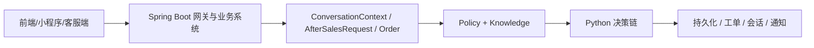

# 售后 Agent 架构说明

## 1. 系统目标

本项目不是单一聊天机器人，而是一套“电商售后业务系统 + Agent 决策引擎”。

目标是让系统在用户提出售后问题后，能够：

- 理解用户问题
- 识别情绪和风险
- 判断当前售后场景
- 核对订单和售后状态
- 判断是否缺少材料
- 判断是否需要转人工
- 在可自动处理时生成工单或推进流程

## 2. 总体架构

系统由两套核心运行时组成：

1. Spring Boot 业务系统
2. Python 售后 Agent 决策系统

其中：

- Spring Boot 负责业务真相源、数据库、接口、前端支撑
- Python 负责模型理解增强和规则链决策

## 3. 分层说明

### 3.1 接入层

这一层负责接收请求和展示结果，不做核心决策。

包含：

- 用户端
- 小程序
- 客服端
- 商家端

### 3.2 Spring Boot 业务系统层

Spring Boot 是业务真相源，负责：

- 登录鉴权
- 商家编号绑定
- 商品、订单、工单、会话管理
- API 对外输出
- 数据库存储
- 商家规则配置入口
- 知识库和策略目录读取

关键文件：

- [AgentGatewayController.java](/D:/ecommerce-after-sales-system-codex-test-ai-module-merge/src/main/java/com/ecommerce/aftersales/controller/AgentGatewayController.java)
- [MerchantCsController.java](/D:/ecommerce-after-sales-system-codex-test-ai-module-merge/src/main/java/com/ecommerce/aftersales/controller/MerchantCsController.java)
- [ResourceAgentPolicyCatalogService.java](/D:/ecommerce-after-sales-system-codex-test-ai-module-merge/src/main/java/com/ecommerce/aftersales/service/impl/ResourceAgentPolicyCatalogService.java)

### 3.3 上下文构建层

这一层把前端请求、订单数据、历史消息统一整理为 Agent 可以消费的上下文对象。

核心对象：

- `ConversationContext`
- `AfterSalesRequest`
- `Order`
- `DecisionContext`

关键文件：

- [models.py](/D:/ecommerce-after-sales-system-codex-test-ai-module-merge/python_agent/after_sales_agent/models.py)

这一层的意义是：后续各个 Agent 不直接处理 HTTP、数据库行或前端表单，而只处理统一的领域对象。

### 3.4 策略层与知识层

这一层要明确分成两部分。

#### Policy

表示“某个商家当前配置了什么值”。

例如：

- 商品编号
- 自动退款上限
- 情绪转人工阈值
- 是否允许自动审核

#### Knowledge

表示“这些术语、方案、场景、字段分别是什么意思”。

例如：

- 情绪等级字典
- 售后方案字典
- 场景与证据知识
- 字段定义知识

关键文件：

- [merchant_policy.py](/D:/ecommerce-after-sales-system-codex-test-ai-module-merge/python_agent/after_sales_agent/merchant_policy.py)
- [after-sales-policy-catalog.json](/D:/ecommerce-after-sales-system-codex-test-ai-module-merge/src/main/resources/after-sales-policy-catalog.json)
- [policy-knowledge-base.json](/D:/ecommerce-after-sales-system-codex-test-ai-module-merge/src/main/resources/agent-knowledge-base/policy-knowledge-base.json)

### 3.5 Python 决策链层

这一层是真正的售后 Agent 核心。

当前主链路基本是：

1. Emotion Agent
2. Scene Agent
3. Intent Agent
4. Description Sufficiency Check
5. State Agent
6. Evidence Agent
7. Risk Agent
8. Handoff Agent
9. Ticket Planner

统一门面：

- [policies.py](/D:/ecommerce-after-sales-system-codex-test-ai-module-merge/python_agent/after_sales_agent/agents/policies.py)

主编排器：

- [return_agent.py](/D:/ecommerce-after-sales-system-codex-test-ai-module-merge/python_agent/after_sales_agent/agents/return_agent.py)

各子 Agent：

- [emotion_agent.py](/D:/ecommerce-after-sales-system-codex-test-ai-module-merge/python_agent/after_sales_agent/agents/emotion_agent.py)
- [intent_agent.py](/D:/ecommerce-after-sales-system-codex-test-ai-module-merge/python_agent/after_sales_agent/agents/intent_agent.py)
- [state_agent.py](/D:/ecommerce-after-sales-system-codex-test-ai-module-merge/python_agent/after_sales_agent/agents/state_agent.py)
- [evidence_agent.py](/D:/ecommerce-after-sales-system-codex-test-ai-module-merge/python_agent/after_sales_agent/agents/evidence_agent.py)
- [risk_agent.py](/D:/ecommerce-after-sales-system-codex-test-ai-module-merge/python_agent/after_sales_agent/agents/risk_agent.py)
- [handoff_agent.py](/D:/ecommerce-after-sales-system-codex-test-ai-module-merge/python_agent/after_sales_agent/agents/handoff_agent.py)
- [ticket_planner.py](/D:/ecommerce-after-sales-system-codex-test-ai-module-merge/python_agent/after_sales_agent/agents/ticket_planner.py)

### 3.6 LLM 增强层

LLM 不应替代规则真相源，它的定位是：

- 会话理解
- 意图和场景辅助理解
- 回复润色
- 降级时回退到规则链

关键文件：

- [qwen_service.py](/D:/ecommerce-after-sales-system-codex-test-ai-module-merge/python_agent/after_sales_agent/services/qwen_service.py)
- [qwen_support.py](/D:/ecommerce-after-sales-system-codex-test-ai-module-merge/python_agent/after_sales_agent/services/qwen_support.py)
- [llm_client.py](/D:/ecommerce-after-sales-system-codex-test-ai-module-merge/python_agent/after_sales_agent/llm_client.py)

### 3.7 持久化层

这一层负责把决策结果和会话过程写回数据库。

当前会写入的核心数据包括：

- 用户消息
- AI 回复
- 会话快照
- 情绪标签
- 情绪分数
- 情绪置信度
- 工单日志
- 通知

关键文件：

- [persistence.py](/D:/ecommerce-after-sales-system-codex-test-ai-module-merge/python_agent/after_sales_agent/services/persistence.py)

## 4. 当前架构里的边界

当前系统应坚持以下边界：

- Spring Boot 负责业务数据真相源
- Python Agent 负责决策链执行
- LLM 只做理解和润色增强
- Policy 保存商家当前值
- Knowledge 保存说明、字典、术语、模板

## 5. 适合知识库化的内容

当前最适合知识库化的是以下几类：

### 5.1 editable_policy_fields

商家可编辑字段定义。

包括：

- 商品编号
- 自动退款上限
- 情绪转人工阈值

### 5.2 emotion_levels

情绪等级知识。

包括：

- `satisfied`
- `calm`
- `anxious`
- `dissatisfied`
- `angry`

### 5.3 after_sales_scheme_knowledge

售后方案知识。

包括：

- 仅退款
- 退货退款
- 补发
- 部分退款

### 5.4 scene_evidence_knowledge

场景与证据知识。

包括：

- `quality_issue`
- `product_damage`
- `package_damage`
- `wrong_or_missing_items`
- `logistics_issue`

### 5.5 reply_template_knowledge

回复模板知识。

包括：

- 安抚话术
- 补材料话术
- 进度说明
- 转人工提示
- 工单创建提示

### 5.6 state_term_knowledge

状态术语说明，不是状态流转逻辑本身。

### 5.7 intent_scene_glossary

意图与场景术语表。

## 6. 不适合直接知识库化的内容

以下内容目前更适合作为执行逻辑保留在代码里：

- `state_rules`
- `intent_actions`
- 风险评估逻辑
- 转人工最终判定
- Ticket 生成主链路
- ReturnAgent 编排
- Qwen prompt 与解析细节

原因是这些内容不仅是“知识”，更是“带上下文的执行判断”。

## 7. 当前已完成与未完成

### 已完成

- 商家策略目录已集中在 Spring Boot 侧
- 知识库资源文件已建立
- `emotion_levels`、`after_sales_scheme_knowledge`、`scene_evidence_knowledge` 已新增数据库表
- Spring Boot 策略服务已支持优先从数据库读取这三类知识，资源文件兜底

### 尚未完全完成

- Python Agent 还没有全面把数据库知识作为主执行输入
- `state_rules / intent_actions / reply_templates` 仍主要来自资源文件和 Python 默认常量
- `EvidenceAgent` 还没有完全改成优先消费数据库场景证据知识
- `EmotionAgent` 的情绪等级判定阈值还没全面走数据库字典

## 8. 推荐的后续迁移顺序

建议按照以下顺序继续推进：

1. 让 `EvidenceAgent` 优先读取 `scene_evidence_knowledge`
2. 让情绪阈值判断优先读取 `emotion_levels`
3. 让前端规则编辑页按 `editable_policy_fields` 动态渲染
4. 再逐步收口 `reply_templates`
5. 最后才评估是否把部分 `state_rules / intent_actions` 配置化

## 9. 最终目标架构

理想状态下，项目将形成四类清晰真相源：

1. Business DB
2. Policy DB
3. Knowledge DB
4. Python Rule Engine

对应关系：

- Business DB：订单、商品、工单、会话
- Policy DB：商家当前规则值
- Knowledge DB：术语、模板、场景、说明
- Rule Engine：决策链和执行逻辑

## 10. 一句话总结

这个项目的本质是：

**Spring Boot 业务底座 + Python 售后决策引擎 + LLM 理解增强 + Policy/Knowledge 双层配置体系。**
