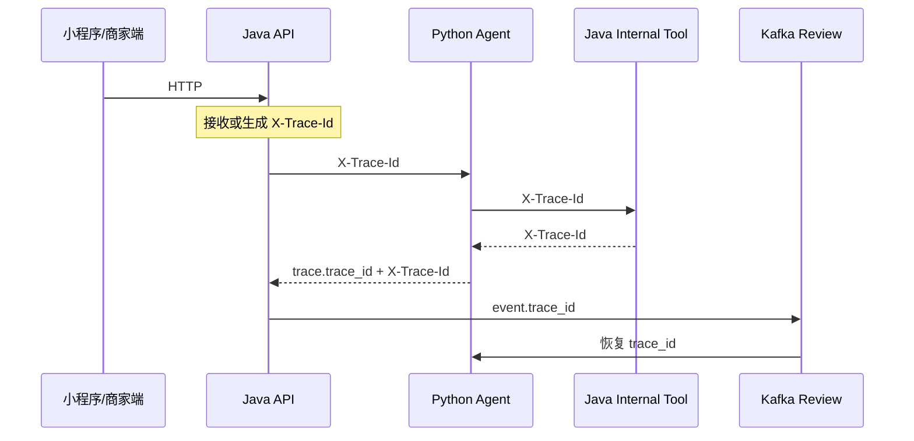
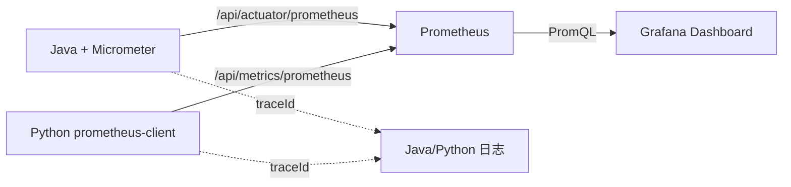

# Agent 可观测性与评测说明

## Trace 传播



Trace ID 固定为 32 位十六进制字符串。外部传入的非法值会被替换，避免日志注入。Java 使用 MDC 写入日志，Python 使用 `ContextVar` 隔离并发请求；SSE 和知识入库线程池通过任务装饰器传播 MDC。

当前 trace 是轻量相关性链路，接口与 W3C/OpenTelemetry 的 128-bit trace id 兼容，但尚未导出完整 span。后续接入 OpenTelemetry Collector 时可以保留现有 ID 和业务字段。

## 指标链路



- Micrometer 和 Python `prometheus-client` 负责在应用里记录计数器、Gauge 和延迟直方图。
- Prometheus 每 10 秒抓取一次，并在本地 TSDB 中保留 15 天。
- Grafana 查询 Prometheus，自动加载 `Ecommerce After-sales Agent Overview` 仪表盘。
- Trace 仍然负责解释“某一次请求经过了什么”；指标负责回答“一段时间内整体是否健康”，两者不会互相替代。

所有业务指标只使用固定低基数标签。用户、订单、工单、会话和 `traceId` 都不会成为指标标签。

## 启动与访问

默认开发令牌保存在 `observability/prometheus/agent-token.txt`，必须与 Compose 中的 `AGENT_INTERNAL_TOKEN` 一致。生产环境必须同时替换两处，不能继续使用仓库内的开发值。

```powershell
docker compose up -d --build
```

启动后可访问：

- Grafana：`http://localhost:3000`，默认用户 `admin`，默认密码 `local-dev-grafana`。
- Prometheus：`http://localhost:9090`，`Status -> Targets` 应看到 Java 和 Python 两个目标为 `UP`。
- Java 健康检查：`http://localhost:8080/api/actuator/health`。

可以通过 `GRAFANA_ADMIN_USER` 和 `GRAFANA_ADMIN_PASSWORD` 覆盖 Grafana 默认凭证。

## 指标出口

Java 指标：

```text
GET /api/internal/agent-metrics
X-Agent-Internal-Token: <shared-secret>
```

主要指标包括网关成功率、延迟桶、人工转接率、知识命中会话率、AI 审核落库结果、Outbox、DLQ 和消费幂等状态。

Prometheus 格式：

```text
GET /api/actuator/prometheus
Authorization: Bearer <shared-secret>
```

Python 指标：

```text
GET http://127.0.0.1:8000/api/metrics
X-Agent-Internal-Token: <shared-secret>
```

主要指标包括请求与步骤延迟、工具成功/失败、结构化错误类别、RAG 模式、审核结论和人工转接次数。延迟平均值为进程生命周期累计值，P95 使用最多 2048 条最近样本的固定窗口，避免指标自身造成无界内存增长。标签使用固定白名单，用户、订单、工单、会话和 trace id 不作为指标标签。

Prometheus 格式：

```text
GET http://127.0.0.1:8000/api/metrics/prometheus
Authorization: Bearer <shared-secret>
```

最近请求 trace：

```text
GET http://127.0.0.1:8000/api/traces
X-Agent-Internal-Token: <shared-secret>
```

JSON 指标和最近 trace 保存在应用进程内，重启后清空，只用于本地演示和诊断。Prometheus 抓取后的时间序列保存在 `prometheus-data` 卷中，但同样不作为业务事实来源。

## 告警规则

`observability/prometheus/alerts.yml` 已包含以下演示规则：

- Java 或 Python 采集目标持续不可用。
- Java Agent 网关五分钟失败率高于 10%。
- Python Agent 工具五分钟失败率高于 20%。
- 十分钟内出现 DLQ 事件。

当前未接入 Alertmanager，因此告警可以在 Prometheus/Grafana 中看到，但不会发送邮件或即时消息。

## 离线评测

无外部依赖的安全门禁：

```powershell
.\.venv\Scripts\python.exe tools/evaluate_agent_safety.py --check
```

可选生成报告：

```powershell
.\.venv\Scripts\python.exe tools/evaluate_agent_safety.py `
  --check `
  --output-prefix docs/agent-safety-baseline
```

其他专项基线：

- `tools/evaluate_rag_recall.py`：RAG Recall@5 与延迟。
- `tools/evaluate_emotion_baseline.py`：情绪分类和人工优先级。
- `tools/evaluate_vision_baseline.py`：视觉 Precision、Recall、误通过率和阈值对比。

## 下一步

1. 接入 OpenTelemetry Java/Python SDK 和 Collector，形成标准 span 树，并通过 exemplar 从慢指标跳转到具体 trace。
2. 增加脱敏真实对话标注集，评估工具选择准确率、无效重复调用率和回答事实一致性。
3. 在 CI 中保存评测报告 artifact，并对 Skills 版本变化生成对比报告。
4. 需要真实通知时再增加 Alertmanager；求职演示阶段先保留规则与可视化，避免无业务价值的基础设施堆叠。
