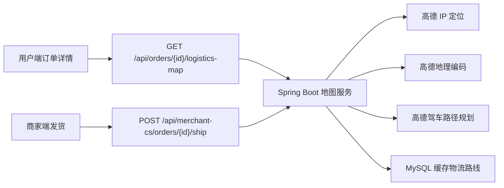

# 高德地图服务 API 接入指导文档

本文档用于把当前项目的“虚拟物流地图”升级为基于高德地图 WebService 的真实地理数据模拟。目标不是接入真实快递公司轨迹，而是用真实地址解析、路径规划和地图点线数据，让用户端订单详情页展示更接近真实物流的发货地、收货地、配送中位置和路线。

## 1. 当前项目现状

当前用户端物流地图在：

```text
frontend/uniapp/src/pages/after-sale/detail.vue
```

核心逻辑是 `buildLogisticsMap(order)`，目前通过订单号和商品名生成固定偏移坐标：

```js
const warehouse = {
  latitude: 39.982 + offset,
  longitude: 116.305 + offset,
  title: '商品发货地'
}

const receiver = {
  latitude: 39.905 - offset,
  longitude: 116.455 - offset,
  title: '收货地址'
}
```

这能演示地图效果，但不是由真实地址计算出来的。接入高德后，建议改成：

```text
商家发货地址 + 用户收货地址
  -> 后端调用高德地理编码
  -> 后端调用高德驾车路径规划
  -> 后端按订单状态计算配送进度点
  -> 用户端 map 组件展示 markers + polyline
```

## 2. 推荐接入方式

采用“后端代理高德 WebService”的方式：



不要在小程序或网页前端直接调用高德 WebService Key，原因是 Web 服务 Key 更适合服务端保存，放到客户端容易泄露。前端只调用本项目后端接口。

## 3. 高德开放平台准备

1. 登录高德开放平台：

```text
https://lbs.amap.com/
```

2. 进入“控制台 -> 应用管理 -> 我的应用”。

3. 创建应用，例如：

```text
应用名称：EcommerceAfterSales
应用类型：Web服务
```

4. 在应用下新增 Key，服务平台选择：

```text
Web服务
```

5. 拿到 `key` 后，只放到后端配置里，不提交到 Git。

## 4. 本项目配置方案

建议在 `src/main/resources/application.yml` 加默认结构，但不要写真实 Key：

```yaml
amap:
  enabled: false
  key: ${AMAP_WEB_SERVICE_KEY:}
  base-url: https://restapi.amap.com
  logistics:
    default-warehouse-address: 北京市朝阳区酒仙桥路
    cache-route: true
    timeout-ms: 3000
```

本地开发时使用环境变量：

```powershell
$env:AMAP_WEB_SERVICE_KEY="你的高德Web服务Key"
mvn spring-boot:run
```

如果后续需要单独本地配置，可以放到 `src/main/resources/application-local.yml`，并确保该文件不提交。

## 5. 需要用到的高德 WebService API

### 5.1 IP 定位 API

官方文档：

```text
https://lbs.amap.com/api/webservice/guide/api/ipconfig
```

用途：

- 不传 `ip` 时，按服务端请求来源定位。
- 可作为默认城市兜底。
- 返回 `province`、`city`、`adcode`、`rectangle`。
- `rectangle` 是城市范围矩形，可用来计算一个城市中心点。

请求地址：

```http
GET https://restapi.amap.com/v3/ip
```

常用参数：

| 参数 | 是否必填 | 说明 |
| --- | --- | --- |
| `key` | 是 | 高德 Web 服务 Key |
| `ip` | 否 | 要定位的 IP，不传则定位请求来源 |
| `output` | 否 | `JSON` 或 `XML`，项目建议用 `JSON` |

示例：

```http
GET https://restapi.amap.com/v3/ip?key=${AMAP_KEY}&output=JSON
```

示例响应重点字段：

```json
{
  "status": "1",
  "info": "OK",
  "province": "北京市",
  "city": "北京市",
  "adcode": "110000",
  "rectangle": "116.0119343,39.66127144;116.7829835,40.2164962"
}
```

项目中建议只把它作为“没有用户地址或地址解析失败时”的兜底，不要把 IP 定位当成精确收货地址。

### 5.2 地理编码 API

官方文档：

```text
https://lbs.amap.com/api/webservice/guide/api/georegeo
```

用途：

- 把商家仓库地址、用户收货地址转换成经纬度。
- 高德坐标格式是 `longitude,latitude`，小程序 `<map>` 需要拆成 `longitude` 和 `latitude`。

请求地址：

```http
GET https://restapi.amap.com/v3/geocode/geo
```

常用参数：

| 参数 | 是否必填 | 说明 |
| --- | --- | --- |
| `key` | 是 | 高德 Web 服务 Key |
| `address` | 是 | 结构化地址 |
| `city` | 否 | 指定城市可提高准确率 |
| `output` | 否 | 建议 `JSON` |

示例：

```http
GET https://restapi.amap.com/v3/geocode/geo?key=${AMAP_KEY}&address=北京市朝阳区酒仙桥路&city=北京&output=JSON
```

响应重点字段：

```json
{
  "status": "1",
  "geocodes": [
    {
      "formatted_address": "北京市朝阳区酒仙桥路",
      "province": "北京市",
      "city": "北京市",
      "adcode": "110105",
      "location": "116.496316,39.982773",
      "level": "道路"
    }
  ]
}
```

### 5.3 驾车路径规划 API

官方文档：

```text
https://lbs.amap.com/api/webservice/guide/api/direction
```

用途：

- 根据发货地和收货地生成真实道路路线。
- 物流模拟用驾车路径最合适。
- 返回路线距离、预计耗时和分段 polyline。

推荐请求地址：

```http
GET https://restapi.amap.com/v5/direction/driving
```

常用参数：

| 参数 | 是否必填 | 说明 |
| --- | --- | --- |
| `key` | 是 | 高德 Web 服务 Key |
| `origin` | 是 | 起点，格式 `longitude,latitude` |
| `destination` | 是 | 终点，格式 `longitude,latitude` |
| `show_fields` | 否 | 可取 `polyline,cost`，返回路线点和耗时等扩展信息 |

示例：

```http
GET https://restapi.amap.com/v5/direction/driving?key=${AMAP_KEY}&origin=116.496316,39.982773&destination=116.397428,39.90923&show_fields=polyline,cost
```

返回中的 `polyline` 是字符串：

```text
116.496316,39.982773;116.497210,39.981100;...
```

后端需要转换为小程序 `<map>` 可用结构：

```json
[
  { "longitude": 116.496316, "latitude": 39.982773 },
  { "longitude": 116.497210, "latitude": 39.981100 }
]
```

### 5.4 静态地图 API，可选

官方文档：

```text
https://lbs.amap.com/api/webservice/guide/api/staticmaps
```

当前小程序已经使用 `<map>` 组件，不一定需要静态地图。静态地图适合：

- 商家网页端订单详情只想展示一张图。
- 消息通知、导出报告、截图场景。

请求地址：

```http
GET https://restapi.amap.com/v3/staticmap
```

示例：

```http
GET https://restapi.amap.com/v3/staticmap?key=${AMAP_KEY}&location=116.397428,39.90923&zoom=11&size=750*300
```

## 6. 后端接口设计

### 6.1 用户端获取物流地图

建议新增接口：

```http
GET /api/orders/{orderId}/logistics-map
Authorization: Bearer <user-token>
```

响应：

```json
{
  "statusText": "配送中",
  "fromText": "商品发货地：北京市朝阳区酒仙桥路",
  "toText": "收货地址：北京市海淀区中关村",
  "latitude": 39.95,
  "longitude": 116.42,
  "scale": 11,
  "distanceMeters": 18500,
  "durationSeconds": 2100,
  "source": "AMAP",
  "markers": [
    {
      "id": 1,
      "latitude": 39.982773,
      "longitude": 116.496316,
      "title": "商品发货地",
      "width": 28,
      "height": 28
    },
    {
      "id": 2,
      "latitude": 39.90923,
      "longitude": 116.397428,
      "title": "收货地址",
      "width": 28,
      "height": 28
    },
    {
      "id": 3,
      "latitude": 39.94,
      "longitude": 116.43,
      "title": "配送车辆",
      "width": 30,
      "height": 30
    }
  ],
  "polyline": [
    {
      "points": [
        { "latitude": 39.982773, "longitude": 116.496316 },
        { "latitude": 39.94, "longitude": 116.43 },
        { "latitude": 39.90923, "longitude": 116.397428 }
      ],
      "color": "#c97b5a",
      "width": 5,
      "dottedLine": false
    }
  ]
}
```

### 6.2 商家端发货时生成路线

当前商家端已有发货接口：

```http
POST /api/merchant-cs/orders/{orderId}/ship
```

建议在发货时执行：

1. 读取订单的 `receiverAddress`。
2. 读取商家默认发货地址。
3. 调用地理编码得到起点和终点坐标。
4. 调用驾车路径规划得到路线。
5. 缓存路线到数据库。
6. 返回订单详情。

这样用户端进入订单详情时，不需要每次都调用高德，直接读缓存即可。

## 7. 数据库设计建议

当前 `order_info` 已有：

```sql
receiver_address
tracking_company
tracking_no
ship_time
receive_time
```

建议新增物流地图缓存表，而不是把 JSON 全塞进 `order_info`：

```sql
CREATE TABLE IF NOT EXISTS order_logistics_route (
    id BIGINT PRIMARY KEY AUTO_INCREMENT,
    order_id BIGINT NOT NULL,
    merchant_code VARCHAR(64) NOT NULL,
    warehouse_address VARCHAR(500) NULL,
    receiver_address VARCHAR(500) NULL,
    origin_lng DECIMAL(10, 6) NULL,
    origin_lat DECIMAL(10, 6) NULL,
    destination_lng DECIMAL(10, 6) NULL,
    destination_lat DECIMAL(10, 6) NULL,
    distance_meters INT NULL,
    duration_seconds INT NULL,
    route_polyline MEDIUMTEXT NULL,
    provider VARCHAR(32) NOT NULL DEFAULT 'AMAP',
    create_time DATETIME NOT NULL DEFAULT CURRENT_TIMESTAMP,
    update_time DATETIME NOT NULL DEFAULT CURRENT_TIMESTAMP ON UPDATE CURRENT_TIMESTAMP,
    UNIQUE KEY uk_order_logistics_route_order (order_id),
    INDEX idx_order_logistics_route_merchant (merchant_code)
);
```

说明：

- `route_polyline` 存 JSON 字符串，内容为 `[{ "longitude": 116.1, "latitude": 39.9 }]`。
- `provider` 预留以后更换地图服务。
- 一单一条路线缓存即可。

后续如果要支持多商家，商家默认发货地址建议单独建表：

```sql
CREATE TABLE IF NOT EXISTS merchant_profile (
    id BIGINT PRIMARY KEY AUTO_INCREMENT,
    merchant_code VARCHAR(64) NOT NULL UNIQUE,
    merchant_name VARCHAR(100) NOT NULL,
    warehouse_address VARCHAR(500) NOT NULL,
    warehouse_lng DECIMAL(10, 6) NULL,
    warehouse_lat DECIMAL(10, 6) NULL,
    create_time DATETIME NOT NULL DEFAULT CURRENT_TIMESTAMP,
    update_time DATETIME NOT NULL DEFAULT CURRENT_TIMESTAMP ON UPDATE CURRENT_TIMESTAMP
);
```

当前项目暂时用 `sys_user.role` 承载商家/客服角色，可以先不拆管理员端，但商家资料、仓库地址、售后地址不建议长期放在 `sys_user`，因为它们属于商家主体，不属于登录账号。

## 8. 后端代码结构建议

新增配置类：

```text
src/main/java/com/ecommerce/aftersales/config/AmapProperties.java
```

职责：

- 读取 `amap.enabled`
- 读取 `amap.key`
- 读取 `amap.base-url`
- 读取默认仓库地址和超时时间

新增服务：

```text
src/main/java/com/ecommerce/aftersales/service/MapService.java
src/main/java/com/ecommerce/aftersales/service/impl/AmapMapServiceImpl.java
```

建议方法：

```java
GeoPoint geocode(String address, String city);

AmapIpLocation locateByIp(String ip);

RoutePlan drivingRoute(GeoPoint origin, GeoPoint destination);

OrderLogisticsMap buildOrderLogisticsMap(OrderInfo order);
```

新增控制器方法：

```text
OrderController
GET /orders/{id}/logistics-map
```

注意项目配置了统一 context path `/api`，所以完整访问路径是：

```text
http://127.0.0.1:8080/api/orders/{id}/logistics-map
```

## 9. Java 调用示例

建议使用 `RestClient` 或 `WebClient`。如果保持简单，可以先用 JDK `HttpClient`。

伪代码：

```java
public GeoPoint geocode(String address, String city) {
    URI uri = UriComponentsBuilder
            .fromHttpUrl(amapBaseUrl + "/v3/geocode/geo")
            .queryParam("key", amapKey)
            .queryParam("address", address)
            .queryParam("city", city)
            .queryParam("output", "JSON")
            .build()
            .encode(StandardCharsets.UTF_8)
            .toUri();

    AmapGeoResponse response = restClient.get()
            .uri(uri)
            .retrieve()
            .body(AmapGeoResponse.class);

    if (response == null || !"1".equals(response.getStatus()) || response.getGeocodes().isEmpty()) {
        throw new BizException("地址解析失败");
    }

    return GeoPoint.parse(response.getGeocodes().get(0).getLocation());
}
```

路径 polyline 解析：

```java
private List<GeoPoint> parsePolyline(String polyline) {
    if (!StringUtils.hasText(polyline)) {
        return List.of();
    }
    return Arrays.stream(polyline.split(";"))
            .map(item -> item.split(","))
            .filter(parts -> parts.length == 2)
            .map(parts -> new GeoPoint(
                    new BigDecimal(parts[1]).doubleValue(),
                    new BigDecimal(parts[0]).doubleValue()
            ))
            .toList();
}
```

注意高德返回顺序是：

```text
longitude,latitude
```

小程序地图点对象是：

```js
{ latitude, longitude }
```

不要写反。

## 10. 配送进度点计算

高德返回的是完整路线，不会返回“当前快递员位置”。本项目只是模拟物流，所以可以按订单状态和时间计算进度：

```text
PAID       -> 进度 0%，只展示起点和终点，线路用虚线
SHIPPED    -> 按发货时间到当前时间计算 20%~80%
RECEIVED   -> 进度 100%，车辆点可改成“已签收”
AFTERSALE  -> 保持最后物流路线，同时展示售后进度
```

示例：

```java
private double resolveProgress(OrderInfo order) {
    if ("PAID".equals(order.getStatus())) {
        return 0;
    }
    if ("RECEIVED".equals(order.getStatus())) {
        return 1;
    }
    if (!"SHIPPED".equals(order.getStatus()) || order.getShipTime() == null) {
        return 0;
    }
    long minutes = Duration.between(order.getShipTime(), LocalDateTime.now()).toMinutes();
    double progress = 0.2 + Math.min(minutes / 240.0, 0.6);
    return Math.max(0.2, Math.min(progress, 0.8));
}
```

根据路线点数组取当前位置：

```java
private GeoPoint pointAtProgress(List<GeoPoint> points, double progress) {
    if (points.isEmpty()) {
        return null;
    }
    int index = (int) Math.floor((points.size() - 1) * progress);
    return points.get(Math.max(0, Math.min(index, points.size() - 1)));
}
```

## 11. 小程序改造点

当前页面：

```text
frontend/uniapp/src/pages/after-sale/detail.vue
```

建议把现有 `buildLogisticsMap(order)` 改成异步接口调用：

```js
async function loadLogisticsMap(orderId) {
  try {
    const data = await request({ url: `/orders/${orderId}/logistics-map` })
    logisticsMap.value = data
  } catch (e) {
    buildFallbackLogisticsMap(orderInfo.value)
  }
}
```

保留现有本地模拟函数，改名为：

```js
buildFallbackLogisticsMap(order)
```

这样高德接口失败时页面仍然可演示，不会空白。

## 12. 商家端改造点

商家端发货位置：

```text
frontend/staff-auth-test-ui/src/views/OrdersView.vue
frontend/staff-auth-test-ui/src/views/OrderDetailView.vue
```

当前点击“发货”已经调用：

```js
shipOrder(orderId)
```

后端发货成功后，应同步生成物流地图缓存。如果生成高德路线失败，不建议阻塞发货，可以：

1. 发货照常成功。
2. 后端记录日志。
3. `order_logistics_route.provider` 写成 `FALLBACK` 或不写路线。
4. 用户端展示本地兜底地图。

## 13. 错误处理和降级策略

高德接口可能失败的情况：

- Key 未配置。
- Key 权限未开通 Web 服务。
- 调用频率超限。
- 地址太模糊，地理编码无结果。
- 网络超时。
- 路线距离太短或跨区域无法规划。

建议错误策略：

| 场景 | 处理方式 |
| --- | --- |
| `amap.enabled=false` | 直接使用本地模拟路线 |
| Key 为空 | 后端启动不失败，但调用地图接口返回 fallback |
| 地理编码失败 | 使用 IP 定位城市中心点兜底 |
| 路径规划失败 | 用起点终点直线 polyline 兜底 |
| 高德超时 | 返回缓存；无缓存则本地模拟 |

后端响应建议带 `source`：

```json
{
  "source": "AMAP"
}
```

可选值：

```text
AMAP       使用高德路线
CACHE      使用数据库缓存
FALLBACK   本地模拟
```

## 14. 联调步骤

### 14.1 验证 Key

```powershell
$key="你的高德Web服务Key"
Invoke-RestMethod "https://restapi.amap.com/v3/ip?key=$key&output=JSON"
```

成功时应返回：

```json
{
  "status": "1",
  "info": "OK"
}
```

### 14.2 验证地理编码

```powershell
$key="你的高德Web服务Key"
$address=[uri]::EscapeDataString("北京市朝阳区酒仙桥路")
Invoke-RestMethod "https://restapi.amap.com/v3/geocode/geo?key=$key&address=$address&city=北京&output=JSON"
```

看 `geocodes[0].location` 是否存在。

### 14.3 验证路径规划

```powershell
$key="你的高德Web服务Key"
Invoke-RestMethod "https://restapi.amap.com/v5/direction/driving?key=$key&origin=116.496316,39.982773&destination=116.397428,39.90923&show_fields=polyline,cost"
```

看响应里是否有路线和 polyline。

### 14.4 项目联调

1. 配置环境变量 `AMAP_WEB_SERVICE_KEY`。
2. 启动 Spring Boot。
3. 用户端购买商品，生成 `PAID` 订单。
4. 商家端订单核验或订单详情点击“发货”。
5. 后端生成 `trackingCompany`、`trackingNo`、`shipTime` 和高德路线缓存。
6. 用户端进入订单详情。
7. 用户端调用 `/api/orders/{id}/logistics-map`。
8. 小程序 `<map>` 展示发货地、收货地、配送车辆和 polyline。

## 15. 接口安全注意事项

- 高德 Web 服务 Key 只放后端。
- 不要把 Key 写入前端 `.env`。
- 不要把真实 Key 提交到 Git。
- 后端接口仍使用当前 JWT 鉴权，用户只能查自己的订单物流。
- 商家只能对自己 `merchant_code` 下的订单发货并生成路线。
- 如果对外部署，需要在高德控制台配置 Key 的安全限制。

## 16. 建议实施顺序

1. 增加配置：`amap.enabled`、`amap.key`、`amap.base-url`。
2. 增加地图 DTO：`GeoPoint`、`OrderLogisticsMap`、`RoutePlan`。
3. 增加 `MapService`，先实现地理编码和驾车路径规划。
4. 增加 `order_logistics_route` 表。
5. 改造商家发货接口，发货后生成路线缓存。
6. 新增用户端 `/orders/{id}/logistics-map`。
7. 改造小程序订单详情页，优先读后端路线，失败再用当前本地模拟。
8. 写联调用例：未发货、配送中、已收货、地址解析失败。

## 17. 本项目最终建议

当前阶段建议先做“真实地址 + 高德路线 + 模拟配送进度”，不要直接接真实快递轨迹。原因：

- 真实快递轨迹还需要快递公司接口或第三方物流 API。
- 当前业务核心是售后和客服联调，物流只需要让购买、发货、配送、售后流程真实可信。
- 高德 WebService 已足够支撑地图展示和路线模拟。

最终用户体验应是：

```text
用户购买商品 -> 订单状态为未发货
商家端点击发货 -> 订单状态变为配送中 -> 后端生成高德路线
用户端订单详情 -> 展示真实地图路线和模拟配送车位置
用户确认收货 -> 订单状态变为已收货 -> 地图显示已签收
用户申请售后 -> 售后详情显示工单进度，仍可保留物流信息入口
```

## 18. 官方资料

- 高德 WebService IP 定位：`https://lbs.amap.com/api/webservice/guide/api/ipconfig`
- 高德 WebService 地理编码/逆地理编码：`https://lbs.amap.com/api/webservice/guide/api/georegeo`
- 高德 WebService 路径规划：`https://lbs.amap.com/api/webservice/guide/api/direction`
- 高德 WebService 静态地图：`https://lbs.amap.com/api/webservice/guide/api/staticmaps`
