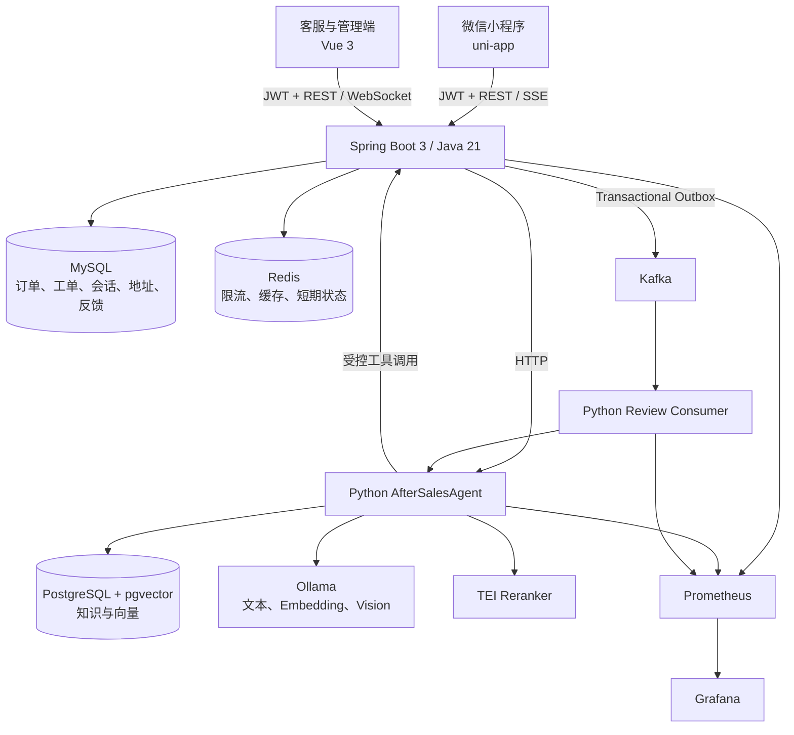
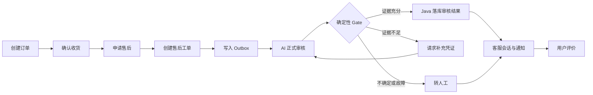
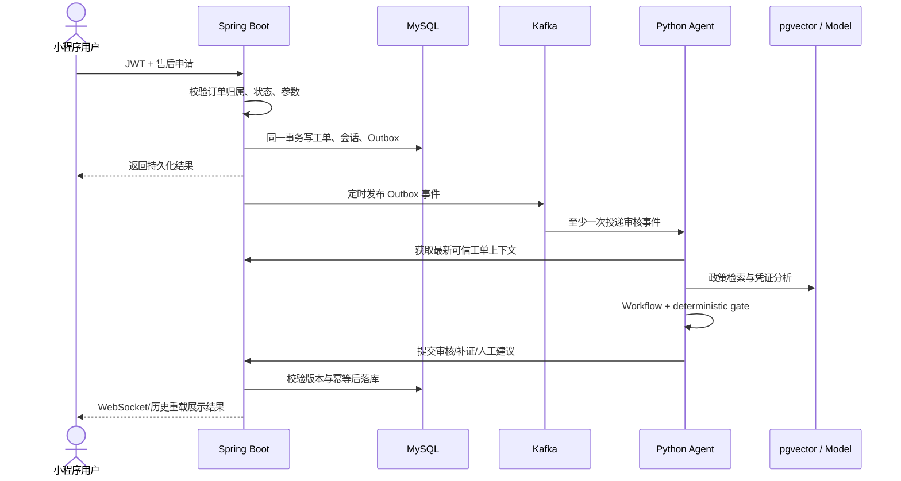
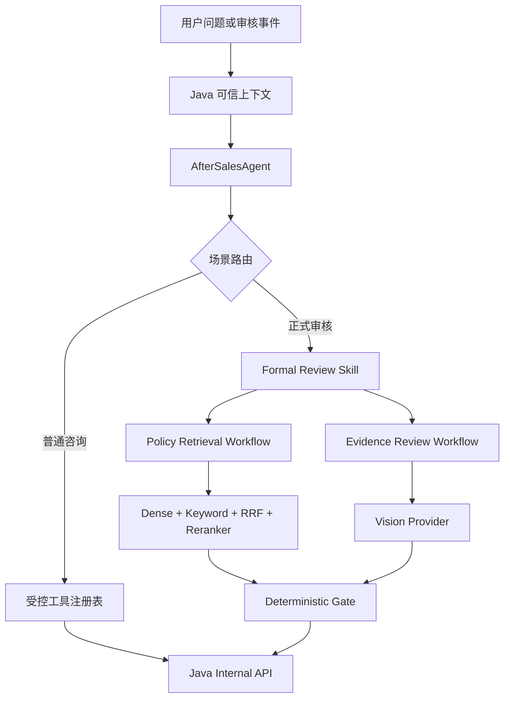
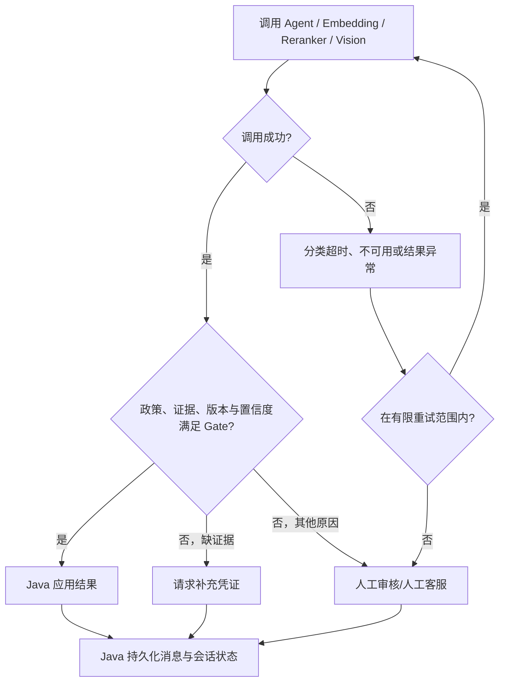

# 系统架构说明

本文描述当前源码中的边界与调用链。业务事实以 Java 服务和 MySQL 为准；Python Agent 不直接修改业务库。

## 1. 系统总览

### 组件职责

| 组件 | 当前职责 | 数据边界 |
| --- | --- | --- |
| 微信小程序 | 登录、商品、订单、售后、客服、地址、资料与反馈 | 不把本地 Storage 当作业务事实 |
| Spring Boot | 鉴权、用户隔离、订单/工单状态机、消息持久化、Agent 网关 | 唯一业务写入口 |
| Python Agent | 对话编排、RAG、情绪与证据分析、工具规划 | 通过 Java 内部 API 读写业务状态 |
| MySQL | 业务记录、审计、Outbox、地址、反馈 | 长期业务事实 |
| pgvector | 已发布知识、切片、Embedding 与检索元数据 | 不保存订单和工单 |
| Redis | 限流、消费幂等、短期缓存 | 不承担长期业务持久化 |
| Kafka | 异步审核事件与失败隔离 | 不作为最终状态来源 |

## 2. 业务架构

地址与反馈属于同一用户域：JWT 经 `@CurrentUserId` 解析身份，地址 SQL 使用 `id + user_id` 校验所有权；反馈提交写入 MySQL，管理员查询再次校验 `ADMIN` 身份。

## 3. 数据流

## 4. AI 调用链

模型只生成建议或工具计划。Java 校验用户/商家归属、状态和幂等键后才能修改最终业务状态。

## 5. 故障降级链路

Kafka Consumer 使用 Redis 认领事件并支持过期接管；达到重试上限后进入 DLQ 或人工处理。模型不可用时，前端仍可读取已持久化消息和会话状态。

## 6. 一致性与安全

- 售后创建与 Outbox 写入同一 MySQL 事务，避免业务成功但事件丢失。
- 事件以 `event_id`、审核请求 ID 和业务版本做幂等与陈旧结果判断。
- 地址默认唯一由事务内先清除旧默认值，并由数据库生成列唯一索引兜底。
- 小程序用户 ID 来自服务端 JWT，不接收前端传入的 `userId` 作为权限依据。
- Agent 内部接口使用共享内部 Token；日志和指标避免记录密钥及自由文本敏感值。
- Prometheus 采集 Java、Agent 和 Consumer 指标，Grafana 展示延迟、错误、降级、Outbox、DLQ 与人工接管。

## 7. 相关源码

- Java API：`src/main/java/com/ecommerce/aftersales/controller/`
- 业务服务：`src/main/java/com/ecommerce/aftersales/service/`
- Agent：`python_agent/after_sales_agent/`
- 数据库迁移：`src/main/resources/db/migration/`
- 可观测性：`observability/`
- 小程序：`frontend/uniapp/`
