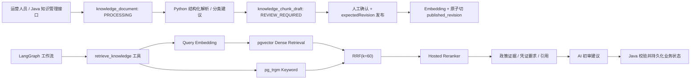
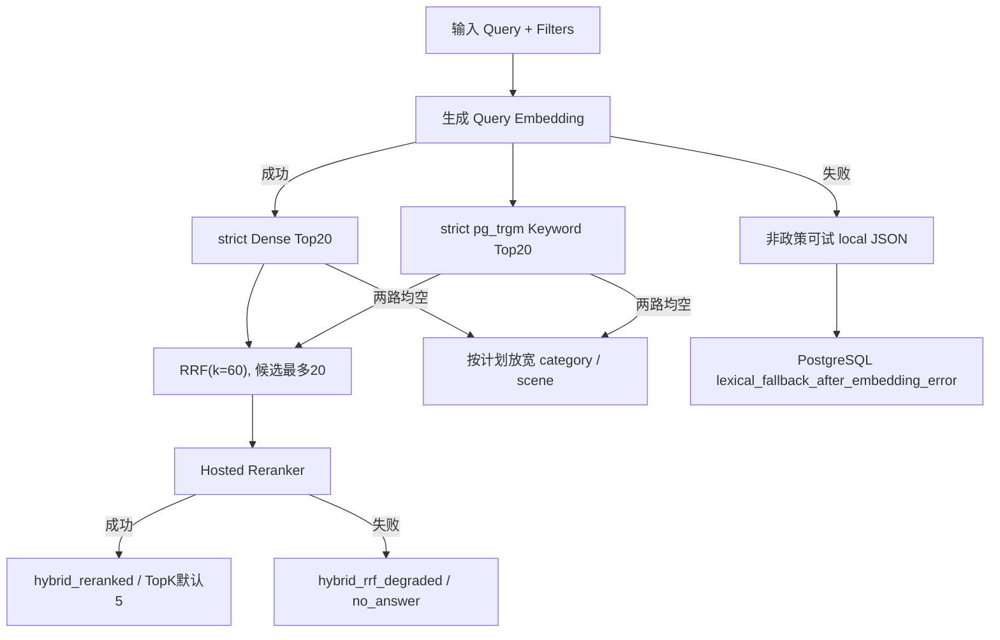
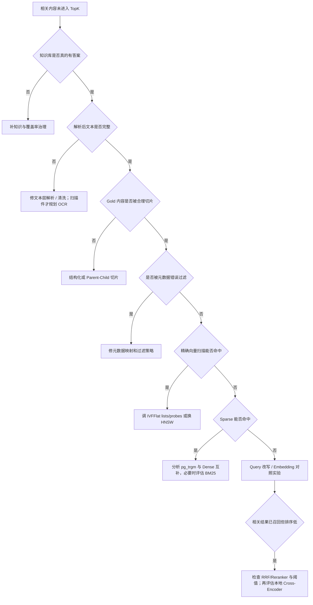

# 智能电商售后 Agent：RAG 全链路深挖

> 面向“Java 后端 + AI Agent 应用开发”岗位的面试资料。本文只把仓库已经存在的代码描述为“已实现”；尚未落地的能力统一标记为“代码中暂未发现”或“建议优化”，不能在面试中说成现状。

> 简历口径说明（依据 2026-07-16 版实时简历）：简历没有声明本项目的 RAG Recall、HitRate、MRR 或 NDCG。仓库当前有 18 条 smoke case，但没有可计算检索指标的 Gold Chunk 标注，dry-run 报告也是 `metrics=null`。面试时不能把它说成“RAG 100%”，若被追问，应明确说明当前只能验证评测流程和安全门禁，不能证明检索效果。

## 0. 先给结论：这个项目的 RAG 到底深不深

当前 RAG **不是简单地调用一次向量接口**，已经具备一条可运行的工程链路：

1. Java 拥有知识文档的 `PROCESSING -> REVIEW_REQUIRED -> PUBLISHING -> PUBLISHED` 生命周期、revision CAS 和发布可见性；
2. Python 解析文本层 PDF、Markdown、UTF-8 TXT，执行结构化递归切片并给出分类建议，但不推进 Java 状态；
3. 解析结果先写 `knowledge_chunk_draft`，人工确认后才对明确 revision 生成 Embedding；
4. Java 调用 Python `/embeddings`，默认使用 DashScope `text-embedding-v3` 生成 1024 维向量；
5. `knowledge_chunk` 保留原文和结构元数据，检索只读取 `published_revision`；
6. 当前分层检索是 pgvector Dense + pg_trgm Keyword，各取 20 个候选，经 `RRF(k=60)` 后调用托管 Reranker；
7. 查询支持商家、品类、场景、意图、业务来源类型、政策版本、有效期和 Chunk 标签的共同硬过滤；
8. 成功模式为 `hybrid_reranked`；Reranker 失败显式进入 `hybrid_rrf_degraded`，降级结果不能授权自动审核；
9. citation、候选数、各阶段耗时、filter level、阈值、Reranker 状态和 fallback reason 都可审计。

它仍有清晰边界：

- PDF 仅支持文本层，不做 OCR；DOCX、HTML 和扫描件未实现；
- keyword 使用 `pg_trgm similarity + ILIKE + heading_path` 加分，不是 BM25/Elasticsearch；
- Reranker 是托管服务，不是本地 Cross-Encoder；
- 结构化切片已经落地，但 Parent-Child、字符 offset 和语义模型切片尚未实现；
- 当前 18 条 smoke case 只用于验证评测流程和安全门禁，不能证明结构化切片、发布 revision 或 Reranker 的效果；
- 缺少新链路 Gold document/chunk、难例集、消融实验和端到端回答质量评测。

因此，面试中最稳妥的定位是：

> 我完成了从结构化解析、草稿审阅、revision 发布到 Dense/pg_trgm、RRF、托管 Reranker、可信政策门禁和 citation/trace 的工程闭环。它仍不是大规模搜索系统：不支持 OCR/DOCX/HTML，也没有 BM25/ES、本地 Cross-Encoder 和足以证明新链路收益的评测集。

### 0.1 与实时简历逐项对齐

实时简历在“智能电商售后 Agent”中对 RAG 的原文能力范围是：

- 使用 `text-embedding-v3` 和 pgvector 检索商家售后政策；
- 元数据过滤；
- 分级放宽召回；
- 关键词降级；
- 查询向量缓存；
- 检索 Trace；
- 结合政策为补证、审批或人工复核提供建议。

这些内容都能在当前仓库找到对应代码；仓库现在还实现了结构化入库、Draft/Publish、RRF 和托管 Reranker。简历没有写本项目的 RAG Recall、HitRate、MRR 或 NDCG 数字，所以回答时应分三层：

1. **简历已写且代码已实现**：可以主动展开；
2. **仓库当前的 18 条 smoke case**：被问到评测时说明其构成、无 Gold Chunk 和 `metrics=null`，不能包装成效果指标；
3. **尚未实现的 OCR/DOCX/HTML、BM25/ES、本地 Cross-Encoder、Parent-Child**：只能作为优化方案。

特别注意不要混淆简历中的两个项目：

- “智能电商售后 Agent”当前仓库已演进为 pgvector + pg_trgm + RRF + 托管 Reranker，但仍没有 Elasticsearch/BM25；
- 第二个“基于 RAG / Agent 的智能问答系统”在简历中单独写了 pgvector + Elasticsearch + RRF；那是另一个项目的描述，不能用来回答本项目当前实现。

简历中的 `Precision 100% / Recall 74.29% / F1 85.25%` 属于 **54 张售后图片的视觉审核评测**，不是 RAG 评测。回答时必须带上“视觉模型、54 张、阈值 0.90”，避免被理解为检索指标。

---

## 1. 两分钟项目 RAG 介绍模板

> 项目里的 RAG 主要解决两个问题：一是售后初审时查找当前商家、当前品类和当前场景适用的政策；二是根据知识条目给出需要补充的凭证，并保留政策来源供人工审核。
>
> 在知识入库侧，Java 拥有状态机和 revision。上传文本层 PDF、Markdown 或 UTF-8 TXT 后，事务提交再让 Python 解析；Python 用 `structured_recursive_v1` 按标题、段落、句子/行和 Token 递归切片，默认 target 500、hard max 800、min merge 150 tokens。结果先写 Draft，人工确认分类、版本和有效期后，Java 用 `expectedRevision` CAS 发起发布，再对明确 revision 生成 1024 维 `text-embedding-v3` 向量并原子切换 `published_revision`。
>
> 在查询侧，Dense 和 pg_trgm Keyword 共用已发布 revision、商家、来源类型、版本、有效期与 Chunk 标签硬过滤，各取 20 个候选，经 `RRF(k=60)` 融合后调用托管 Reranker，最终 TopK 默认 5。严格过滤没有结果时按计划放宽 category/scene；非政策知识还可放宽 intent。Embedding 失败可进入 `lexical_fallback_after_embedding_error`，Reranker 失败进入 `hybrid_rrf_degraded`，二者都不能作为自动审批依据。
>
> 安全上，RAG 只提供证据，不直接修改工单。可信政策要求 strict filter、Dense/Keyword 双通道、政策来源、Reranker 成功、来源阈值和有效 citation；工作流还复核商家、版本、业务时间有效期、图片与风险规则。政策默认阈值是 0.75，不是所有来源统一 0.65。系统保存 query、mode、hits、citation 与各阶段 trace，便于复盘。
>
> 目前局限是没有 OCR/DOCX/HTML、keyword 不是 BM25/ES、Reranker 依赖托管服务。简历里没有写 RAG 指标；仓库当前 18 条 smoke case 中没有可计算 Recall/HitRate 的 Gold Chunk，dry-run 也不产出指标。下一步应先补齐 Gold document/chunk、难负例和版本安全例，再做切片、检索和 Reranker 消融。

---

## 2. RAG 在系统中的边界



职责边界：

- Java：知识管理 API、文档记录、异步任务、业务权限、审核结果和工单状态；
- Python：Embedding、检索、降级、LangGraph 编排和证据使用；
- PostgreSQL + pgvector：知识文档和向量事实来源；
- MySQL：订单、工单、审核和聊天等业务事实来源；
- Redis：当前代码中不是知识向量库；Query Embedding 缓存是 Python 进程内 LRU，不是 Redis；
- Kafka：异步触发 AI 初审，不直接承担知识检索。

面试中不要说“RAG 决定退款”。更准确的是：

> RAG 找政策证据，Agent 生成初审建议，Java 持有业务状态机和最终落库权限。

---

## 3. 知识入库全链路

### 3.1 Java 入口

核心入口在：

- `KnowledgeManagementController`：文件导入、状态查询、Draft 查看/编辑和发布；
- `KnowledgeService`：校验文件、写 `knowledge_document`，事务提交后按明确 revision 派发解析；
- `KnowledgeIngestionAsyncService`：调用 Python `/knowledge/parse` 或 `/embeddings`，把结果交给 Java 生命周期 Service；
- `KnowledgeDraftService`：只在当前 `PROCESSING + revision` 上替换 Draft，并推进到 `REVIEW_REQUIRED`；
- `KnowledgePublishService`：`expectedRevision` CAS、发布门禁、Embedding 后原子切换 `published_revision`。

核心设计是 **先保存文档事实，解析与发布分离**。状态、`revision` 和 `published_revision` 是 `knowledge_document` 的独立列；错误码和错误消息进入 metadata。Python 只返回解析/分类建议，不拥有生命周期。

```text
上传 -> PROCESSING
解析成功 -> REVIEW_REQUIRED
人工按 expectedRevision 编辑 -> revision + 1，仍为 REVIEW_REQUIRED
发布 CAS -> PUBLISHING + revision + 1
Embedding/写 Chunk/切读指针成功 -> PUBLISHED
解析失败 -> PARSE_FAILED
Embedding 失败 -> EMBEDDING_FAILED
```

解析只写 `knowledge_chunk_draft`。政策类发布门禁要求合法版本和完整有效期，所有 Chunk 分类标签均已确认；通过后才创建正式 `knowledge_chunk`。

### 3.2 为什么必须在事务提交后启动异步任务

如果 Java 在数据库事务尚未提交时就让异步线程读取文档，异步线程使用另一个连接，可能看不到未提交记录。上传和发布都使用 after-commit 调度，并把 `documentId + targetRevision` 显式传给 Worker，避免“任务先跑、数据后提交”和“Worker 猜当前版本”。

晚到 Worker 也不能覆盖新状态：解析替换要求 `PROCESSING + targetRevision`，发布提交要求 `PUBLISHING + targetRevision`；失败回写使用同样的条件。条件不再成立时返回 stale，不改当前 revision。

但要注意：这不是可靠任务队列。若 Java 在文档事务提交后、真正调度异步线程前宕机，任务可能丢失。更可靠的改进是：

1. 为知识索引建立独立 Job/Outbox 表；
2. 文档和索引任务在同一事务写入；
3. Worker 扫描并以 CAS 领取任务；
4. 支持重试次数、下次重试时间和死信状态。

这是建议优化，当前知识入库没有复用售后链路的 Transactional Outbox。

### 3.3 文件解析现状

当前支持：

- `.pdf`：仅文本层，使用 `pypdf`，保留页码、编号标题路径，并过滤跨页稳定页眉/页脚；
- `.md`：UTF-8/UTF-8-BOM，识别 ATX/Setext 标题、段落、列表、引用、代码块和表格；
- `.txt`：UTF-8/UTF-8-BOM，识别显式编号标题和段落。

不支持 OCR、扫描 PDF、DOCX 和 HTML。PDF 的 fail-closed 规则很重要：真正没有内容流/图片的空白页允许；只要某页有内容流或图片却提取不到文本，就返回 `PDF_TEXT_LAYER_MISSING`，避免混合 PDF 静默漏掉关键条款。整份 PDF 都没有文本同样失败。

稳定解析错误包括：

```text
UNSUPPORTED_FILE_TYPE
PDF_ENCRYPTED
PDF_TEXT_LAYER_MISSING
FILE_DECODE_FAILED
DOCUMENT_CONTENT_EMPTY
DOCUMENT_CHUNKING_FAILED
FILE_TOO_LARGE
```

当前已能定位标题路径和 PDF 页码，但没有字符 offset，也不能引用扫描图片中的区域。

### 3.4 上传大小契约与后续解析升级

端到端不能只看 Java multipart 限制：

| 层 | 配置 | 当前默认 | 原因 |
|---|---|---:|---|
| Java 原文件 | `KNOWLEDGE_MAX_FILE_BYTES` | 10 MiB / `10485760` | 上传业务上限 |
| Agent 普通端点 | `AGENT_MAX_REQUEST_BYTES` | 2 MiB / `2097152` | 限制一般 JSON 请求 |
| Agent 解析端点 | `KNOWLEDGE_PARSE_MAX_REQUEST_BYTES` | `15029592` | 10 MiB Base64 后再加 1 MiB JSON envelope |

`/api/knowledge/parse` 是唯一使用专用上限的端点，超限返回 `FILE_TOO_LARGE`。调整 Java 原文件上限时必须同步重算 Agent parse envelope，否则会出现“Java 接收成功、Agent 必然 413”的错误配置。

后续解析升级应聚焦当前没有的能力：OCR/版面分析、DOCX/HTML、表格单元格语义、字符 offset、解析器版本和近重复治理。已实现的标题/段落/列表/代码/表格边界、PDF 页码和稳定页眉页脚过滤不应再当作未来方案。

---

## 4. 切片：当前结构化递归策略、取舍与优化

### 4.1 当前切片算法

默认策略为 `structured_recursive_v1`：

| 参数 | 默认值 | 含义 |
|---|---:|---|
| `target_tokens` | 500 | 相邻结构块组合目标 |
| `hard_max_tokens` | 800 | Token 硬上限 |
| `min_merge_tokens` | 150 | 兼容小块的合并阈值 |
| `hard_max_chars` | 6400 | Token 估算失真时的字符保险丝 |

处理顺序：

1. Parser 先产出带标题路径、页范围和内容类型的结构块；
2. 同一标题路径、页范围相邻且内容类型允许时，组合到约 500 tokens；
3. 超硬上限的段落/引用按句子拆，列表和代码按行拆；
4. 超长表格按行分组，每片重复两行表头；
5. 仍超限时才用 Token 估算递归切分，并受 6400 字符硬上限保护；
6. 小于 150 tokens 的候选只与上下文兼容的邻块合并，且合并后不能越过硬上限。

当前没有固定 overlap。跨 Chunk 连续性依靠标题路径、页码和确定性上下文，而不是复制固定比例原文。

### 4.2 当前策略的优点

- 对标题、段落、列表、代码和表格边界敏感，减少条件/例外被固定窗口切断；
- 每个 Chunk 保留 `heading_path/page_start/page_end/content_types/estimated_tokens`；
- 表格行拆分仍携带表头，单个数据行不会失去列语义；
- 没有固定 overlap，降低重复 Embedding、重复命中和存储成本；
- 所有规则确定性执行，便于复现、测试和 revision 重建。

### 4.3 当前策略的问题

1. Token 是轻量估算而非模型官方 tokenizer，极端文本仍需 6400 字符保险丝；
2. PDF 只识别显式编号标题，没有版面模型，视觉标题可能被当普通段落；
3. 相邻组合以标题路径/页范围为主，不理解“适用条件”和“例外条款”的深层语义；
4. 不做固定 overlap，跨块依赖关系需要依靠 contextualized embedding 或未来 Parent-Child；
5. 所有文档仍共用一套默认参数，FAQ、政策和代码型知识未按类型自适应；
6. 当前字段保存策略名，但缺少系统化的多策略线上实验和迁移治理。

### 4.4 如何继续验证和优化

不要因为默认值已经是 500 就认定最优。正确做法是建立实验矩阵，例如：

| 实验 | Chunk | Overlap | 策略 | 比较指标 |
|---|---:|---:|---|---|
| A | 700 字符 | 20% | 历史固定窗口基线（非现状） | Recall@5、MRR、重复率、成本 |
| B | 500/800 token | 无固定重叠 | 当前 `structured_recursive_v1` | 同上 |
| C | 300–600 token | 句级动态上下文 | 结构化递归变体 | 同上 |
| D | 子块 300 token | 父块 1200 token | Parent-Child | 同上 |

选择标准不只是 Recall：还要看 Top1 准确率、上下文完整度、平均返回 Token、索引大小和重建耗时。

### 4.5 Parent-Child Retrieval 是否适合本项目

适合长政策：

- 小 Child Chunk 用于精确召回；
- 命中后返回较完整的 Parent Section 给 LLM；
- 避免“大块召回不准”和“小块缺上下文”二选一。

但当前知识条目较短，直接引入会增加数据模型复杂度。应先用评测证明固定窗口造成了上下文缺失，再实施。

---

## 5. Embedding 模型选型

### 5.1 当前实现

`PgVectorConfig` 默认配置：

| 参数 | 当前值 |
|---|---|
| Provider | DashScope |
| Model | `text-embedding-v3` |
| Dimension | 1024 |
| Timeout | 120 秒 |
| Max retries | 3 |
| Query cache TTL | 300 秒 |
| Query cache size | 256 |

Schema 使用 `vector(1024)`，`embed_many` 会检查返回向量数量和维度。文档与查询必须使用相同模型、相同预处理和相同维度。

当前代码也支持 `openai_compatible` Provider 配置，但仓库中没有模型横向基准。不能说 `text-embedding-v3` 是实验证明最优，只能说它是当前默认选择。

### 5.2 面试中如何解释当前选型

> 项目是中文电商售后场景，当前大模型和视觉模型也主要走 DashScope 生态，所以先选用了支持中文语义、提供批量接口且接入成本低的 text-embedding-v3。维度固定为 1024，与 pgvector Schema 对齐。但这属于工程上的初始选择，仓库中没有与 BGE-M3、multilingual-e5 等模型做同数据集对比，因此我不会说它在这个领域客观最优。

### 5.3 真正的模型选型维度

1. 中文、口语、错别字和售后术语效果；
2. Query/Document 是否需要不同前缀或不同编码方式；
3. 最大输入长度和截断规则；
4. 向量维度、索引体积、内存和检索延迟；
5. Batch 吞吐、限流、价格、SLA；
6. 托管 API 的稳定性与数据合规，或自部署的 GPU 成本；
7. 模型版本是否稳定，升级后是否必须全量重建；
8. Dense-only 还是同时支持 Sparse/Hybrid；
9. 在本项目 gold 数据集上的 Recall@K、MRR、NDCG；
10. 在真实查询分布上的 p50/p95 延迟与失败率。

### 5.4 建议的选型实验

固定以下变量：同一批文档、同一切片、同一 TopK、关闭 Query Cache、同一元数据过滤；分别比较多个 Embedding 模型。

输出至少包括：

- Recall@1/3/5/10；
- MRR@10、NDCG@10；
- 按场景/品类的 Macro 指标；
- Query Embedding p50/p95；
- Vector Search p50/p95；
- 每千文档索引时间、向量存储量和 API 成本；
- 无答案查询的误召回率。

选型不是“维度越高越好”。高维可能提高表达能力，也会增加存储、索引构建和计算成本，最终必须由业务数据验证。

### 5.5 模型升级的工程问题

直接修改 `EMBEDDING_MODEL` 不够，因为旧文档向量来自旧模型。建议增加：

- `embedding_model`；
- `embedding_dimension`；
- `embedding_version`；
- 入库日志使用 `strategy_version`，Chunk metadata 当前键为 `chunking_strategy`；
- `content_hash`；
- `indexed_at`。

升级时建立新版本索引，完成回填和评测后再切换读流量，避免新 Query 向量与旧 Document 向量混用。

---

## 6. pgvector 数据模型与索引

### 6.1 当前表结构

`knowledge_document` 保存：

- 来源类型和来源编码；
- 商家编码；
- 标题、正文；
- 商品品类、场景、意图、政策版本；
- tags、metadata、状态；
- `valid_from/valid_to`；
- `review_status/revision/published_revision/content_hash`。

`knowledge_chunk_draft` 保存人工发布前的：

- 原始 `chunk_text`、`heading_path`、`page_number` 和结构 metadata；
- 多值 `product_categories/scenes/intents`；
- 分类来源、置信度、原因、`review_required` 和 revision。

`knowledge_chunk` 保存：

- `document_id`；
- `document_type`；
- `chunk_index`；
- `chunk_text`；
- `embedding vector(1024)`；
- revision、多值标签、标题路径、页码、`search_text` 和结构 metadata。

`published_knowledge_chunk` 视图和 Retriever SQL 都要求 `kc.revision = kd.published_revision`。正式 Chunk 与 Draft 分表，上传/编辑不会直接污染当前检索结果。

### 6.2 当前 ANN 索引

Schema 创建了 IVFFlat 余弦索引：

```sql
CREATE INDEX ... USING ivfflat (embedding vector_cosine_ops)
WITH (lists = 100);
```

查询前设置 `ivfflat.probes=10`。

- `lists`：向量被划分到多少个倒排分区；
- `probes`：一次查询扫描多少个分区；
- probes 越大，通常召回越高、延迟越高；
- lists 和 probes 都不能脱离数据规模盲调。

当前知识规模较小时，ANN 不一定比精确扫描更有价值。建议基准测试：

1. 精确扫描作为 gold；
2. IVFFlat probes=1/5/10/20/50；
3. 比较 ANN Recall@K 与 p95；
4. 数据量增长后再比较 HNSW。

### 6.3 元数据过滤为何重要

纯向量相似只能回答“语义像不像”，不能保证：

- 是否属于当前商家；
- 是否适用于当前品类和售后场景；
- 是否是有效政策而非 FAQ；
- 是否是当前政策版本；
- 文档是否已删除。

所以 SQL 在排序前增加共同结构化过滤。Dense 和 keyword 复用 `build_hard_filter_sql`，同时约束：

```text
status = 1 且未软删除
published_revision 非空且 Chunk revision 正好等于它
merchant = 当前商家或 GLOBAL
source_type / policy_version / 有效期匹配
Chunk product_categories / scenes / intents 匹配或为空通用标签
```

这也是为什么 RAG 不能只有向量库，还需要结构化数据库和元数据治理。

### 6.4 结构化元数据链路（已修复）

当前 `productCategory`、`scene`、`intent`、`policyVersion` 和 `tags` 已贯通以下路径，并增加了 Draft 审阅层：

```text
管理端表单
  → Text / File / 兼容 Upload DTO
  → KnowledgeService
  → knowledge_document 独立列
  → Python 解析/分类建议
  → knowledge_chunk_draft 人工确认
  → KnowledgePublishService
  → knowledge_chunk 列与 metadata
  → Retriever SQL Filter
```

具体实现：

- `TextImportRequest` 和 `UpdateRequest` 已补齐结构化字段；
- 兼容入口 `uploadKnowledge` 会完整转发 `sourceCode`、过滤字段、tags 和自定义 metadata；
- 文本、文件和批量导入都写入 `knowledge_document` 的独立列；
- 列表和详情原本已经返回这些字段，API 读写契约现在一致；
- 管理端从 Java `/metadata-options` 获取商家、品类、场景和知识用途的受控选项，不再让管理员填写内部枚举；
- 政策类知识由 Java 自动绑定商家当前售后策略版本，FAQ 等非政策知识不强制携带版本；
- 标签仍允许自由填写，但当前只用于检索增强和运营标记，不作为强等值过滤条件；
- 解析阶段把结构字段写到 Draft，发布阶段才把已确认分类和结构 metadata 写入正式 Chunk；
- Draft 编辑和发布都携带 `expectedRevision`，冲突返回当前 revision/status，不允许静默覆盖；
- 发布对明确 target revision 异步生成 Embedding，完成后才原子切 `published_revision`；
- `sourceCode` 创建后不通过更新接口修改，保证引用标识和唯一约束稳定。

自定义 `metadata` 允许业务扩展，但 Service 会保护 `ingestionStatus`、`ingestionSourceType`、`fileName/file_name`、`fileStoragePath`、`deleted` 等内部键。只有 Java 文件上传链路标记 `ingestionSourceType=FILE` 时，发布上下文才信任对应 file name，用户 metadata 不能伪造来源文件。

`source_type` 是 `after_sales_policy/faq/evidence_requirement` 等业务语义；`source_format` 才是 `pdf/markdown/text`。两者不能混用。

原文与检索上下文也分离：`chunk_text` 保持原文，Retriever 将它放入命中项的 `snippet`；citation 只保存 Chunk/文档、来源、标题路径、页码、revision、版本和有效期等溯源元数据。Embedding 输入确定性添加文档标题、标题路径、页范围、可信文件名/`source_code` 和内容类型，keyword `search_text` 额外加入已确认分类。这样提升召回，又不把检索增强文本冒充引用正文。

历史数据使用 `20260721_backfill_knowledge_filter_metadata.sql` 做安全回填：只从旧 metadata 中已经存在的同名或驼峰字段复制到独立列，并把 `数码/general/product_damage/resend` 等历史别名规范化为 `digital/NULL/damage/reissue`，最后同步 Chunk metadata。对于完全没有明确来源值的历史文档保持 NULL，不根据标题或知识类型猜测品类/场景；Retriever 把 NULL 当作通用知识处理。

Java 的 `KnowledgeMetadataPolicy` 是受控词表和规范化的唯一入口：

- 前端只显示中文 Label，提交稳定的 canonical value；
- 兼容 API 仍可接收有限的中文/历史别名，由 Java 转成标准值；
- 未知商家或拼错的强过滤值直接返回 400，避免创建“写入成功但永远无法命中”的知识；
- Python Retriever 保留 Alias Map 是为了兼容订单中的中文品类和历史数据，不再承担修正任意管理员输入的职责。
- 商家过滤采用“当前商家 + `GLOBAL` 通用知识”，不会召回其他商家的知识；传入 `GLOBAL` 时只检索全局知识。`GLOBAL` 命中仍不能冒充商家专属政策进入可信自动审核。

当前剩余局限是词表仍写在 Java 代码中，不是可配置的数据字典；迁移脚本也尚未经过真实 PostgreSQL Testcontainers 集成验证。若品类经常变化，下一步应从商品类目表或独立元数据字典生成受控选项，而不是重新开放自由输入。

---

## 7. Query 构造与检索

### 7.1 当前 Query 构造

正式工单政策检索会组合：

- 会话中的问题描述；
- 商品名；
- 品类；
- 售后原因映射场景；
- 售后类型；
- 规则式 Query Expansion；
- 固定短语“售后政策、凭证要求、审核规则”。

这属于确定性的 Query Enrichment，不是 LLM Multi-Query。

咨询/凭证检索还会显式传入 `product_category` 和 `scene`。

### 7.2 正式政策检索的初始过滤

`_retrieve_policy_action` 不再只把业务字段拼进 Query，而是同时显式传递：

```python
{
    "query": ...,
    "merchant_code": merchant_code,
    "product_category": category,
    "scene": scene,
    "intent": intent,
    "source_type": "after_sales_policy",
    "policy_version": policy_version,
    "top_k": 5,
}
```

这些值不由 LLM 猜测：

- merchant 来自工单/订单归属；
- category 来自订单商品；
- scene 由售后原因确定性映射；
- intent 由售后类型确定性映射；
- source type 固定为政策知识；
- policy version 来自工单或会话中 Java 保存的策略版本。

Query 仍负责表达用户的自然语言问题，Filter 负责确定业务适用范围。向量和 lexical 路径使用相同的启用状态、软删除与商家作用域边界。严格过滤没有命中时，Retriever 才按受控顺序放宽 category/scene，并把结果标为 relaxed；它不能进入 trusted policy 自动审核。

建议：

- Query 负责表达用户问题；
- Filter 负责业务适用范围；
- 两者不要互相替代；
- 若政策版本未知，应先从订单/商家策略获取，而不是直接放宽。

### 7.3 当前检索流程



逐级放宽顺序：

1. strict；
2. category relaxed；
3. scene relaxed；
4. category and scene relaxed。

政策检索不放宽 merchant、intent、source type、policy version 和有效期；非政策来源额外允许 `intent_relaxed`。两个通道在每个 level 都复用相同 hard filter。

### 7.4 为什么不能一开始就取消全部过滤

召回率和正确性之间有冲突。取消过滤可能命中更多内容，但把其他商家、其他政策版本的规则返回给用户属于严重错误。正确的放宽策略应当：

- 明确哪些过滤是安全边界，永不放宽，如 merchant；
- 明确哪些过滤可以退化，如品类可退到 general；
- 在 Trace 中记录放宽级别；
- 放宽结果只用于提示或转人工，不能自动审批。

当前可信门禁要求 `filter_level/relaxation_level` 都是 `strict`，且 Reranker 成功，因此任何 relaxed 或 degraded 模式都不会授权自动审核。

---

## 8. 混合召回与重排

### 8.1 当前 keyword 不是 BM25

当前 Keyword 通道以 Chunk 为检索单位，查询 `knowledge_chunk.search_text`：

```text
similarity(search_text, query)
+ 完整 ILIKE 命中 1.0
+ heading_path ILIKE 命中 0.6
```

`search_text` 包含与 Embedding 一致的确定性文档/章节/页码/可信来源上下文，并额外加入已确认分类。PostgreSQL 使用 `pg_trgm` GIN 索引。它比旧的整文档 `LIKE` 更适合拼写片段和精确短语，但仍没有 BM25 的 IDF、长度归一化和分词模型。

面试中不要说项目已经实现 BM25 或 Elasticsearch。代码中暂未发现。

### 8.2 当前 RRF 与托管 Reranker

Dense 和 keyword 各取最多 20 条，并按 `chunk_id` 去重后用 RRF 融合：

```text
RRF(d) = Σ 1 / (60 + rank_i(d))
```

RRF 只比较名次，不直接相加余弦分数和 pg_trgm 分数。融合候选最多 20 条，再交给托管 Reranker；Reranker 候选上限也是 20，最终返回 TopK 默认 5、最大 10。

成功响应必须给出合法且不重复的候选 index 和 `[0,1]` relevance score，模式为 `hybrid_reranked`。这是真实模型重排，但依赖外部托管服务，不等于本地 Cross-Encoder。

### 8.3 两个通道的正确性边界

Dense 与 keyword 已复用 `build_hard_filter_sql`，都会排除软删除、未发布 revision、错误商家/来源/版本/有效期和不匹配 Chunk 标签。过去“lexical 未排除 soft delete”的缺陷已经修复，不能再当作现状。

仍需关注：pg_trgm 不是语言学分词；`GLOBAL` 可作为通用知识命中，但不能冒充商家专属政策；严格无结果后的分类放宽只能用于提示/人工，不得提升为可信政策。

### 8.4 当前显式降级

以下情况进入 `hybrid_rrf_degraded`：Reranker 未配置/配置非法、并发排队超时、熔断打开、网络/HTTP/总超时、非法响应或客户端关闭。返回值保留 RRF TopK，且：

```text
degraded = true
no_answer = true
trusted_policy_eligible = false
fallback_reason / reranker_failure_reason = 稳定原因
```

Embedding 失败是另一条路径：非政策知识可先试本地 JSON，随后 PostgreSQL keyword 可返回 `lexical_fallback_after_embedding_error`；政策类型不走 local JSON。看到该 mode 说明关键词兜底可用，不代表标准 `text-embedding-v3 -> pgvector -> RRF -> Reranker` 链路正常。

### 8.5 是否继续演进 BM25/本地 Reranker

不一定。当前已经有托管 Reranker；演进应满足：

- Dense/Sparse 能召回相关文档，但 Top1/Top3 排序经常错误；
- 候选集不大，额外延迟可接受；
- 离线 NDCG/MRR 和端到端回答准确率确实提升。

如果相关文档根本没有进入 Top20，Reranker 无法解决问题，应先修解析、切片、元数据或初次召回。只有 pg_trgm 在真实规模下成为瓶颈或 BM25 显著改善难例时，才引入 ES/OpenSearch；只有成本、合规或 SLA 要求时，才评估本地 Cross-Encoder。

---

## 9. 引用溯源、可信政策与安全兜底

### 9.1 当前引用内容

Retriever 从数据库行构造 citation，工具边界统一为 `citations` 列表；可追踪 citation 至少要求 `source_code` 与 `chunk_id/document_id`。当前字段包括：

- `chunk_id/document_id`；
- `source_type/source_code/title/merchant_code`；
- `heading_path/page_number`；
- `revision/policy_version/valid_from/valid_to`。

审核表还保存：

- `knowledge_query`；
- `knowledge_retrieval_mode`；
- `knowledge_hit_count`；
- `knowledge_hits_json`；
- `knowledge_trace_json`。

所以当前已经能回答“用了哪个发布 revision、哪一页/章节、什么检索模式、为何降级”。文本层 PDF 可以精确到页和标题路径；仍没有字符 offset，也不能定位 OCR 图片区域。

字段归属要分清：

| 层 | 关键字段 |
|---|---|
| Draft | 原文、`heading_path/page_number`、结构 metadata、分类建议、revision |
| Published Chunk | 原文、发布 revision、多值标签、`search_text`、结构 metadata |
| Hit/Citation | Chunk/文档 ID、来源、标题、商家、路径、页码、revision、版本、有效期 |
| Retrieval Trace | 候选数、阶段耗时、filter level、阈值、Reranker 成败、fallback reason、可信资格 |

入库聚合日志记录 `source_format`、Chunk 数、最大/平均估算 Token、标题路径数、跨页 Chunk 数和 `strategy_version`。注意 Chunk metadata 中策略键当前是 `chunking_strategy`。

### 9.2 可信政策条件

可信政策不是“统一 0.65 过线”。Retriever 与工作流共同要求：

1. 发布 revision、启用/软删、商家、来源、版本、有效期和 Chunk 标签均通过 strict hard filters；
2. Dense 和 keyword 都命中同一个 Chunk；
3. 来源属于政策类型，且托管 Reranker 成功；
4. relevance score 达来源阈值：政策类默认 0.75、凭证 0.65、FAQ 0.60；
5. Hit 有可追踪 citation；
6. 工作流再次检查 `after_sales_policy`、精确商家、期望版本和业务发生时间位于有效期内；
7. 最终分数还要达到 `max(RAG_AUTO_APPROVE_MIN_SCORE, hit.threshold)`。

随后 Agent 还要结合图片审核、证据一致性、风险规则和情绪等条件，RAG 并非单独决定自动审核。

### 9.3 降级结果为何不能自动决策

- `hybrid_rrf_degraded` 没有成功的模型重排与阈值校准；
- lexical-only 只能说明关键词相似；
- local JSON 是开发/离线兜底，不一定与商家当前政策同步；
- relaxed filter 可能不再精确适用当前品类/场景；
- 模型/数据库失败时系统证据链不完整。

合理策略是：可以生成一般性提示，但标记 `policy_uncertain`，保守转人工或要求补证据。

### 9.4 一个文档与日志不一致的问题

`_build_evidence_needed` 的日志写“RAG 未命中，LLM 常识推断”，但实际代码直接回退到固定列表：

```python
["商品问题照片", "问题描述"]
```

因此面试时应说“通用固定兜底”，不能说这里真的又调用了 LLM。

---

## 10. Embedding 超时、重试和缓存

### 10.1 当前重试

`embed_many` 对网络连接、Socket Timeout 等异常按约 1/2/4 秒指数退避，最多重试 3 次；但 HTTPError 会直接失败，当前没有细分：

- 429：应读取 Retry-After 后重试；
- 5xx：可有限重试；
- 400/401：通常不应重试；
- 请求过大：应拆 Batch，而不是重复相同请求。

发布 Worker 当前会为一个 revision 的全部 Draft Chunk 构造 contextualized text，并一次请求 `/embeddings`；随后严格校验返回数量和 1024 维。大文档仍有单次 Embedding Payload、内存和限流风险，应按服务端 Batch 限制分批，同时在最终事务中保持“全部向量完成后才切 `published_revision`”。

### 10.2 当前 Query Embedding 缓存

- Python 进程内 `OrderedDict` LRU；
- TTL 300 秒；
- 最大 256 条；
- Key 是清洗后的原始 Query；
- 不是 Redis；
- 多实例之间不共享，重启即丢失。

这适合短期降低重复查询成本，因为缓存丢失不影响正确性。但 Query 很多且高度个性化时命中率可能很低，应通过指标决定是否保留。

更完整的 Cache Key 应考虑：

```text
embedding_provider + model + dimension + preprocessing_version + normalized_query
```

### 10.3 熔断和并发控制

当前 Retriever 有超时和重试，但代码中暂未发现专门针对 Embedding API 的熔断器和 Semaphore 并发上限。项目其他模型链路的可靠性设计不能自动算作 RAG 已实现。

建议：

- Semaphore 控制同时 Embedding 请求数；
- 连续失败率过阈值打开 Circuit Breaker；
- 熔断期间直接走 lexical，避免请求堆积；
- Batch 队列削峰；
- 指标区分 timeout、429、5xx、bad request 和 dimension mismatch。

---

## 11. 离线评测：当前代码究竟测了什么

### 11.1 当前 smoke 数据集

当前 `python_agent/evaluation/rag_retrieval_cases.jsonl` 有 18 条 case：

- 15 条标记为 `legacy_scene_heuristic_unverified`；
- 3 条标记为 `negative_intent_reviewed`；
- 所有 case 的 `relevant_chunk_ids` 当前均为空；
- `docs/rag-recall-baseline.json` 是 dry-run 产物，`metrics=null`。

这套数据能验证评测 CLI 是否可运行、分层链路是否启用、负例是否 fail closed，以及输出结构是否完整。它没有可核验的 Gold Chunk 集合，不能证明结构化切片、Draft/Publish、RRF 或 Reranker 的检索收益。

### 11.2 为什么当前不能报告 Recall 或 HitRate

严格 Recall@K 需要每个 Query 的完整相关集合：

```text
Recall@K = TopK 中相关文档数 / 该 Query 的全部相关文档数
```

HitRate@K 至少也需要一个可核验的相关结果集合：

```text
HitRate@K = TopK 中至少命中一条 Gold 结果的 Query 数 / Query 总数
```

当前 18 条 case 没有 `relevant_chunk_ids`，因此两者都不能计算。面试中最安全的说法：

> 仓库当前有 18 条 smoke case，用于验证评测流程、分层检索开关和安全负例；因为还没有 Gold document/chunk 标注，dry-run 报告也是 `metrics=null`，所以我不会把它描述成 Recall、HitRate 或线上效果。下一步要先补标注，再报告 MRR、NDCG 和过滤违规率。

### 11.3 当前评测的局限

1. 只有 18 条，样本太小；
2. 15 条旧场景仍是 `unverified`，不能当作人工确认 Gold；
3. 没有 Gold Document/Chunk，无法计算 Recall、HitRate、MRR 或 NDCG；
4. 负例只有 3 条，缺少跨商家、过期政策和版本冲突等安全难例；
5. 缺少口语、错别字、省略、多轮指代和多意图；
6. 没有引用正确性、过滤违规率和 page/path 覆盖率；
7. dry-run 不执行真实 Provider/数据库链路，也没有可报告的 p50/p95；
8. 没有比较 lexical、dense、hybrid、rerank 的完整消融实验。

### 11.4 应建立怎样的评测集

每个 Case 至少包含：

```json
{
  "query": "耳机只有左边有声音怎么申请售后",
  "merchant_code": "MERCHANT_DEMO",
  "product_category": "headphone",
  "scene": "quality_issue",
  "intent": "exchange",
  "expected_document_ids": [101, 108],
  "expected_chunk_ids": [501],
  "must_not_document_ids": [301],
  "answerable": true,
  "difficulty": "colloquial",
  "source": "synthetic_reviewed"
}
```

建议分层：

- 直接改写：知识原文的同义改写；
- 真实口语：客服会话脱敏采样；
- 难例：条件组合、否定、时间版本、多轮省略；
- 负例：知识库无答案，应拒答；
- 安全例：跨商家和过期政策绝不能命中；
- 对抗例：Query 中含错误政策、诱导越权。

训练/调参集与最终 Holdout 必须分开，避免调到测试集上。

### 11.5 应报告的检索指标

| 指标 | 回答的问题 | 适用场景 |
|---|---|---|
| Recall@K | 所有相关资料有多少进入 TopK | 候选召回阶段 |
| HitRate@K | 是否至少命中一条相关资料 | 单答案/最低可用性 |
| Precision@K | TopK 中有多少是相关的 | 上下文噪声 |
| MRR | 第一条相关结果排得多靠前 | 关注 Top1 的问答 |
| NDCG@K | 多级相关性下排序是否合理 | 多条政策不同相关度 |
| Filter violation rate | 是否命中错误商家/版本 | 业务安全边界 |
| No-answer false positive | 无答案时是否乱返回 | 拒答能力 |

端到端还应评估：

- 答案正确性；
- Faithfulness/Groundedness；
- Citation correctness 和 Citation completeness；
- 自动审核误放率；
- 转人工率；
- p50/p95 延迟、失败率和单 Query 成本。

### 11.6 评测时如何避免指标造假

- Gold 由至少两人复核，记录分歧；
- 以 document_id/chunk_id 判定，不只看 scene；
- 报告 Macro 和按场景分组指标，避免大类掩盖小类；
- 同时报样本数和置信区间；
- 冷缓存、热缓存分开；
- 固定数据版本、模型版本、切片版本、probes 和 TopK；
- 每次实验输出失败样本，而不只输出总分；
- 最终 Holdout 不参与阈值和参数调优。

---

## 12. 召回率不高：不要直接换模型，按层排查



### 12.1 第一层：知识覆盖

先跑 `tools/audit_knowledge_coverage.py`，检查：

- category × scene 是否有文档；
- 文档是否存在 Chunk；
- ingestionStatus 是否 SUCCESS；
- 是否有 inactive/deleted；
- 政策版本是否完整。

如果知识库没有答案，调 Embedding 没有意义。

### 12.2 第二层：解析和切片

对失败 Query 定位 Gold 文档，检查：

- 原文是否成功解析；
- 关键条件是否被清洗掉；
- 条件和结论是否跨 Chunk；
- Chunk 是否过大导致主题混杂；
- Chunk 是否过小导致语义不足；
- 标题、品类和场景信息是否在 Chunk/metadata 中。

### 12.3 第三层：元数据过滤

检查 Trace 的 strict filters 和 fallback attempts：

- category 别名是否覆盖真实值；
- scene/intent 枚举是否一致；
- merchant_code 是否缺失或默认错；
- policy_version 是否过度严格；
- Java 上传是否丢失过滤字段。

管理端新增数据已经使用 Java 统一词表；Alias Map 主要兼容订单中的中文品类和历史知识。若出现新值，应先进入词表和迁移流程，不能只在 Retriever 临时增加一个别名。

### 12.4 第四层：ANN 参数

如果精确扫描能命中，但 IVFFlat TopK 不命中，是 ANN 召回损失：

- 增大 probes；
- 重新评估 lists；
- 确认索引已 ANALYZE；
- 数据规模较小时使用 exact scan；
- 比较 HNSW。

如果精确扫描也不命中，调 probes 没有用。

### 12.5 第五层：Dense/Sparse 互补

Dense 擅长语义改写，Sparse 擅长：

- 商品型号；
- 政策编号；
- 退款时限数字；
- 专有名词；
- 错误码。

售后知识同时包含自然语言和精确规则，Hybrid 通常比单一路径更适合，但是否值得引入 ES 要由数据规模和 SLA 决定。

### 12.6 第六层：Query 改写

可尝试：

- 去掉无关会话噪声；
- 从多轮会话抽取当前问题；
- 补充商品品类、售后类型和场景；
- 同义词/缩写规范化；
- Multi-Query 后去重融合；
- HyDE 仅作为实验，不直接当事实。

当前代码已有确定性 Query Expansion，但没有 LLM Multi-Query。Query 变长不一定更好，固定的“售后政策”等词可能让不同问题过度相似，必须做消融实验。

### 12.7 第七层：重排与阈值

若相关文档进入 Top20 但不进 Top5：

- 先检查当前 RRF 排名与托管 Reranker 输入/输出；
- 检查 `hybrid_rrf_degraded` 比例、失败原因和来源阈值；
- 只有托管方案效果或 SLA 不满足时再评估本地 Cross-Encoder；
- 训练/微调需有 Pairwise 相关数据；
- 设置最低相关性阈值；
- 对无答案 Query 选择 abstain，而不是强行返回 TopK。

---

## 13. 当前实现的缺陷清单与优先级

### P0：面试前必须说清楚

1. 简历没有写 RAG 指标；当前 18 条 smoke 没有 Gold Chunk，`metrics=null`，不能包装成 Recall 或 HitRate；
2. 支持文本层 PDF/Markdown/UTF-8 TXT，不支持 OCR/DOCX/HTML；
3. 当前是 `structured_recursive_v1`，不是固定窗口/overlap；
4. keyword 是 pg_trgm，不是 BM25/ES；
5. 当前已有 RRF 和托管 Reranker，但不是本地 Cross-Encoder；
6. RAG 只提供证据，Java 持有业务状态。

### P1：建议优先修复

1. 重建新链路 Gold document/chunk、负例和安全难例；
2. 对发布 Embedding 请求做 Batch，但保持 revision 原子切换；
3. 补字符 offset/OCR 场景的引用能力；
4. 增加真实 PostgreSQL/pgvector 的迁移与并发发布集成测试；
5. 监控 Reranker 降级率、filter violation 和 citation 覆盖率。

### P2：质量提升

1. OCR/DOCX/HTML 与版面分析；
2. 用数据决定是否引入 BM25/ES；
3. Parent-Child 或本地 Cross-Encoder 对照实验；
4. 按知识类型自适应切片；
5. Precision/MRR/NDCG、负例和引用评测；
6. ANN 参数基准和 HNSW 对比。

### P3：规模化以后再做

1. 双索引版本和无损切换；
2. 增量 CDC/可靠索引 Job；
3. 大规模 ES/OpenSearch；
4. Embedding 自部署和 GPU Batch；
5. 在线反馈、Hard Negative Mining、漂移监控。

---

## 14. 高频面试问题与回答模板

### Q1：你们为什么选择 700 字符、20% 重叠？

> 700 字符、20% overlap 是历史固定窗口基线，不是当前实现。当前 `structured_recursive_v1` 默认 target 500、hard max 800、min merge 150 tokens、hard chars 6400，按结构块、段落、句子/行、Token 递归，没有固定 overlap。参数仍需用 Gold Chunk、MRR、上下文完整度、重复率和成本做对照实验。

### Q2：为什么用 text-embedding-v3？

> 主要因为当前是中文电商售后，项目已使用 DashScope 生态，这个模型接入成本低、支持批量，并能输出与 Schema 对齐的 1024 维向量。但仓库没有模型横评，所以我不会说它客观最优。正式选型应固定切片和检索参数，对 text-embedding-v3、BGE-M3、multilingual-e5 等候选比较 Recall@K、MRR、p95、成本和版本稳定性。

### Q3：向量库为什么选 pgvector？

> 当前知识规模不大，PostgreSQL 已经保存知识文档和结构化元数据，pgvector 可以在一条 SQL 中完成 merchant、scene、version 过滤和向量排序，事务与运维成本较低。代价是超大规模检索和复杂 Sparse Search 能力不如专用搜索系统。如果规模、吞吐和 BM25 需求上升，再评估 ES/OpenSearch 或专用向量数据库，而不是为技术栈展示提前拆系统。

### Q4：你们实现了混合检索吗？

> 实现了。分层开关开启时，pgvector Dense 与 pg_trgm Keyword 各取 20 个候选，经 `RRF(k=60)` 融合后交给托管 Reranker，最终 TopK 默认 5。成功是 `hybrid_reranked`；Reranker 失败是 `hybrid_rrf_degraded`，不能自动批准。keyword 不是 BM25/ES，Reranker 也不是本地 Cross-Encoder。

### Q5：召回率低你会怎么办？

> 我不会先换模型。我会沿链路定位：先确认知识库有 Gold 答案，再看解析是否丢内容、切片是否切断条件、元数据是否误过滤；然后用精确向量扫描对比 IVFFlat，区分 Embedding 问题和 ANN 参数问题；再比较 Sparse 是否命中。只有相关结果已进入较大候选集但排序靠后时，才引入 RRF 或 Reranker。每一步都用失败样本和分层指标验证。

### Q6：你的简历没有写 RAG 指标，那你们做过召回评测吗？

> 当前仓库有 18 条 smoke case，其中 15 条是未完成人工 Gold 验证的旧场景，3 条是已审负例；`relevant_chunk_ids` 为空，dry-run 报告也是 `metrics=null`。因此我只能说评测 CLI 和安全门禁已经可运行，不能报告 Recall、HitRate 或线上效果。下一步需要补 Gold document/chunk、真实口语、无答案、跨商家和版本难例，再报告 MRR、NDCG、过滤违规率和 p95。

### Q7：Embedding API 挂了怎么办？

> Query Embedding 失败时，非政策知识可尝试本地 JSON，PostgreSQL keyword 可返回 `lexical_fallback_after_embedding_error`；政策知识不靠 local JSON 获得可信资格。这些 mode 都不会进入 trusted policy。看到缺少 `DASHSCOPE_API_KEY`/`BAILIAN_API_KEY` 的日志应先修运行进程配置，不能把 lexical fallback 当标准链路。

### Q8：为什么 metadata filter 不能只拼进 Prompt/Query？

> 品类词拼进 Query 只能提高语义倾向，不能提供确定性的商家隔离和版本约束。当前正式政策检索会从订单、工单和会话策略上下文取 merchant、category、scene、intent、source type 和 policy version，作为 SQL Filter 显式传入；这些字段不是让 LLM 生成，也不是让普通用户填写。严格过滤失败后才有限放宽 category/scene，而且放宽结果不能授权自动审核。

### Q9：如何避免返回过期政策？

> Dense 和 keyword 都只读已发布 revision，并共同过滤 status、deleted、policy_version、`valid_from/valid_to`；工作流还用订单期望版本和售后业务发生时间复核 `valid_from <= business_time < valid_to`。放宽过滤不会放宽版本或有效期。

### Q10：RAG 如何做引用溯源？

> 当前 citation 有 chunk/document ID、来源、标题、商家、heading path、页码、发布 revision、政策版本和有效期；工具边界只保留至少含 source_code 与 chunk/document ID 的可追踪 citation。文本层 PDF 可定位页和章节，仍缺字符 offset，扫描件/OCR 不支持。

### Q11：为什么相关文档召回了，答案仍可能错？

> Retrieval Recall 只是必要条件，不是充分条件。可能返回了太多噪声、Chunk 缺上下文、模型忽略否定条件、引用与结论不一致，或者业务状态已经变化。因此还要测 Precision/NDCG、Groundedness、Citation Correctness 和最终业务规则一致性；高风险审核必须让 Java 状态机和人工兜底约束模型。

### Q12：如何处理知识更新期间读到新旧混合数据？

> Java 用 revision 管理 Draft/Publish。解析和人工编辑不改变 `published_revision`；发布 Worker 只处理显式 target revision，向量数量/维度校验通过后，在 PostgreSQL 事务里写新 Chunk 并 CAS 切 `published_revision`。Retriever 只读该 revision，失败或晚到 Worker 都不能产生半发布状态。

### Q13：为什么全量重建不能先 DELETE 再慢慢插入并逐批提交？

> 那会产生知识空窗和部分新旧状态。当前按 revision 构建并验证新 Chunk，最后切 `published_revision`；读侧在切换前始终看到旧 revision。规模扩大后可以把构建批次拆开，但读指针仍必须在完整校验后一次切换。

### Q14：如何确定 TopK？

> TopK 是召回和噪声/Token 成本的权衡。当前默认 5，并限制最多 10。不能只看 Recall 随 K 上升，还要看 Precision、MRR、LLM 输入 Token、端到端答案正确性和 p95。常见做法是先召回较大的候选集给 Reranker，再只给 LLM Top3–5。

### Q15：当前 RAG 最想先改什么？

> 当前第一优先级是重建能覆盖结构化切片、发布 revision、双通道和 Reranker 的 Gold ID/负例评测集；第二是监控降级率、filter violation 和 citation 覆盖；第三才是根据失败样本决定 OCR、BM25/ES、Parent-Child 或本地 Cross-Encoder。先有可信评测，避免凭感觉堆技术。

---

## 15. 面试答题结构

回答 RAG 设计题可以按六段式：

1. **业务目标**：查什么知识，给谁使用，结果能否直接决策；
2. **入库链路**：解析、清洗、切片、Embedding、版本和失败恢复；
3. **检索链路**：Query、Filter、Dense/Sparse、TopK、Rerank；
4. **安全与降级**：超时、重试、fallback、拒答、人工；
5. **评测指标**：数据规模、Gold、Recall/MRR/NDCG、延迟和局限；
6. **当前不足**：明确代码现状，再给有优先级的优化方案。

遇到没实现的能力，可以这样回答：

> 当前已经接入托管 Reranker，但没有本地 Cross-Encoder。若离线数据证明托管重排收益不足，或 SLA/成本/合规不满足，我会比较本地候选，并用 MRR/NDCG、降级率和 p95 验证，而不是把备选方案说成已上线。

---

## 16. 代码导航

| 主题 | 文件 |
|---|---|
| pgvector Schema | [`sql/pgvector_schema.sql`](../../sql/pgvector_schema.sql) |
| 扩展 Seed 知识 | [`sql/seed_extended_after_sales_knowledge.sql`](../../sql/seed_extended_after_sales_knowledge.sql) |
| Java 知识 Controller | [`KnowledgeManagementController.java`](../../src/main/java/com/ecommerce/aftersales/controller/KnowledgeManagementController.java) |
| Java 知识 Service | [`KnowledgeService.java`](../../src/main/java/com/ecommerce/aftersales/service/KnowledgeService.java) |
| 受控元数据词表与版本绑定 | [`KnowledgeMetadataPolicy.java`](../../src/main/java/com/ecommerce/aftersales/service/KnowledgeMetadataPolicy.java) |
| Java 异步入库 | [`KnowledgeIngestionAsyncService.java`](../../src/main/java/com/ecommerce/aftersales/service/KnowledgeIngestionAsyncService.java) |
| 知识 DTO | [`KnowledgeUploadDto.java`](../../src/main/java/com/ecommerce/aftersales/dto/KnowledgeUploadDto.java) |
| 历史元数据安全回填 | [`20260721_backfill_knowledge_filter_metadata.sql`](../../sql/migrations/20260721_backfill_knowledge_filter_metadata.sql) |
| Python Retriever | [`pgvector_retriever.py`](../../python_agent/after_sales_agent/retrieval/pgvector_retriever.py) |
| Python 全量重建 | [`knowledge_admin_service.py`](../../python_agent/after_sales_agent/application/knowledge_admin_service.py) |
| Agent 工具注册 | [`tool_registry.py`](../../python_agent/after_sales_agent/application/tool_registry.py) |
| RAG 在工作流中的使用 | [`after_sales_workflow.py`](../../python_agent/after_sales_agent/application/after_sales_workflow.py) |
| Retriever 单元测试 | [`test_pgvector_retriever.py`](../../python_agent/tests/test_pgvector_retriever.py) |
| Recall 基线脚本 | [`evaluate_rag_recall.py`](../../tools/evaluate_rag_recall.py) |
| 覆盖率审计 | [`audit_knowledge_coverage.py`](../../tools/audit_knowledge_coverage.py) |
| 当前评测报告 | [`rag-recall-baseline.md`](../rag-recall-baseline.md) |

常用命令：

```powershell
# 在配置 PGVECTOR_DSN 和 Embedding Key 后运行检索基线
python tools/evaluate_rag_recall.py

# 检查品类、场景、文档和 Chunk 覆盖
python tools/audit_knowledge_coverage.py

# 运行 Retriever 单元测试
python -m pytest python_agent/tests/test_pgvector_retriever.py -q
```

---

## 17. 最后速记：十句话

1. Java 管知识管理和业务事实，Python 管 Embedding、检索和 Agent 编排；
2. 支持文本层 PDF/Markdown/UTF-8 TXT；结构化递归默认 500/800/150 tokens、6400 chars，无固定 overlap；
3. 默认 DashScope `text-embedding-v3`，1024 维，但没有模型横评；
4. Java 管 Draft/Publish revision，检索只读 `published_revision`；
5. 检索是 Dense + pg_trgm 各 Top20 -> RRF(k=60) -> 托管 Reranker；
6. 两通道共用 merchant/source/version/time/Chunk 标签 hard filters；
7. degraded、relaxed、lexical-only、local JSON 都不能授权自动审核；
8. 简历没写 RAG 指标；当前 18 条 smoke 没有 Gold Chunk、`metrics=null`，不能声称 Recall 或 HitRate；
9. 召回低先查知识、解析、切片和 Filter，再查 ANN、模型和 Reranker；
10. citation/trace 已含页码、标题路径、revision、候选数与降级原因；下一步优先建设新链路可信评测集。
