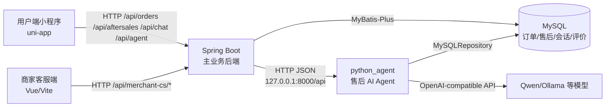
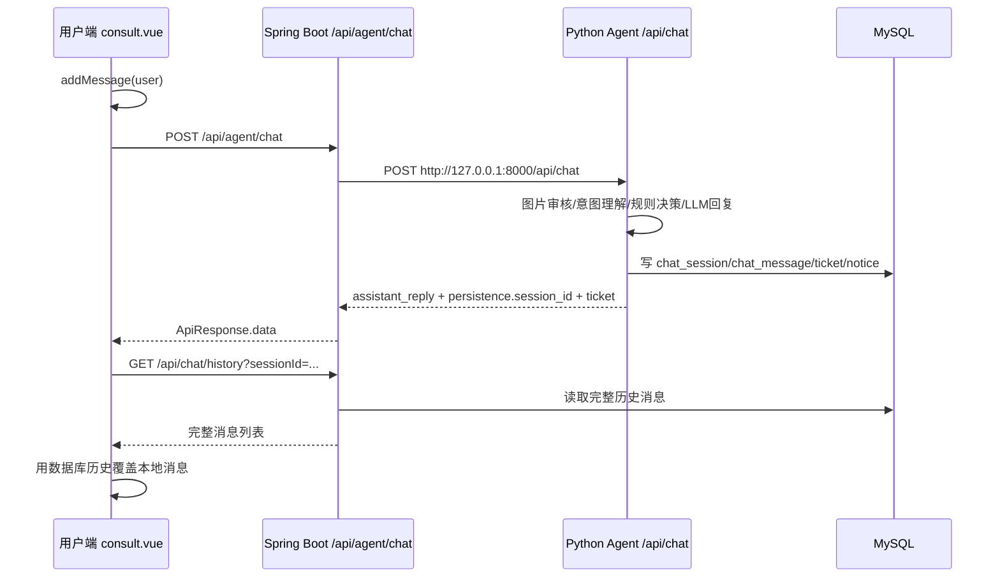
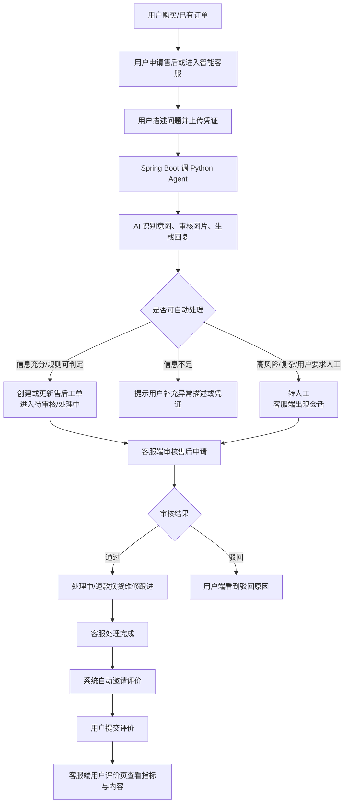
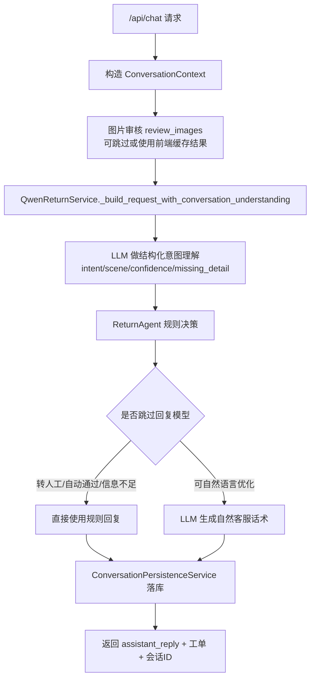

# 中期检查第 4、5、6 点讲解文档

本文面向中期检查答辩，重点解释：

- 第 4 点：后端功能完成程度
- 第 5 点：前后端联调与核心业务闭环
- 第 6 点：AI 核心功能完成程度

项目整体是一个“Spring Boot 主业务系统 + Python Agent AI 能力模块 + 用户端小程序 + 商家客服端 Web 控制台”的售后客服系统。核心原则是：业务数据以 Spring Boot 和 MySQL 为主，AI 负责售后意图理解、凭证识别、回复生成和转人工建议，最终仍由业务系统落库并驱动前后端展示。

## 1. 整体架构



关键代码位置：

- Spring Boot 入口配置：`src/main/resources/application.yml`
- AI 网关控制器：`src/main/java/com/ecommerce/aftersales/controller/AgentGatewayController.java`
- Spring 调 Python Agent：`src/main/java/com/ecommerce/aftersales/service/impl/AgentGatewayServiceImpl.java`
- Python Agent HTTP 服务：`python_agent/api_server.py`
- 用户端请求封装：`frontend/uniapp/src/utils/request.js`
- 用户端 AI 请求封装：`frontend/uniapp/src/utils/afterSalesAgent.js`
- 商家端请求封装：`frontend/staff-auth-test-ui/src/api/merchantCs.js`

`application.yml` 中配置了：

```yaml
server:
  servlet:
    context-path: /api

app:
  agent:
    base-url: http://127.0.0.1:8000/api
    timeout-millis: 90000
```

所以外部前端访问 Spring Boot 时是 `/api/...`，而 Spring Boot 内部访问 Python Agent 时是 `http://127.0.0.1:8000/api/...`。

## 2. 第 4 点：后端功能完成程度

### 2.1 后端承担的核心职责

Spring Boot 是主业务后端，负责：

- 用户登录、JWT 签发和鉴权
- 商品、订单、售后申请、客服会话、评价、通知等业务数据管理
- 接收用户端和商家端请求
- 调用 Python Agent 获取 AI 分析和回复
- 将 AI 处理结果转成业务数据：会话消息、售后工单、通知、评价邀请等
- 统一接口响应和异常处理

主要 Controller：

- `UserAuthController`：用户注册、登录、验证码
- `OrderController`：用户订单列表、订单详情、演示购买、订单状态更新
- `AfterSalesController`：用户售后申请创建、售后详情、售后列表
- `UserChatController`：用户端咨询会话、历史消息、评价提交
- `MerchantCsController`：商家客服端工作台、会话、售后审核、订单核验、评价查看、通知
- `AgentGatewayController`：Spring Boot 到 Python Agent 的网关入口

### 2.2 统一响应与异常

项目使用 `ApiResponse<T>` 包装所有接口响应：

```java
{
  "success": true,
  "code": 200,
  "message": "获取成功",
  "data": ...
}
```

位置：`src/main/java/com/ecommerce/aftersales/common/ApiResponse.java`

前端请求封装会根据 `code` 或 `success` 判断成功失败：

- 用户端：`frontend/uniapp/src/utils/request.js`
- 商家端：`frontend/staff-auth-test-ui/src/api/merchantCs.js`

用户端如果收到 `401`，会清理本地 token 并跳转登录页。

### 2.3 数据存储

主要数据表对应的领域：

- `order_info` / `order_item`：订单和订单商品
- `after_sales_ticket`：售后申请/工单
- `ticket_attachment`：售后凭证附件
- `ticket_log`：售后处理日志
- `chat_session`：用户和客服/AI 的会话
- `chat_message`：会话消息
- `message_notice`：通知
- `review_info`：用户服务评价
- `sys_user`：商家客服账号
- `user`：小程序用户

Spring Boot 通过 MyBatis-Plus Mapper 访问数据库。Python Agent 也会通过 `python_agent/after_sales_agent/infra/db.py` 中的 `MySQLRepository` 写入同一套数据库，因此会话和工单能在用户端、客服端、AI 模块之间共享。

### 2.4 售后申请后端逻辑

用户正式提交售后申请时走：

```text
POST /api/aftersales
AfterSalesController.create()
AfterSalesServiceImpl.create()
```

核心逻辑在 `AfterSalesServiceImpl.create()`：

1. 校验订单存在，并且订单属于当前登录用户。
2. 校验订单状态必须允许售后，例如 `RECEIVED` 或 `SHIPPED`。
3. 校验同一订单是否已有未结束售后，避免重复申请。
4. 创建 `after_sales_ticket`。
5. 将订单状态更新为 `AFTERSALE`。
6. 保存上传的凭证图片到 `ticket_attachment`。

这保证了“已经申请售后”的订单不会再次显示为可申请售后。

### 2.5 商家客服端后端逻辑

商家端统一通过：

```text
/api/merchant-cs/*
```

核心接口在 `MerchantCsController`：

- `GET /merchant-cs/sessions`：会话列表
- `GET /merchant-cs/sessions/{id}/messages`：会话消息
- `POST /merchant-cs/sessions/{id}/messages`：客服回复
- `GET /merchant-cs/tickets`：售后申请列表
- `POST /merchant-cs/tickets/{id}/approve`：审核通过
- `POST /merchant-cs/tickets/{id}/reject`：驳回
- `POST /merchant-cs/tickets/{id}/complete`：处理完成
- `GET /merchant-cs/reviews`：用户评价列表

业务实现集中在 `MerchantCsServiceImpl`。

例如客服处理完成售后：

```text
MerchantCsController.completeTicket()
MerchantCsServiceImpl.completeTicket()
```

后端会：

1. 将售后工单状态改为 `COMPLETED`。
2. 写入 `ticket_log`。
3. 找到同订单/同售后对应的会话。
4. 将会话状态改为 `AWAITING_EVALUATION`。
5. 向用户会话写入“请评价本次服务”的系统消息。
6. 发送通知。

这就是“处理完成后自动邀请用户评价”的业务闭环。

## 3. 第 5 点：前后端联调与核心业务闭环

### 3.1 用户端和客服端的数据不是各存一份

项目里用户端和客服端不是各自维护独立会话数据，而是共享后端数据库：

- 用户端进入聊天页，会根据 `sessionId/orderId/afterSaleId` 调用 `/api/chat/session` 或 `/api/chat/history`。
- 客服端进入会话详情，会调用 `/api/merchant-cs/sessions/{id}` 和 `/api/merchant-cs/sessions/{id}/messages`。
- 两边最终读的都是 `chat_session` 和 `chat_message`。

因此同一个订单从“售后详情进入聊天”和从“咨询会话列表进入聊天”，应该解析到同一个 `chat_session`。这部分逻辑在：

- 用户端：`frontend/uniapp/src/pages/chat/consult.vue`
- 后端：`UserChatController.findExistingSession()`
- Python Agent 持久化：`ConversationPersistenceService.persist_interaction()`
- Python 仓储：`MySQLRepository.find_or_create_session()`

### 3.2 用户端咨询数据流

用户端聊天页主要在：

```text
frontend/uniapp/src/pages/chat/consult.vue
```

用户发送消息时：



这里有一个重要设计：用户端收到 AI 返回后，不只依赖本地追加消息，而是优先回读 `/chat/history`。原因是 Python Agent 可能在数据库里额外写入：

- 转人工系统消息
- 售后工单状态消息
- 评价邀请消息
- 其他持久化消息

如果用户端只看本地追加，就会和客服端不一致。现在统一以数据库历史为准。

### 3.3 客服端会话数据流

商家客服端在：

```text
frontend/staff-auth-test-ui/src/views/SessionsView.vue
frontend/staff-auth-test-ui/src/views/SessionDetailView.vue
```

列表和详情通过 `merchantCs.js` 调后端：

```text
GET /api/merchant-cs/sessions
GET /api/merchant-cs/sessions/{sessionId}
GET /api/merchant-cs/sessions/{sessionId}/messages
POST /api/merchant-cs/sessions/{sessionId}/messages
```

客服回复时：

1. 前端调用 `sendSessionMessage(sessionId, content)`。
2. Spring Boot 在 `MerchantCsServiceImpl.sendSessionMessage()` 写入 `chat_message`。
3. 更新 `chat_session` 的状态、最后消息、处理人。
4. 用户端再次进入会话时，通过 `/chat/history` 能看到客服回复。

目前系统主要通过 HTTP 拉取刷新保证一致性，`ChatWebSocketHandler` 已提供广播能力，用户端人工会话中发送消息时后端会尝试 `broadcastToSession()`，但当前核心闭环仍以数据库落库和接口查询为准。

### 3.4 售后核心业务闭环

一条完整的售后链路如下：



### 3.5 用户评价闭环

用户评价入口在用户端聊天页，提交到：

```text
POST /api/chat/evaluation
```

后端位置：`UserChatController.submitEvaluation()`

后端会：

1. 校验会话属于当前用户。
2. 校验会话状态是 `AWAITING_EVALUATION`。
3. 更新 `chat_session`：`status = RESOLVED`，写入满意度。
4. 写入 `review_info`。
5. 把五个细分指标存入 `review_info.topics` JSON：
   - 综合评价
   - 响应速度
   - 服务态度
   - 专业程度
   - 处理效率
6. 写入会话系统消息：“感谢您的评价，本次售后服务已完成。”

客服端评价页通过：

```text
GET /api/merchant-cs/reviews
```

读取 `review_info`，并关联订单、用户、售后单、商品图片，展示评价详情。

## 4. 第 6 点：AI 核心功能完成程度

### 4.1 AI 模块为什么独立成 python_agent

Spring Boot 更适合做稳定的业务接口、权限、数据库事务和管理后台；Python 更适合做 AI 编排、模型调用、图片处理、规则 Agent 和实验迭代。

所以项目采用：

```text
Spring Boot 负责业务主链路
Python Agent 负责 AI 能力
两者通过 HTTP JSON 通信
```

不是直接在 Java 里调用模型 SDK，而是 Spring Boot 把请求代理给 Python Agent。

### 4.2 Spring Boot 和 Python Agent 是怎么通信的

用户端调用：

```text
POST http://127.0.0.1:8080/api/agent/chat
```

Spring Boot 入口：

```text
AgentGatewayController.chat()
```

Spring Boot 服务层：

```text
AgentGatewayServiceImpl.chat()
```

它会把请求转发到：

```text
POST http://127.0.0.1:8000/api/chat
```

核心代码在 `AgentGatewayServiceImpl`：

- `buildUrl(path)`：拼接 `app.agent.base-url`
- `postJson(url, body, responseType)`：使用 Java `HttpClient` 发 JSON 请求
- `timeoutMillis`：由 `application.yml` 配置，当前是 90000ms
- 异常时抛 `BizException(502, ...)`

图片审核同理：

```text
POST /api/agent/review-images
Spring Boot -> POST http://127.0.0.1:8000/api/review-images
```

### 4.3 Python Agent 的 HTTP 入口

Python Agent 入口是：

```text
python_agent/api_server.py
```

启动后监听：

```text
127.0.0.1:8000/api
```

主要接口：

- `GET /api/health`：健康检查
- `POST /api/review-images`：图片/凭证审核
- `POST /api/chat`：售后智能客服对话
- `GET /api/traces`：本地调试追踪

`AgentApiHandler._handle_chat()` 是核心入口。它做了这些事：

1. 读取 JSON 请求体。
2. 解析订单、用户消息、图片附件、历史消息。
3. 必要时调用图片审核服务。
4. 如果有 `session_id`，从数据库加载最近历史消息。
5. 构造 `ConversationContext`。
6. 调 `QwenReturnService.handle()` 生成回复。
7. 调 `ConversationPersistenceService.persist_interaction()` 写入数据库。
8. 返回 `assistant_reply`、`ticket`、`fallback_need_human`、`persistence.session_id` 等给 Spring Boot。

### 4.4 AI 对话内部是怎么跑的

核心类：

- `ReturnConversationService`：规则 Agent 和图片审核的基础编排
- `QwenReturnService`：对话理解 + 规则兜底 + LLM 回复生成
- `ReturnAgent`：售后规则决策
- `VisionReviewService`：凭证图片审核
- `ConversationPersistenceService`：把 AI 结果落到业务数据库

AI 对话流程：



### 4.5 LLM 具体做了什么

`QwenReturnService.handle()` 分两阶段：

第一阶段：对话理解。

调用：

```text
OpenAICompatibleClient.chat_json(
  system_prompt = _conversation_understanding_system_prompt(),
  user_prompt = _conversation_understanding_user_prompt(...)
)
```

要求模型只输出 JSON，字段包括：

- `intent`：申请售后、退款进度、补充凭证、转人工等
- `scene`：质量问题、商品破损、包装破损、物流异常、进度查询等
- `confidence`：置信度
- `quality_description_detailed`：质量问题描述是否足够具体
- `normalized_issue`：提炼出的具体异常
- `missing_detail`：还缺什么信息
- `reason`：判断依据

然后代码会做修复和兜底，例如：

- 用户问“退款什么时候到账”，强制识别为 `refund_progress`
- 用户说“人工/真人客服”，强制识别为 `human_service`
- 用户只说“质量问题”但没有具体异常，会要求补充异常描述

第二阶段：生成客服回复。

如果规则结果允许模型润色，调用：

```text
OpenAICompatibleClient.chat_json(
  system_prompt = _system_prompt(),
  user_prompt = _user_prompt(context, fallback_result)
)
```

模型只负责把规则结果转成自然、简洁、适合小程序售后场景的回复。它不能改规则结论，不能编造退款时间、审核结果、工单号，也不能暴露“自动审核、风险等级、Agent”等内部词。

如果规则判断必须转人工、必须补充材料或已经自动处理，代码会跳过模型回复，直接使用规则结果，避免模型胡说。

### 4.6 AI 结果怎么同步到客服端

Python Agent 的 `ConversationPersistenceService.persist_interaction()` 会直接写数据库：

- 查找或创建 `chat_session`
- 写入用户消息 `chat_message`
- 写入 AI 回复 `chat_message`
- 如果需要人工，调用 `mark_session_waiting_human()`
- 如果产生售后工单，写入或复用 `after_sales_ticket`
- 写入 `ticket_log`
- 写入 `message_notice`

因此客服端不是从 Python Agent 取数据，而是从 Spring Boot 的 `/merchant-cs/*` 接口读取数据库。也就是说：

```text
AI 产生结果 -> Python Agent 落库 -> 客服端通过 Spring Boot 读库展示
```

这也是为什么用户端、客服端必须共享同一个 `chat_session`，否则会出现“用户端一份消息、客服端另一份消息”的问题。

## 5. 身份如何判断：HTTP 无状态怎么解决

HTTP 本身无状态，每次请求之间服务器默认不知道“是谁”。本项目用 JWT 解决。

### 5.1 用户端登录

用户端登录接口：

```text
POST /api/miniapp/auth/login
```

后端登录成功后通过 `JwtTokenUtil.generateToken(userId, phone)` 生成 JWT。JWT 的 subject 是 `userId`。

用户端把 token 存到本地：

```text
uni.setStorageSync('token', token)
```

后续请求在 `frontend/uniapp/src/utils/request.js` 中自动带上：

```http
Authorization: Bearer <token>
```

### 5.2 商家客服端登录

客服端登录：

```text
POST /api/merchant-cs/auth/login
```

登录成功后把 token 存到浏览器：

```text
localStorage.setItem('merchant_cs_token', token)
```

后续请求在 `frontend/staff-auth-test-ui/src/api/merchantCs.js` 中自动带上：

```http
Authorization: Bearer <token>
```

### 5.3 后端如何识别当前用户/客服

Spring Security 配置：

```text
SecurityConfig
```

项目设置：

```java
sessionCreationPolicy(SessionCreationPolicy.STATELESS)
```

意思是后端不依赖服务端 Session，每次请求都靠 JWT 自证身份。

`JwtAuthenticationFilter` 每次请求都会：

1. 判断是否是公开路径，如登录、商品、上传、Agent 网关。
2. 从 `Authorization` 头里取 token。
3. 用 `JwtTokenUtil.parseUserId(token)` 解析出 userId。
4. 写入 request attribute：
   - `currentUserId`
   - 如果是 `/api/merchant-cs/**`，同时写入 `currentStaffId`
5. 写入 Spring SecurityContext。

Controller 中通过注解拿当前身份：

```java
public ApiResponse<List<AfterSalesVO>> listByUserId(@CurrentUserId Long userId)
```

注解解析器：

- `CurrentUserIdArgumentResolver`
- `CurrentStaffIdArgumentResolver`

它们从 request attribute 里取当前 ID。

### 5.4 不同身份怎么区分

当前实现的区分方式主要靠接口路径：

- 用户端：`/api/orders`、`/api/aftersales`、`/api/chat`、`/api/notifications`
- 客服端：`/api/merchant-cs/**`
- AI 网关：`/api/agent/**`

`JwtAuthenticationFilter` 看到 `/api/merchant-cs/**` 会额外设置 `currentStaffId`。商家端服务层再通过 `ensureStaff()` 查询 `sys_user`，确认这个 token 对应的是客服账号。

也就是说，HTTP 无状态问题通过：

```text
前端保存 JWT -> 每次请求带 Authorization -> 后端过滤器解析 JWT -> Controller 注入当前身份
```

来解决。

## 6. 响应时间与异常处理

### 6.1 普通业务接口

普通业务接口是 Spring Boot 直接访问 MySQL，一般响应时间取决于数据库查询和分页。商家端列表接口使用分页：

```text
GET /api/merchant-cs/tickets?page=1&size=10
GET /api/merchant-cs/sessions?page=1&size=10
```

### 6.2 AI 接口

AI 接口可能比较慢，因为涉及：

- 图片 base64 传输
- 图片审核模型调用
- 文本理解模型调用
- 回复生成模型调用
- 数据库持久化

因此 Agent 超时时间配置为 90 秒：

```yaml
app.agent.timeout-millis: 90000
```

用户端 AI 请求也有单独超时：

```text
frontend/uniapp/src/utils/apiConfig.js
DEFAULT_AGENT_TIMEOUT = 90000
```

### 6.3 Agent 异常兜底

Spring 调 Python Agent 失败时：

- `AgentGatewayServiceImpl.exchange()` 会捕获连接异常、IO 异常、中断异常
- 对外返回 `502 Agent服务暂时不可用`

图片审核有更细的兜底：

```text
buildImageReviewFallback()
```

当图片审核失败时，不直接中断整个售后流程，而是返回“图片分析暂时异常，我会先根据描述继续处理”。

Python Agent 内部也有兜底：

- LLM 不可用时使用规则 Agent 结果
- 意图理解不合法时做关键词修复
- 图片审核失败时返回 fallback image review

## 7. 核心亮点总结

### 7.1 与核心业务紧密结合

AI 不是单纯聊天，而是嵌入售后业务：

- 识别用户是不是在申请售后
- 判断是质量问题、破损、包装问题、物流问题还是进度查询
- 判断材料是否充分
- 判断是否需要转人工
- 自动创建/关联售后工单
- 写入客服会话
- 驱动客服端处理和用户端评价

### 7.2 规则和大模型结合

模型负责理解和表达，规则负责业务边界：

- LLM：意图识别、语义归一、回复润色
- Rule Agent：售后状态机、材料要求、是否转人工、是否生成工单
- Persistence：把结果写回业务数据库

这样既有 AI 灵活性，又能保证售后流程不乱。

### 7.3 用户端和客服端共用数据源

所有关键状态最终都落到 MySQL：

- 会话：`chat_session`
- 消息：`chat_message`
- 售后工单：`after_sales_ticket`
- 日志：`ticket_log`
- 通知：`message_notice`
- 评价：`review_info`

用户端和客服端都通过 Spring Boot 读取这些数据，避免两端状态不一致。

### 7.4 无状态 HTTP 下的身份恢复

JWT 让每个请求都能携带身份，后端无需保存 Session：

```text
Authorization: Bearer token
```

后端每次解析 token，注入 `@CurrentUserId` 或 `@CurrentStaffId`，再做订单归属、售后归属、会话归属校验。

## 8. 答辩时可以这样讲第四、五、六点

### 第 4 点：后端功能完成程度

可以说：

> 后端已经完成订单、售后申请、客服会话、商家审核、通知、用户评价和 AI 网关等核心模块。所有接口统一使用 ApiResponse 返回，鉴权采用 JWT 无状态方案。售后申请创建会校验订单归属和重复申请，客服端处理完成后会自动推动会话进入待评价状态，并写入评价邀请消息。数据层使用 MyBatis-Plus 访问 MySQL，核心业务数据都落库。

### 第 5 点：前后端联调与核心业务闭环

可以说：

> 用户端和客服端不是各自维护数据，而是共享 Spring Boot 和 MySQL。用户端发送售后问题后，Spring Boot 调 Python Agent，Agent 分析后写入会话、工单、通知等数据；客服端从同一张会话表和消息表读取，所以能看到用户与 AI 的完整上下文。客服审核通过、处理完成、邀请评价、用户评价提交、客服端查看评价，形成了一个完整闭环。

### 第 6 点：AI 核心功能完成程度

可以说：

> AI 模块独立在 python_agent 中，通过 HTTP JSON 和 Spring Boot 通信。AI 不是简单问答，而是先做结构化意图理解，再进入售后规则 Agent 判断材料、状态和是否转人工，最后才由大模型生成自然话术。图片凭证也会进入 Agent 分析。AI 输出不会只返回给前端，还会通过持久化服务写入数据库，驱动客服端会话和售后工单变化。

