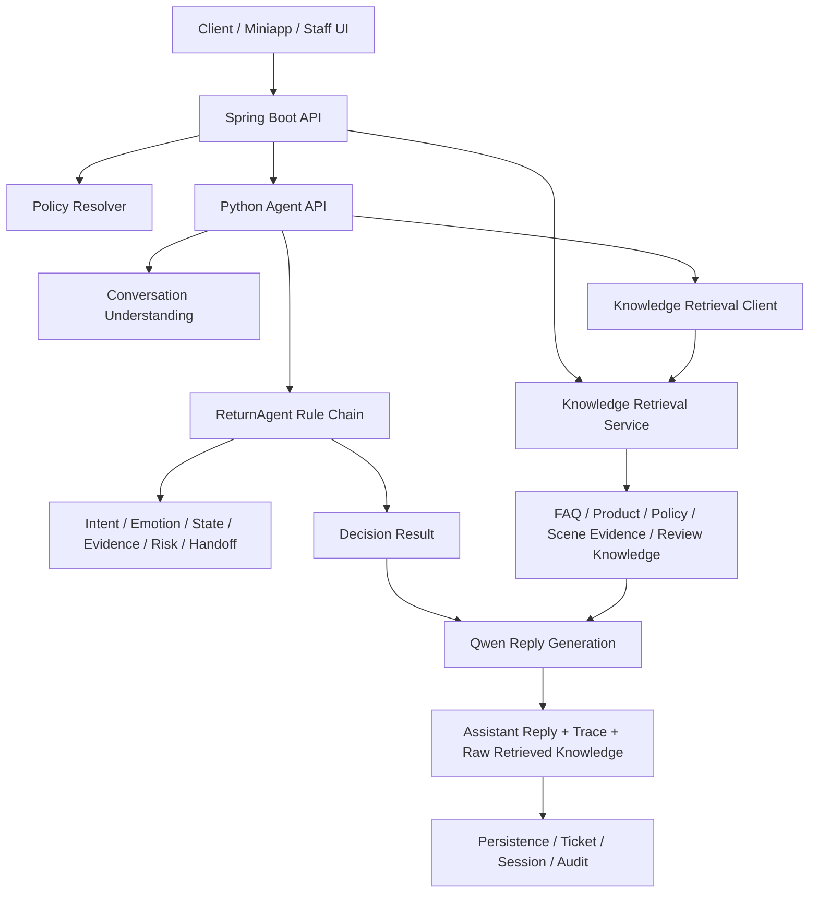

# RAG Runtime Architecture

## 1. Goal

This project does not use RAG to decide after-sales actions directly.

The design goal is:

- the rule chain decides business actions
- the knowledge layer provides retrieval context
- the LLM uses retrieved knowledge to explain, guide, and answer naturally
- persistence and audit can see what knowledge was retrieved

In short:

`Rule Engine = decide`

`RAG = explain`

## 2. Runtime Layers

## 3. Boundary

### 3.1 Rule Engine Responsibilities

The rule engine is still the only authority for:

- whether the user can apply for after-sales service
- which intent is accepted
- which scene is recognized for processing
- whether evidence is missing
- whether human handoff is required
- which after-sales scheme is chosen
- whether a ticket should be created

Main files:

- [return_agent.py](/D:/ecommerce-after-sales-system-codex-test-ai-module-merge/python_agent/after_sales_agent/agents/return_agent.py)
- [policies.py](/D:/ecommerce-after-sales-system-codex-test-ai-module-merge/python_agent/after_sales_agent/agents/policies.py)
- [merchant_policy.py](/D:/ecommerce-after-sales-system-codex-test-ai-module-merge/python_agent/after_sales_agent/merchant_policy.py)

### 3.2 RAG Responsibilities

RAG is only used for:

- FAQ answering
- policy explanation
- product guidance
- scene evidence guidance
- review interpretation support
- grounding the final natural-language reply

RAG must not override:

- `decision`
- `intent`
- `missing_fields`
- `need_human`
- `suggested_action`

That constraint is already enforced in the Python reply prompt.

Main files:

- [knowledge_retrieval.py](/D:/ecommerce-after-sales-system-codex-test-ai-module-merge/python_agent/after_sales_agent/services/knowledge_retrieval.py)
- [qwen_service.py](/D:/ecommerce-after-sales-system-codex-test-ai-module-merge/python_agent/after_sales_agent/services/qwen_service.py)

## 4. Java Side Design

### 4.1 Knowledge Source of Truth

Spring Boot is the single knowledge source of truth for retrieval.

It merges:

- resource catalog knowledge
- database knowledge tables

Current merged knowledge lives behind:

- [ResourceAgentPolicyCatalogService.java](/D:/ecommerce-after-sales-system-codex-test-ai-module-merge/src/main/java/com/ecommerce/aftersales/service/impl/ResourceAgentPolicyCatalogService.java)

### 4.2 Retrieval Service

Runtime retrieval is implemented in:

- [KnowledgeRetrievalService.java](/D:/ecommerce-after-sales-system-codex-test-ai-module-merge/src/main/java/com/ecommerce/aftersales/service/KnowledgeRetrievalService.java)
- [KnowledgeRetrievalServiceImpl.java](/D:/ecommerce-after-sales-system-codex-test-ai-module-merge/src/main/java/com/ecommerce/aftersales/service/impl/KnowledgeRetrievalServiceImpl.java)

Current retrieval mode:

- `lexical_hybrid_v1`

Current ranking inputs:

- query exact match
- title match
- content match
- metadata match
- scene boost
- product category boost

This is a practical first-stage retrieval chain, not a vector pipeline yet.

### 4.3 Retrieval APIs

Agent-facing API:

- `POST /api/agent/knowledge/retrieve`

Merchant-facing search API:

- `GET /api/merchant-cs/knowledge/search`

Related files:

- [AgentGatewayController.java](/D:/ecommerce-after-sales-system-codex-test-ai-module-merge/src/main/java/com/ecommerce/aftersales/controller/AgentGatewayController.java)
- [MerchantCsController.java](/D:/ecommerce-after-sales-system-codex-test-ai-module-merge/src/main/java/com/ecommerce/aftersales/controller/MerchantCsController.java)
- [AgentGatewayDtos.java](/D:/ecommerce-after-sales-system-codex-test-ai-module-merge/src/main/java/com/ecommerce/aftersales/dto/AgentGatewayDtos.java)

## 5. Python Side Design

### 5.1 Reply Flow

Current `QwenReturnService` flow:

1. build `AfterSalesRequest`
2. run conversation understanding
3. run `ReturnAgent` rule chain
4. retrieve knowledge using the current message and rule result
5. inject retrieved knowledge into the reply prompt
6. generate the final customer-facing reply
7. return `raw.retrieved_knowledge` and trace data

### 5.2 Retrieval Query Inputs

The retrieval client currently sends:

- `query`
- `merchantCode`
- `productCategory`
- `scene`
- `intent`
- `topK`
- `sources`

That means retrieval is already context-aware, not just plain keyword search.

### 5.3 Returned Trace

The Python chat response now exposes:

- `raw.retrieved_knowledge`
- `trace.steps[].name = knowledge_retrieve`

So later UI work can directly show:

- what knowledge was hit
- which source type it came from
- which query was used
- how many chunks were returned

## 6. Knowledge Classification

### 6.1 Best Fit for RAG

These are best suited for retrieval-style usage:

- `faq_knowledge`
- `product_knowledge`
- `after_sales_policy_knowledge`
- `review_interpretation_knowledge`

Reason:

- longer text
- explanation-oriented
- can benefit from top-K retrieval
- may change over time

### 6.2 Best Fit for Structured Execution

These are better as structured execution knowledge, not free-text RAG:

- `emotion_levels`
- `emotion_keyword_knowledge`
- `emotion_strategy_knowledge`
- `scene_evidence_knowledge`
- `after_sales_scheme_knowledge`
- editable merchant policy fields

Reason:

- deterministic
- configuration-like
- directly consumed by agents
- better read as typed structures than retrieved paragraphs

## 7. Current State

What is already completed:

- Spring Boot retrieval endpoint is live
- Python retrieval client is live
- Qwen reply prompt consumes retrieved knowledge
- chat trace exposes retrieval steps
- raw payload exposes retrieved knowledge hits

What is not yet completed:

- vector embeddings
- chunk table runtime retrieval
- reranker
- retrieval hit persistence
- front-end knowledge-hit panel

## 8. Recommended Next Step

The next best step is not another model change.

The best next step is:

1. persist retrieval hits with each chat round
2. expose a front-end panel for retrieved knowledge
3. separate "execution knowledge" from "retrieval knowledge" even more clearly in admin and docs

That will make the architecture easier to audit, debug, and evolve.
